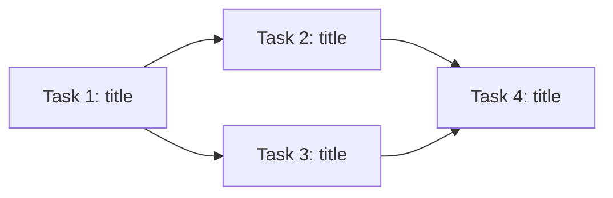

Generate tasks.json from a design document or spec: $ARGUMENTS

## What This Does

Bridges the gap between `/plan` output and `/auto-build` input. Reads a spec, PRD, or design doc and decomposes it into a structured `tasks.json` compatible with `/auto-build` and `/auto-build-all`.

## Process

### Step 1: Source Discovery

1. If `$ARGUMENTS` is a file path → read that file
2. If `$ARGUMENTS` is empty → auto-discover in this order:
   - `docs/*/design-doc.md`
   - `docs/*/prd.md`
   - `specs/*.md`
   - `docs/design/*.md`
3. If multiple matches → ask the user which one to use
4. If none found → "No spec or design doc found. Run `/plan` first to create one."

### Step 1.5: Research Gate

Before decomposing, check if research is needed. Research IS needed if ANY of:
- The source doc references a library/framework not yet verified via Context7 this session
- The source doc involves an external API (Stripe, Twilio, Salesforce, Resend, etc.)
- The source doc mentions a version upgrade or migration

If YES: invoke the researcher agent (Context7 MCP). Attach the Research Brief to the architect agent's context in Step 2. This prevents generating tasks with wrong API assumptions.

If NO: proceed directly to Step 2.

### Step 2: Parse with Architect Agent

Launch the **architect agent (Opus)** to analyze the source document:

- Extract: feature name, requirements, mentioned files, acceptance criteria
- Read CLAUDE.md and AGENTS.md for project conventions and learned patterns
- Explore existing code patterns: find similar features, shared utilities, types
- Identify reusable services, components, and validation schemas before creating new ones
- Query knowledge-rag MCP (if configured) for existing design decisions in `docs/`
- Cross-reference any PRDs, architecture docs, or prior research briefs
- Ensure tasks don't contradict existing documented decisions
- If the document covers multiple milestones, scope to ONE milestone and ask the user which

### Step 3: Decompose into Tasks

Apply the same rules as `/init-tasks`:

- **1-3 files per task** maximum
- **Dependency-ordered** (task 2 can depend on task 1)
- **At least 2 testable acceptance criteria** per task
- **Max 15 tasks** per run — if more needed, ask user to split
- **Include test files** in the `files` array
- First task: scaffold/setup if starting fresh
- Last task: integration verification

### Step 4: Human Approval Gate

Show the proposed task list:

```
## Proposed Tasks from: {source file}

Project: {project-name}
Tasks: {count}
Estimated scope: {total files}

1. {title} — {1-line description} (files: {count}, depends: {deps})
2. {title} — {1-line description} (files: {count}, depends: {deps})
...

Write tasks.json? [yes / adjust / abort]
```

**Important checks before writing:**
- If `tasks.json` already exists with completed tasks → warn: "Existing tasks.json has {N} completed tasks. Overwriting will lose that progress. Continue?"
- If `tasks.json` exists with pending tasks → warn: "Existing tasks.json has {N} pending tasks. Overwrite?"

### Step 5: Write tasks.json

Write using the exact schema from `/init-tasks`:

```json
{
  "project": "short-kebab-case-name",
  "description": "One-line description from the spec",
  "stack": "detected from project",
  "created": "ISO date",
  "source": "path/to/source/document.md",
  "tasks": [
    {
      "id": 1,
      "title": "Short title",
      "description": "What this task accomplishes",
      "status": "pending",
      "priority": "P0",
      "risk": "low",
      "acceptance": [
        "Concrete testable criterion 1",
        "Concrete testable criterion 2"
      ],
      "files": ["src/path/to/file.ts", "src/path/to/test.ts"],
      "depends_on": [],
      "attempts": 0,
      "max_attempts": 3
    }
  ]
}
```

### Step 6: Report

```
## Tasks Generated

Source: {source file}
Project: {project name}
Tasks: {count}
File: tasks.json

Task list:
1. {title} (depends: none)
2. {title} (depends: 1)
...

Task dependency graph (Mermaid):

(Generate the actual graph from task dependencies — the above is an example structure)

Next steps:
- Run /auto-build to implement one task at a time
- Run /auto-build-all to implement all tasks autonomously
- Run /auto-ship to build + check + ship in one pass
```

## Rules

- ALWAYS show the task list for human approval before writing
- ALWAYS warn if overwriting existing tasks.json
- NEVER generate more than 15 tasks — split into milestones instead
- NEVER include vague acceptance criteria ("works well", "good UX")
- Every acceptance criterion must be testable (renders at path, returns value, test passes)
- The `source` field tracks provenance — which doc generated these tasks
- Schema must be 100% compatible with `/auto-build` and `/auto-build-all`
- ALWAYS set `priority` (P0/P1/P2) and `risk` (low/medium/high) for every task
- P0 tasks are critical path — implement first; P2 tasks can be deferred if time is tight
- High-risk tasks get sequential execution with extra verification in `/auto-build-all`
- Tasks with no `depends_on` overlap are candidates for parallel execution
