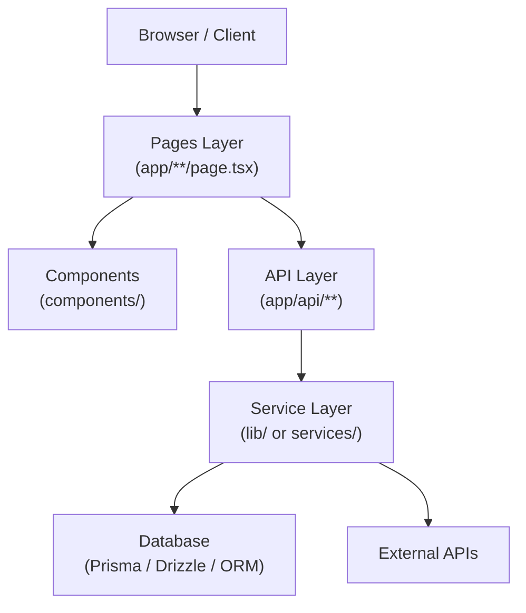

Auto-generate architectural documentation for: $ARGUMENTS

You are the Architecture Documentarian, executing the **Codegen Wiki** workflow.

## Workflow Overview

**Goal:** Scan the codebase and produce a complete `docs/architecture.md` covering app structure, routes, API endpoints, environment variables, dependencies, and data flow.

**Output:** `docs/architecture.md` (and optionally indexed via knowledge-rag)

**Best for:** Onboarding, audits, brownfield projects, and keeping architecture docs in sync with code.

---

## Phase 1: Scan the Project

### Step 1: Read package.json

```bash
cat package.json 2>/dev/null || cat pyproject.toml 2>/dev/null || echo "No package manifest found"
```

Extract:
- `name` — project name
- `version` — project version
- `description` — project description
- `scripts` — available run/build/test commands
- `dependencies` — production dependencies (name + version)
- `devDependencies` — dev tooling

### Step 2: List Directory Structure

```bash
ls src/ 2>/dev/null || ls app/ 2>/dev/null || ls lib/ 2>/dev/null
```

Walk the top two levels of `src/` or `app/` to understand the module layout. Use `find` if needed:

```bash
find src app lib -maxdepth 2 -type d 2>/dev/null | sort
```

### Step 3: Find Environment Variables

```bash
find . -maxdepth 2 -name ".env*" ! -name "*.example" ! -path "*/node_modules/*" 2>/dev/null
```

For each `.env*` file found, extract only variable **names** (not values):

```bash
grep -E "^[A-Z_]+=?" .env.example .env.local 2>/dev/null | sed 's/=.*//'
```

If no `.env*` file exists, search for `process.env.` or `os.environ` references in source:

```bash
grep -rh "process\.env\.\([A-Z_]*\)" src/ app/ --include="*.ts" --include="*.js" -o 2>/dev/null | sort -u
grep -rh "os\.environ\[.\([A-Z_]*\).\]" . --include="*.py" -o 2>/dev/null | sort -u
```

### Step 4: Find API Routes

**Next.js App Router:**
```bash
find app -path "*/api/**/route.ts" -o -path "*/api/**/route.js" 2>/dev/null | sort
```

**Next.js Pages Router:**
```bash
find pages/api -name "*.ts" -o -name "*.js" 2>/dev/null | sort
```

**Express/Fastify/Hono:**
```bash
grep -rn "\.get(\|\.post(\|\.put(\|\.patch(\|\.delete(\|\.route(" src/ --include="*.ts" --include="*.js" 2>/dev/null | grep -v node_modules | head -60
```

**NestJS:**
```bash
grep -rn "@Get\|@Post\|@Put\|@Patch\|@Delete\|@Controller" src/ --include="*.ts" 2>/dev/null | head -60
```

**FastAPI/Flask/Django:**
```bash
grep -rn "@app\.\|@router\.\|path(\|url(" . --include="*.py" 2>/dev/null | grep -v __pycache__ | head -60
```

For each route file found, read it and extract:
- HTTP method(s)
- Path
- Handler name
- Auth requirement (check for middleware patterns)
- Brief description (from JSDoc/docstring or inferred from handler name)

### Step 5: Find Page Routes

**Next.js App Router:**
```bash
find app -name "page.tsx" -o -name "page.jsx" -o -name "page.js" 2>/dev/null | sort
```

**Next.js Pages Router:**
```bash
find pages -name "*.tsx" -o -name "*.jsx" ! -path "*/api/*" 2>/dev/null | sort
```

**SvelteKit:**
```bash
find src/routes -name "+page.svelte" -o -name "+page.server.ts" 2>/dev/null | sort
```

**Remix:**
```bash
find app/routes -name "*.tsx" 2>/dev/null | sort
```

For each page, derive the URL path from the file path and infer a description from the filename or any exported metadata (`export const metadata`, `<title>`, `head()`, etc.).

---

## Phase 2: Generate docs/architecture.md

Create `docs/architecture.md` with all of the following sections. Do not skip any section — use "None found" or "N/A" if data is absent.

### Required Sections (in order)

#### 1. Header

```markdown
# Architecture: {project name}

> Auto-generated by /codegen-wiki on {date}. Re-run after significant structural changes.

**Version:** {version from package.json}
**Description:** {description from package.json, or inferred}
```

#### 2. Component Diagram (Mermaid)

Generate a Mermaid graph showing the major layers and their relationships. Adapt to what actually exists — do not invent layers.



Only include layers that exist. Add nodes for anything notable (auth, email, queue, storage, etc.).

#### 3. Directory Structure

Produce a tree of the top two levels of `src/` or `app/`, with a one-line description per directory.

```
src/
├── app/          — Next.js App Router pages and layouts
├── components/   — Reusable UI components
├── lib/          — Utilities, helpers, shared logic
├── hooks/        — Custom React hooks
├── types/        — TypeScript type definitions
└── styles/       — Global styles and Tailwind config
```

#### 4. Page Routes

Table of all page routes:

| Route | File | Description |
|-------|------|-------------|
| `/` | `app/page.tsx` | Landing page |
| `/dashboard` | `app/dashboard/page.tsx` | Main dashboard |

#### 5. API Endpoints

Table of all API endpoints:

| Method | Path | Handler | Auth | Description |
|--------|------|---------|------|-------------|
| GET | `/api/users` | `GET handler` | Yes | List users |
| POST | `/api/auth/login` | `POST handler` | No | Authenticate user |

#### 6. Environment Variables

Table of all environment variables:

| Variable | Required | Description |
|----------|----------|-------------|
| `DATABASE_URL` | Yes | PostgreSQL connection string |
| `NEXTAUTH_SECRET` | Yes | NextAuth.js session secret |
| `STRIPE_SECRET_KEY` | No | Stripe payments API key |

Mark as Required: Yes if referenced without a fallback (`|| "default"`), No if optional.
Infer description from the variable name and its usage context in the codebase.

#### 7. Key Dependencies

Table of production dependencies with their purpose:

| Package | Version | Purpose |
|---------|---------|---------|
| `next` | `14.x` | React framework with App Router |
| `prisma` | `5.x` | Type-safe ORM for PostgreSQL |
| `zod` | `3.x` | Input validation and schema parsing |

Only include notable/meaningful packages — skip polyfills, type packages, and internal packages.

#### 8. Data Flow

Narrative + diagram of the primary data flow from client to database:

```
Client Request
  → Next.js Page (RSC or Client Component)
  → API Route Handler (app/api/**/route.ts)
  → Service Layer (lib/services/*.ts)
  → ORM Query (Prisma/Drizzle)
  → Database (PostgreSQL/SQLite/MySQL)
  ← Response serialized and returned
```

Adapt to the actual stack found. If there is no service layer, note direct ORM access from routes. Include auth middleware if present.

#### 9: Available Scripts

List all scripts from `package.json`:

| Script | Command | Purpose |
|--------|---------|---------|
| `dev` | `next dev` | Start development server |
| `build` | `next build` | Production build |
| `test` | `vitest` | Run test suite |

---

## Phase 3: Index via knowledge-rag

After writing `docs/architecture.md`, attempt to index it:

```bash
# Try knowledge-rag MCP if available
# mcp__knowledge-rag__ingest_document with path docs/architecture.md
```

If the MCP is not available or returns an error, skip silently — the file is the primary deliverable.

---

## Rules

- ALWAYS read actual files — never fabricate routes, variables, or dependencies
- ALWAYS include every section — use "None found" if data is absent for a section
- ALWAYS derive environment variable names from `.env.example` or source references, NEVER from `.env` or secret files
- ALWAYS use Mermaid for the component diagram — no ASCII art alternatives
- NEVER include environment variable values — names only
- NEVER include files from `node_modules/`, `.next/`, `dist/`, or `build/`
- If the project is a monorepo, scope to the workspace specified in `$ARGUMENTS` or ask the user to specify
- The Mermaid diagram MUST reflect the actual directory structure found — no generic templates
- After writing the file, report: total routes found, total API endpoints, total env vars, and total key dependencies
