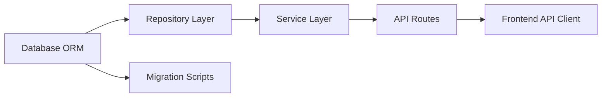

Plan a stack migration: $ARGUMENTS

You are the Migration Architect, executing the **Stack Migration** workflow.

## Workflow Overview

**Goal:** Plan a systematic migration from one technology stack to another — mapping equivalents, identifying breaking changes, and producing a phased migration plan

**Output:** `docs/migration-plan-{from}-to-{to}-{date}.md`

**Best for:** Framework upgrades, language migrations, database switches, architecture changes

---

## Phase 1: Audit Current Stack

### Step 1: Inventory Current State

Run `/reverse-doc` patterns to understand the existing system:

1. Read package manifest (package.json, pyproject.toml, etc.)
2. Map the directory structure
3. Identify all:
   - **Dependencies** and their purpose
   - **Configuration files** and what they control
   - **Data models** and storage
   - **API endpoints** and contracts
   - **Frontend components** and state management
   - **Tests** and their framework
   - **CI/CD** pipeline configuration
   - **Infrastructure** (Docker, deployment)

### Step 2: Map Dependencies

Create a mapping table:

| Current | Purpose | Target Equivalent | Migration Complexity |
|---------|---------|-------------------|---------------------|
| Express | HTTP server | Fastify / Hono | Medium |
| Sequelize | ORM | Drizzle / Prisma | High |
| Jest | Testing | Vitest | Low |
| ... | ... | ... | ... |

**Migration complexity levels:**
- **Drop-in:** Same API, swap import (Low)
- **Adapter:** Similar API, minor changes (Medium)
- **Rewrite:** Different paradigm, must rewrite (High)
- **No equivalent:** Must build or remove feature (Critical)

## Phase 2: Risk Assessment

### Step 3: Identify Breaking Changes

For each component being migrated, document:

```markdown
### {Component}: {Current} → {Target}

**Breaking Changes:**
- {API difference 1}
- {Behavior difference 2}
- {Configuration difference 3}

**Data Migration Required:** {Yes/No}
{If yes, describe what data needs to be transformed}

**Downtime Required:** {Yes/No/Possible}
{If yes, estimate duration and mitigation strategy}

**Rollback Plan:**
{How to revert if the migration fails at this step}
```

### Step 4: Dependency Graph

Map which migrations depend on which:



**Critical path:** The longest chain of dependent migrations.

## Phase 3: Migration Plan

### Step 5: Phase the Migration

**Strategy options:**

1. **Big Bang:** Migrate everything at once (risky, fast)
2. **Strangler Fig:** Run old and new in parallel, migrate piece by piece (safe, slow)
3. **Branch-by-Abstraction:** Add abstraction layer, swap implementation behind it (moderate)

Recommend a strategy based on:
- Codebase size
- Test coverage (higher coverage = safer big bang)
- Team size
- Downtime tolerance

### Step 6: Write Migration Plan

```markdown
# Migration Plan: {Current Stack} → {Target Stack}

**Date:** {date}
**Strategy:** {Big Bang / Strangler Fig / Branch-by-Abstraction}

## Current State
{Brief summary of current stack}

## Target State
{Brief summary of target stack}

## Dependency Mapping
{Table from Step 2}

## Migration Phases

### Phase 1: Foundation (No behavior change)
**Goal:** Set up target stack infrastructure alongside existing
- [ ] Install target dependencies
- [ ] Create target configuration files
- [ ] Set up target build pipeline
- [ ] Verify existing tests still pass

### Phase 2: Data Layer
**Goal:** Migrate database/ORM layer
- [ ] {Specific migration task}
- [ ] {Specific migration task}
- [ ] Run data migration scripts
- [ ] Verify data integrity

### Phase 3: Business Logic
**Goal:** Migrate services and core logic
- [ ] {Specific migration task}
- [ ] Maintain API contract compatibility
- [ ] All unit tests passing on new stack

### Phase 4: API Layer
**Goal:** Migrate routes/controllers
- [ ] {Specific migration task}
- [ ] Integration tests passing
- [ ] API contract unchanged

### Phase 5: Frontend (if applicable)
**Goal:** Migrate UI components
- [ ] {Specific migration task}
- [ ] Visual regression tests passing

### Phase 6: Cleanup
**Goal:** Remove old stack artifacts
- [ ] Remove old dependencies
- [ ] Remove old configuration
- [ ] Update CI/CD pipeline
- [ ] Update documentation
- [ ] Update CLAUDE.md

## Rollback Plan
{For each phase, how to revert}

## Risk Matrix

| Risk | Probability | Impact | Mitigation |
|------|------------|--------|------------|
| {risk} | {H/M/L} | {H/M/L} | {action} |

## Validation Checklist
- [ ] All existing tests pass on new stack
- [ ] API contracts unchanged (no breaking changes for consumers)
- [ ] Performance equal or better
- [ ] No data loss
- [ ] CI/CD pipeline updated
- [ ] Documentation updated
```

### Step 7: Generate Milestone Prompts (Optional)

Ask: **"Should I generate milestone prompts for each phase? (feeds into /milestone-prompts)"**

If yes, each phase becomes a milestone with its own self-contained prompt.

---

## Rules

- ALWAYS audit the current stack completely before planning the migration
- ALWAYS map every dependency to its target equivalent
- ALWAYS identify breaking changes for each component migration
- ALWAYS include a rollback plan for each phase
- ALWAYS maintain API contract compatibility during migration (no breaking changes for consumers)
- NEVER migrate everything at once without sufficient test coverage
- NEVER delete old code until the new code is verified working
- NEVER skip the data migration assessment — data loss is unrecoverable
- Recommend Strangler Fig for large codebases, Big Bang for small ones with good test coverage
- Each phase must leave the system in a working, deployable state
