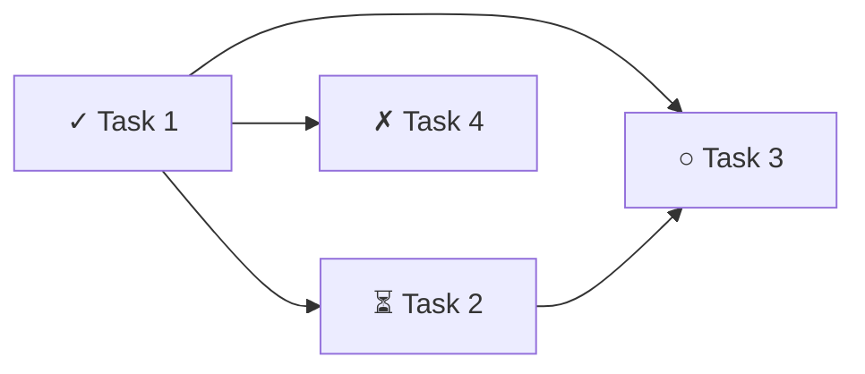

Show pipeline status and task progress.

## What This Does

Reads pipeline trace data, tasks.json, and recent logs to display a comprehensive
status dashboard of the current or most recent pipeline run.

## Process

### Step 1: Task Status

Read `tasks.json` if it exists:

```
## Task Status

Project: {project name}
Source: {source document}
Created: {date}

| # | Title | Status | Priority | Attempts | Depends On |
|---|-------|--------|----------|----------|------------|
| 1 | {title} | ✓ completed | P0 | 1/3 | — |
| 2 | {title} | ⏳ in_progress | P0 | 1/3 | 1 |
| 3 | {title} | ○ pending | P1 | 0/3 | 1, 2 |
| 4 | {title} | ✗ blocked | P1 | 3/3 | 1 |

Progress: {completed}/{total} ({percent}%)
Blocked: {count} tasks
```

### Step 2: Dependency Graph

Generate a Mermaid dependency graph from tasks.json:



Color coding: green = completed, yellow = in_progress, gray = pending, red = blocked

### Step 3: Pipeline Trace

Read `~/.claude/logs/pipeline-trace.jsonl` if it exists:

```
## Pipeline Trace (most recent run)

Pipeline: {auto-ship / auto-dev}
Started: {timestamp}
Status: {running / completed / failed}

| Phase | Status | Duration | Details |
|-------|--------|----------|---------|
| Pre-flight | ✓ | 2s | Branch: feat/my-feature |
| Build | ✓ | 18m | 8/8 tasks completed |
| Coverage | ✓ | 45s | 84% (target: 80%) |
| Verify | ✓ | 30s | test ✓ lint ✓ typecheck ✓ |
| Visual | ✓ | 1m | No console errors |
| Check | ✓ | 3m | PASS (2 warnings) |
| Ship | ✓ | 1m | PR #42 |
| Review | ✓ | 2m | 0 critical, 1 suggestion |

Total: 26m
```

### Step 4: Recent History

Read `~/.claude/logs/auto-ship.log` for recent pipeline runs:

```
## Recent Pipelines

| Date | Branch | Tasks | Verdict | PR |
|------|--------|-------|---------|----|
| 2026-03-21 | feat/auth | 8/8 | PASS | #42 |
| 2026-03-20 | feat/pwa | 6/7 | PASS | #41 |
| 2026-03-19 | fix/sync | 3/3 | PASS | #40 |
```

### Step 5: Blocked Task Details

If any tasks are blocked, show details:

```
## Blocked Tasks

### Task 4: Add rate limiting
- Reason: Redis connection timeout in test environment
- Attempts: 3/3
- Last error: ConnectionRefusedError: connect ECONNREFUSED 127.0.0.1:6379
- Suggestion: Ensure Redis is running, or mock Redis in tests
```

## Rules

- If no tasks.json exists, say "No tasks.json found. Run /auto-tasks or /init-tasks first."
- If no pipeline trace exists, show only task status
- Always show the dependency graph — it's the most useful visual
- Show blocked task details prominently — they need human attention
- Keep the output concise — dashboard, not a novel
