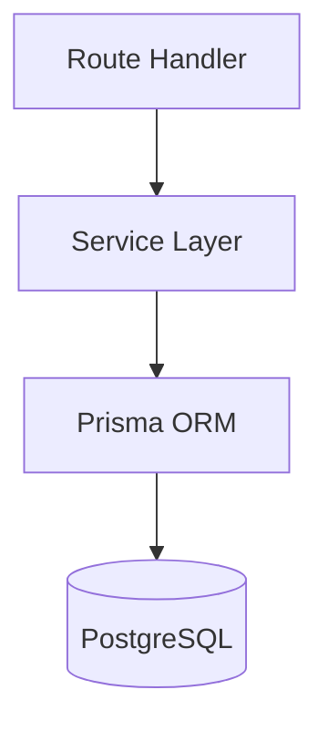

Plan: $ARGUMENTS

## What This Does

This is the ONE command for all planning. It replaces `/architect`, `/full-pipeline`, `/bmad:prd`, `/bmad:architecture`, `/design-doc`, and `/spec` for the planning phase.

## Step 0: Research Gate (Runs Before Routing)

Before choosing a route, check if research is needed. Research IS needed if ANY of:
- Task references a library/framework not yet verified via Context7 this session
- Task involves choosing between 2+ technical options
- Task touches an external API (Stripe, Twilio, Salesforce, Resend, etc.)
- Task is a version upgrade or migration
- User explicitly says "research", "compare", "evaluate", or "what should we use"

**If YES:** Invoke the researcher agent. It returns a Research Brief.
Attach the brief to the planning context before routing.

**If NO:** Proceed directly to routing.

Research adds ~5 minutes but prevents 30+ minutes of wrong-API debugging.

## Step 0.5: Resource Audit (Non-Negotiable)

Before routing, complete the Resource Audit from `rules/consistency.md`:
- If task involves UI: read `~/.claude/skills/design-system/SKILL.md`
- If task is a new project: read the matching stack template from `~/.claude/config/stacks/`
- If task produces a BMAD artifact: read the matching template from `~/.claude/config/bmad/templates/`
- If project has AGENTS.md: read it for project-specific patterns and gotchas

Do NOT proceed to routing until the audit is complete.

## Routing Logic

### Assess Scope from $ARGUMENTS

**Quick Plan (code task, 3-10 files):**
- Use the architect agent (Opus, plan mode)
- Explore codebase, identify affected files, map dependencies
- Output: implementation plan with file-by-file changes
- Time: ~5 minutes

**Feature Spec (new feature, unclear scope):**
- Run /spec workflow: specify → clarify → plan → tasks
- Output: spec + plan + task list in specs/ directory
- Time: ~15 minutes

**Full Pipeline (major feature or new product):**
- Run /full-pipeline: BMAD business layer → spec-kit technical layer → task decomposition
- Output: PRD + architecture + spec + plan + tasks
- Pause after each phase for human review
- Time: ~45 minutes

### How to Decide

Ask yourself (or the user if unclear):
1. "Do we know WHAT to build?" → If no: Full Pipeline
2. "Do we know HOW to build it?" → If no: Feature Spec
3. "Do we just need to figure out WHICH FILES to change?" → Quick Plan

### Shortcuts

If the user provides explicit hints:
- "plan the architecture for..." → Full Pipeline
- "plan how to implement..." → Feature Spec or Quick Plan
- "plan the changes for..." → Quick Plan
- "plan the product for..." → Full Pipeline

## VS Code Integration

### RAG Context (automatic)
If `.claude/mcp.json` is configured with `knowledge-rag`, the researcher agent and planning phases automatically query design docs in `docs/` via MCP. No manual context pasting needed — PRDs, architecture docs, and research briefs are all searchable.

### Mermaid Diagrams in Plans
When generating architecture plans, data flow diagrams, or sequence diagrams, use Mermaid syntax in markdown:
````markdown

````
The `bierner.markdown-mermaid` extension renders these inline in VS Code — the user sees visual diagrams without leaving the editor.

### Plan Review in VS Code
When the Claude Code VS Code extension is active, plans open as editable markdown documents. The user can annotate the plan directly before running `/build`. This is the recommended review workflow:
1. `/plan` generates the plan
2. Plan opens in VS Code editor (editable)
3. User annotates/modifies
4. `/build` reads the annotated plan

### Dependency Exploration
During Quick Plan, suggest using VS Code's built-in **Call Hierarchy** (`Shift+F12`) to trace dependencies before finalizing the affected file list. The `juanallo.vscode-dependency-cruiser` extension can also visualize module import graphs for larger refactors.

### GitHub Context
If the `GitHub.vscode-pull-request-github` extension is signed in, reference related GitHub issues in the plan. The user can see linked issues in the sidebar while reviewing the plan.

## Output

Always end with:
```
## Plan Complete

Approach: {Quick Plan / Feature Spec / Full Pipeline}
Research: {conducted — see brief / not needed}
Artifacts: {list of files created}
Diagrams: {Mermaid diagrams included — preview in VS Code with markdown-mermaid}

Next: Run /build to implement, or review the plan in VS Code first.
      (Tip: Use Call Hierarchy (Shift+F12) to verify dependency assumptions)
```

## Rules
- ALWAYS read existing code before planning (don't plan in a vacuum)
- For Quick Plan: the architect agent does the work, just present its output
- For Feature Spec: run the spec-kit steps, pause for human input at /clarify
- For Full Pipeline: pause after EACH phase for human review
- If scope is ambiguous, default to Feature Spec (middle ground)
- NEVER plan library usage without Context7 verification — the researcher agent handles this
- If the researcher flags Confidence: Low on any finding, pause and ask the user before planning
- ALWAYS use Mermaid for visual diagrams — they render inline in VS Code
- ALWAYS query RAG (knowledge-rag MCP) when design docs exist in docs/ — don't plan without checking existing decisions
