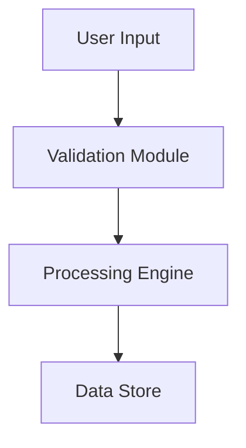

# Design Document Creation Instructions

> **Portable prompt template.** Append to any LLM ask to get a structured, section-by-section design document.
> **Claude Code command:** `/design-doc`

---

## Usage

Append this to your ask:

```
Create a design document for [your feature/system].

[INSERT THESE INSTRUCTIONS BELOW]
```

---

## Instructions

You are tasked with creating a comprehensive design document in Markdown format. This document must be **self-contained**, covering both high-level architecture and low-level implementation details while remaining concise and readable.

### Document Objectives

Create a design document that:
- Serves as the single source of truth for the project's architecture and implementation
- Is readable by both technical and non-technical stakeholders
- Provides sufficient detail for implementation without being bloated with code
- Can be understood by software engineers, product managers, and future developers

---

### Section 1: Introduction & Overview

**Include:**
- Clear project overview: what is being built and why
- Main concepts and terminology
- Core modules and their purposes
- Key business value and objectives

**Format:** Use paragraphs for readability. Avoid bullet-heavy lists.

---

### Section 2: System Architecture

**Include:**
- Overall system architecture and component relationships
- Main business logic flows and sequence of operations
- Visual representations (REQUIRED):
  - Mermaid diagrams (flowcharts, sequence diagrams, component diagrams)
  - OR ASCII diagrams for simpler representations
  - Tables to summarize component responsibilities

**Example:**


---

### Section 3: Data Structures & Core Abstractions

**Include:**
- Primary data structures with their key properties
- Relationships between data entities
- Tables to summarize structure properties

**Format:**
```
Structure: UserProfile
- id: unique identifier
- name: string
- preferences: object containing user settings
- createdAt: timestamp
```

---

### Section 4: Implementation Details

**Include:**
- Module organization and responsibilities
- Folder structure and file organization
- Key classes, functions, or components
- Important interfaces and APIs

**MINIMIZE SOURCE CODE** — show code only for complex or critical business logic. Use placeholders for standard implementations.

**GOOD:**
```javascript
class PaymentProcessor {
  // Handles secure payment transactions
  processPayment(amount, paymentMethod) {
    // ... validation and processing logic
  }
}
```

---

### Section 5: Conventions & Design Patterns

**Include:**
- File and folder naming conventions
- Design patterns being employed
- Error handling approach
- Logging and monitoring conventions

---

### Section 6: Development Milestones

**Critical:**
- Each milestone = ONE working, executable feature
- No time estimates — focus on FUNCTIONALITY
- 3-7 milestones total
- Each milestone has a testable deliverable

**Example:**
```
Milestone 1: Core Data Layer
- Implement database schema and models
- Deliverable: Can CRUD records via CLI/script

Milestone 2: Authentication Module
- User registration and login
- Deliverable: Users can authenticate and maintain sessions
```

---

### Section 7: Project Setup & Tooling

**Include:**
- Package manager to use
- Setup commands
- Required dependencies and why
- Build and run instructions

**ALWAYS use package manager CLI:**
- `npm install <package>` NOT manual package.json editing
- `uv add <package>` NOT manual pyproject.toml editing

---

## Meta-Instructions

### Length & Readability
- Conciseness is desirable — remove redundancy
- Use diagrams to accompany paragraphs where possible
- Self-contained but not exhaustive

### Execution Rules
- Write the document ONE section at a time
- After completing each section, STOP and ask for confirmation
- Only proceed to the next section after approval
- If unsure about any decision, ask a clarifying question before continuing
