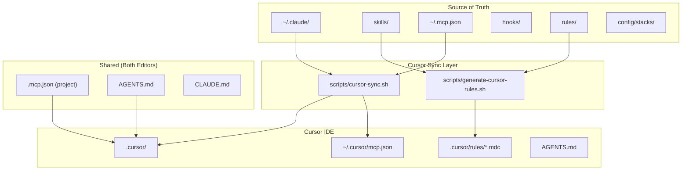
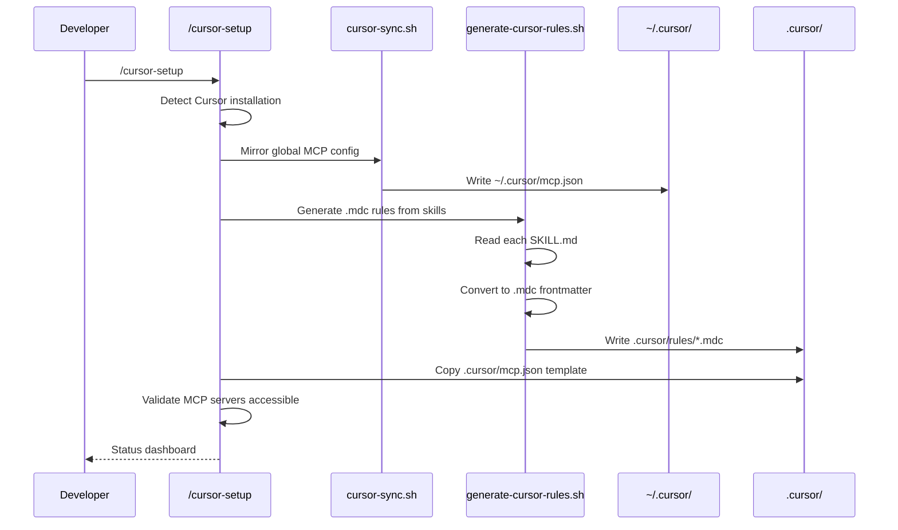
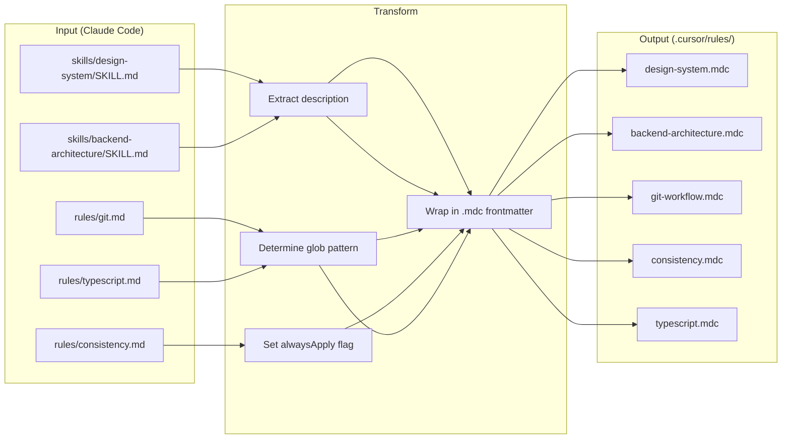
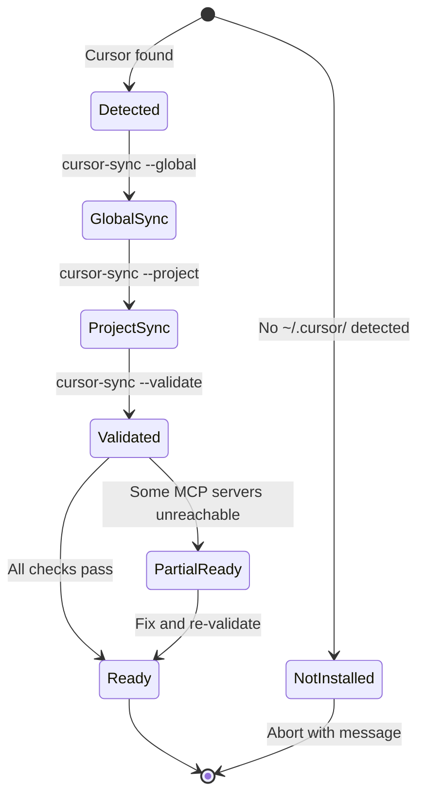

# Design Document: Cursor Integration

**Created:** 2026-03-23
**Status:** Draft
**Brief:** [brief.md](brief.md)
**Research:** [../research-cursor-integration.md](../research-cursor-integration.md)

---

## 1. Introduction

### 1.1 Purpose
This document defines the implementation plan for bridging Claude Code's super setup (skills, hooks, MCP servers, BMAD pipeline, stack templates) into the Cursor IDE. It covers the config sync engine, Cursor project template, `/cursor-setup` skill, and scaffold integration. Intended audience: the implementing developer (Claude Code autonomous pipeline).

### 1.2 Problem Statement
The Claude Code super setup is locked to VS Code. Cursor IDE has emerged as the industry-standard agentic coding platform with unique features (Cloud Agents, Automations, BugBot) that Claude Code cannot replicate alone. Developers who want both tools must maintain two disconnected configurations manually, losing skill enforcement, MCP access, and design system compliance when switching editors.

### 1.3 Solution Overview
A one-way sync layer where Claude Code remains the source of truth. Three deliverables:
1. **`cursor-sync`** — CLI script to mirror MCP configs and generate `.mdc` rules from skills
2. **Cursor template** — Drop-in `.cursor/` directory scaffolded into every new project
3. **`/cursor-setup` skill** — One-command setup + validation

### 1.4 Scope

**In scope:**
- MCP config sync (`~/.mcp.json` → `~/.cursor/mcp.json`)
- `.mdc` rule generation from Claude Code skills
- Cursor project template (`~/.claude/config/cursor-template/`)
- `/cursor-setup` skill
- `/new-project` scaffold integration
- AGENTS.md cross-editor compatibility
- Cursor Automation templates (files only, manual import)

**Out of scope:**
- Bidirectional rule sync
- Cursor Automation API provisioning
- Replacing Claude Code pipelines with Cursor's native agent
- Cursor Team Rules dashboard integration

### 1.5 Key Constraints
- Must not modify existing `~/.claude/` infrastructure
- Both VS Code and Cursor must work simultaneously on same projects
- MCP server format is identical — sync is file-level, not protocol-level
- `.mdc` frontmatter format must match Cursor's schema exactly
- Install script (`install.sh`) must be extended, not replaced

---

## 2. Architecture

### 2.1 System Overview



### 2.2 Sync Flow



### 2.3 File Generation Pipeline



### 2.4 State Diagram: Cursor Setup Lifecycle



---

## 3. Data Structures

### 3.1 MCP Config Format (Shared)

Both tools use the identical JSON structure. No transformation needed — just file copy with path adjustment.

```jsonc
// ~/.cursor/mcp.json (generated from ~/.mcp.json)
{
  "mcpServers": {
    "context7": {
      "command": "npx",
      "args": ["-y", "@upstash/context7-mcp"]
    },
    "sandbox": {
      "command": "uv",
      "args": [
        "run", "--with", "mcp[cli]", "--with", "pydantic",
        "python3", "${userHome}/.claude/mcp-servers/sandbox-server.py"
      ]
    },
    "learning": {
      "command": "uv",
      "args": [
        "run", "--with", "mcp[cli]",
        "python3", "${userHome}/.claude/mcp-servers/learning-server.py"
      ]
    }
  }
}
```

**Key difference:** Cursor supports `${userHome}` variable interpolation while Claude Code uses literal paths. The sync script must convert `/Users/calebmambwe` to `${userHome}` in the Cursor output.

### 3.2 Cursor Rule (.mdc) Format

```markdown
---
description: "Enforces design system tokens for colors, spacing, typography, and component patterns"
alwaysApply: false
globs: ["**/*.tsx", "**/*.jsx", "**/*.css", "**/*.scss"]
---

# Design System Rules

[Content extracted from skills/design-system/SKILL.md]
...
```

**Frontmatter fields:**

| Field | Type | Required | Description |
|-------|------|----------|-------------|
| description | string | Yes | Used by Cursor AI to decide relevance. Must be specific and actionable. |
| alwaysApply | boolean | No | `true` = inject into every chat. `false` = AI decides based on description. |
| globs | string[] | No | File patterns that trigger this rule. Overrides alwaysApply when matched. |

### 3.3 Rule Mapping Table

Defines how each Claude Code skill/rule maps to a Cursor `.mdc` rule:

| Source | Source Path | Output File | alwaysApply | Globs |
|--------|-------------|-------------|-------------|-------|
| Skill | `skills/design-system/SKILL.md` | `design-system.mdc` | false | `["**/*.tsx", "**/*.jsx", "**/*.css"]` |
| Skill | `skills/backend-architecture/SKILL.md` | `backend-architecture.mdc` | false | `["**/*.ts", "**/*.py"]` |
| Skill | `skills/docker/SKILL.md` | `docker.mdc` | false | `["**/Dockerfile*", "**/docker-compose*", "**/.devcontainer/**"]` |
| Rule | `rules/git.md` | `git-workflow.mdc` | true | — |
| Rule | `rules/consistency.md` | `consistency.mdc` | true | — |
| Rule | `rules/typescript.md` | `typescript.mdc` | false | `["**/*.ts", "**/*.tsx"]` |
| Rule | `rules/python.md` | `python.mdc` | false | `["**/*.py"]` |
| Rule | `rules/security.md` | `security.mdc` | true | — |
| Rule | `rules/testing.md` | `testing.mdc` | false | `["**/*.test.*", "**/*.spec.*", "**/tests/**"]` |
| Rule | `rules/api.md` | `api.mdc` | false | `["**/routes/**", "**/api/**", "**/controllers/**"]` |
| Custom | CLAUDE.md (project) | `project-conventions.mdc` | true | — |

### 3.4 Cursor Template Directory Structure

```
~/.claude/config/cursor-template/
  rules/
    design-system.mdc          # From skills/design-system
    backend-architecture.mdc   # From skills/backend-architecture
    docker.mdc                 # From skills/docker
    git-workflow.mdc           # From rules/git.md
    consistency.mdc            # From rules/consistency.md
    typescript.mdc             # From rules/typescript.md
    python.mdc                 # From rules/python.md
    security.mdc               # From rules/security.md
    testing.mdc                # From rules/testing.md
    api.mdc                    # From rules/api.md
  mcp.json                     # Project-level MCP config template
```

### 3.5 Automation Template Format

```yaml
# automations/auto-pr-review.yaml
name: "Auto PR Review"
description: "Runs code review when a GitHub PR is opened"
trigger:
  type: github
  event: pull_request.opened
instructions: |
  Review this pull request for:
  1. Code quality and consistency
  2. Security vulnerabilities (OWASP Top 10)
  3. Test coverage gaps
  4. Design system compliance (if UI changes)
  Use the project's AGENTS.md for context.
mcps:
  - github
  - context7
model: claude-opus-4-6
```

### 3.6 Validation Result Structure

```bash
# Output format of cursor-sync --validate
CURSOR_INTEGRATION_STATUS=(
  "cursor_installed=true"
  "cursor_path=/Applications/Cursor.app"
  "global_mcp_synced=true"
  "mcp_servers_reachable=3/3"
  "project_cursor_dir=true"
  "rules_generated=10"
  "agents_md_compatible=true"
  "claude_code_extension=installed"
)
```

---

## 4. Implementation Details

### 4.1 `scripts/cursor-sync.sh` — Config Sync Engine

**Purpose:** Mirror MCP configs and generate Cursor rules from Claude Code skills/rules.

**Interface:**
```bash
cursor-sync [COMMAND] [OPTIONS]

Commands:
  global        Sync ~/.mcp.json → ~/.cursor/mcp.json
  project       Generate .cursor/ directory for current project
  rules         Generate .mdc rules from skills + rules
  validate      Check all integrations are working
  all           Run global + project + rules + validate

Options:
  --dry-run     Show what would change without writing
  --force       Overwrite existing .cursor/ files
  --verbose     Show detailed output
  --quiet       Only show errors
```

**Core Logic — Global MCP Sync:**
```bash
sync_global_mcp() {
  local src="$HOME/.mcp.json"
  local dst="$HOME/.cursor/mcp.json"

  # Read source, convert absolute home paths to ${userHome}
  local content
  content=$(cat "$src" | sed "s|$HOME|\${userHome}|g")

  mkdir -p "$HOME/.cursor"

  if [[ "$DRY_RUN" == true ]]; then
    echo "[dry-run] Would write $dst"
    return
  fi

  echo "$content" > "$dst"
  echo "[ok] Global MCP config synced to $dst"
}
```

**Core Logic — Rule Generation:**
```bash
generate_rule() {
  local source_file="$1"    # e.g., skills/design-system/SKILL.md
  local output_name="$2"    # e.g., design-system.mdc
  local always_apply="$3"   # true/false
  local globs="$4"          # JSON array string or empty

  local description
  description=$(head -5 "$source_file" | grep -i "description:" | sed 's/.*description:\s*//')

  # If no description in frontmatter, use first non-empty line
  if [[ -z "$description" ]]; then
    description=$(grep -m1 '^[^#-]' "$source_file" | head -c 100)
  fi

  local frontmatter="---\ndescription: \"$description\"\nalwaysApply: $always_apply"
  if [[ -n "$globs" ]]; then
    frontmatter="$frontmatter\nglobs: $globs"
  fi
  frontmatter="$frontmatter\n---\n"

  # Extract content (skip existing frontmatter if present)
  local content
  content=$(awk '/^---$/{if(++c==2)next}c<2{next}1' "$source_file")
  # If no frontmatter found, use full file
  if [[ -z "$content" ]]; then
    content=$(cat "$source_file")
  fi

  echo -e "$frontmatter\n$content" > ".cursor/rules/$output_name"
}
```

**Core Logic — Validation:**
```bash
validate_integration() {
  local errors=0

  # 1. Check Cursor installed
  if ! ls /Applications/Cursor.app &>/dev/null && ! command -v cursor &>/dev/null; then
    echo "[FAIL] Cursor not found"
    ((errors++))
  else
    echo "[OK] Cursor installed"
  fi

  # 2. Check global MCP synced
  if [[ -f "$HOME/.cursor/mcp.json" ]]; then
    echo "[OK] Global MCP config exists"
  else
    echo "[FAIL] Global MCP config missing — run: cursor-sync global"
    ((errors++))
  fi

  # 3. Check MCP servers reachable
  local servers
  servers=$(jq -r '.mcpServers | keys[]' "$HOME/.cursor/mcp.json" 2>/dev/null)
  local total=0 reachable=0
  for server in $servers; do
    ((total++))
    local cmd
    cmd=$(jq -r ".mcpServers.\"$server\".command" "$HOME/.cursor/mcp.json")
    if command -v "$cmd" &>/dev/null; then
      ((reachable++))
    else
      echo "[WARN] MCP server '$server' command not found: $cmd"
    fi
  done
  echo "[OK] MCP servers: $reachable/$total reachable"

  # 4. Check project .cursor/ directory
  if [[ -d ".cursor/rules" ]]; then
    local rule_count
    rule_count=$(ls .cursor/rules/*.mdc 2>/dev/null | wc -l)
    echo "[OK] Project rules: $rule_count .mdc files"
  else
    echo "[WARN] No .cursor/rules/ in current project — run: cursor-sync project"
  fi

  # 5. Check AGENTS.md
  if [[ -f "AGENTS.md" ]]; then
    echo "[OK] AGENTS.md present"
  else
    echo "[WARN] No AGENTS.md — run: /init-agents-md"
  fi

  # 6. Check Claude Code extension
  if ls "$HOME/.cursor/extensions/"*claude* &>/dev/null; then
    echo "[OK] Claude Code extension installed in Cursor"
  else
    echo "[WARN] Claude Code extension not found in Cursor"
  fi

  if [[ $errors -eq 0 ]]; then
    echo ""
    echo "Integration status: READY"
  else
    echo ""
    echo "Integration status: $errors issue(s) found"
  fi
  return $errors
}
```

### 4.2 `/cursor-setup` Skill

**File:** `commands/cursor-setup.md`

```markdown
---
name: cursor-setup
description: "One-command Cursor IDE integration — syncs MCP, generates rules, validates setup"
---

# /cursor-setup

Set up Cursor IDE integration with Claude Code's super setup.

## Steps

1. **Detect Cursor** — Check /Applications/Cursor.app or `cursor` CLI
2. **Sync Global MCP** — Run `cursor-sync global`
3. **Generate Project Rules** — Run `cursor-sync rules`
4. **Create Project .cursor/** — Run `cursor-sync project`
5. **Install Claude Code Extension** — Guide user if not installed
6. **Validate** — Run `cursor-sync validate`
7. **Print Dashboard** — Show integration status

## Usage
```
/cursor-setup              # Full setup
/cursor-setup --validate   # Just check status
/cursor-setup --refresh    # Re-sync rules and MCP
```
```

### 4.3 Scaffold Integration Changes

**Files to modify:**

1. **`install.sh`** — Add `cursor-template` to the modules list, add cursor sync to post-install
2. **`/new-project` command** — After creating `.vscode/`, also create `.cursor/` from template
3. **`/init-agents-md`** — Ensure output includes Cursor-compatible instructions

**install.sh additions:**
```bash
# In the module installation section, add:
install_cursor_template() {
  local src="$REPO_DIR/config/cursor-template"
  local dst="$CLAUDE_DIR/config/cursor-template"

  if [[ -d "$src" ]]; then
    install_module "$src" "$dst" "cursor-template"

    # Also sync global MCP if Cursor is installed
    if ls /Applications/Cursor.app &>/dev/null || command -v cursor &>/dev/null; then
      echo -e "${BLUE}Syncing Cursor MCP config...${NC}"
      bash "$REPO_DIR/scripts/cursor-sync.sh" global --quiet
    fi
  fi
}
```

### 4.4 Automation Templates

Stored in `config/cursor-automations/` as reference files. Users import them manually via cursor.com/automations.

**Template 1: Auto PR Review**
- Trigger: GitHub PR opened
- Action: Review code quality, security, test coverage
- MCPs: github, context7

**Template 2: Ghost Run Dispatch**
- Trigger: Linear issue assigned with label "auto-build"
- Action: Clone repo, implement the issue, create PR
- MCPs: github, linear, context7

**Template 3: Incident Response**
- Trigger: PagerDuty incident
- Action: Investigate logs, find recent changes, propose fix PR
- MCPs: datadog, github, slack

---

## 5. Conventions & Patterns

### 5.1 File/Folder Structure (New Files)

```
claude-super-setup/
  scripts/
    cursor-sync.sh              # NEW: Main sync engine
  commands/
    cursor-setup.md             # NEW: /cursor-setup skill
  config/
    cursor-template/            # NEW: Template directory
      rules/
        design-system.mdc
        backend-architecture.mdc
        docker.mdc
        git-workflow.mdc
        consistency.mdc
        typescript.mdc
        python.mdc
        security.mdc
        testing.mdc
        api.mdc
      mcp.json
    cursor-automations/         # NEW: Automation templates
      auto-pr-review.yaml
      ghost-run-dispatch.yaml
      incident-response.yaml
```

### 5.2 Naming Conventions
- Scripts: `kebab-case.sh` (e.g., `cursor-sync.sh`)
- Rules: `kebab-case.mdc` matching the source skill/rule name
- Automation templates: `kebab-case.yaml`
- Commands: `kebab-case.md` (consistent with existing commands/)

### 5.3 Path Handling
- All paths in Cursor configs use `${userHome}` instead of literal `$HOME`
- All paths in scripts use `$HOME` or `$CLAUDE_DIR` variables
- Never hardcode `/Users/calebmambwe` — always use variables

### 5.4 Idempotency
- `cursor-sync` is idempotent — running it twice produces the same result
- Existing `.cursor/rules/*.mdc` files are overwritten (source of truth is Claude Code)
- User-created rules in `.cursor/rules/` with names not in the mapping table are preserved

### 5.5 Error Handling
- All scripts use `set -euo pipefail`
- Validation failures print actionable fix commands
- Missing Cursor installation is a warning, not an error (user may want to pre-generate configs)

---

## 6. Development Milestones

### Milestone 1: Core Sync Engine
**Deliverable:** `cursor-sync.sh` script with global MCP sync and rule generation

**Definition of Done:**
- [ ] `scripts/cursor-sync.sh` created with `global`, `rules`, `project`, `validate`, `all` subcommands
- [ ] Global MCP sync converts absolute paths to `${userHome}`
- [ ] Rule generation reads all 5 skills + 8 rules from mapping table
- [ ] All 10 `.mdc` files generated with correct frontmatter
- [ ] `--dry-run` flag works for all subcommands
- [ ] `--force` flag overwrites existing files
- [ ] Validation checks all 6 integration points
- [ ] Script is executable and passes shellcheck

**Depends on:** Nothing (start here)

---

### Milestone 2: Cursor Template Directory
**Deliverable:** `~/.claude/config/cursor-template/` with all rule files and MCP config

**Definition of Done:**
- [ ] `config/cursor-template/rules/` contains all 10 `.mdc` files
- [ ] `config/cursor-template/mcp.json` contains project-level MCP template
- [ ] Template uses `${workspaceFolder}` for project-relative paths
- [ ] Template files are valid (parseable by Cursor)
- [ ] Each `.mdc` file has accurate `description`, `alwaysApply`, and `globs`

**Depends on:** Milestone 1 (rule generation logic defines the mapping)

---

### Milestone 3: /cursor-setup Skill
**Deliverable:** One-command setup skill in `commands/cursor-setup.md`

**Definition of Done:**
- [ ] `commands/cursor-setup.md` created with full skill definition
- [ ] Skill calls `cursor-sync all` internally
- [ ] Supports `--validate` and `--refresh` flags
- [ ] Prints formatted status dashboard after setup
- [ ] Guides user through Claude Code extension installation if missing
- [ ] Works on macOS (Cursor in /Applications) and Linux

**Depends on:** Milestones 1 & 2

---

### Milestone 4: Scaffold Integration
**Deliverable:** `/new-project` and `install.sh` updated to include Cursor support

**Definition of Done:**
- [ ] `install.sh` includes `cursor-template` in module list
- [ ] `install.sh` runs `cursor-sync global` post-install if Cursor detected
- [ ] `/new-project` scaffolds `.cursor/` alongside `.vscode/`
- [ ] `/init-agents-md` output is compatible with both editors
- [ ] `--modules=cursor-template` flag works in install.sh
- [ ] Existing VS Code setup is unaffected

**Depends on:** Milestones 2 & 3

---

### Milestone 5: Automation Templates & Docs
**Deliverable:** Automation templates and usage documentation

**Definition of Done:**
- [ ] `config/cursor-automations/` contains 3 YAML templates
- [ ] Each template has name, description, trigger, instructions, MCPs, model
- [ ] `docs/cursor-integration/README.md` with setup guide
- [ ] README includes: prerequisites, quick start, configuration, troubleshooting
- [ ] Feature registry updated with final status

**Depends on:** Milestone 4

---

## 7. Project Setup & Tooling

### 7.1 Prerequisites
- macOS or Linux
- Cursor IDE installed (`/Applications/Cursor.app` or `cursor` CLI)
- Claude Code CLI installed and configured
- `jq` for JSON manipulation
- `shellcheck` for script validation
- Existing `~/.claude/` super setup (via `install.sh`)

### 7.2 Development Quick Start
```bash
cd ~/claude_super_setup

# Test the sync script
bash scripts/cursor-sync.sh all --dry-run

# Run for real
bash scripts/cursor-sync.sh all

# Validate
bash scripts/cursor-sync.sh validate
```

### 7.3 Testing Strategy
```bash
# Shellcheck validation
shellcheck scripts/cursor-sync.sh

# Dry-run produces expected output
bash scripts/cursor-sync.sh all --dry-run 2>&1 | grep -c "[dry-run]"

# Generated .mdc files have valid frontmatter
for f in .cursor/rules/*.mdc; do
  head -1 "$f" | grep -q "^---$" || echo "FAIL: $f missing frontmatter"
done

# Global MCP config is valid JSON
jq . ~/.cursor/mcp.json > /dev/null

# No hardcoded home paths in Cursor configs
grep -r "/Users/" ~/.cursor/mcp.json && echo "FAIL: hardcoded path" || echo "OK"
```

### 7.4 Key Dependencies

| Tool | Purpose | Why |
|------|---------|-----|
| `jq` | JSON parsing/transformation | Standard CLI JSON tool, no npm dependency needed |
| `shellcheck` | Script linting | Catches bash bugs before runtime |
| `sed` | Path transformation | Convert absolute paths to `${userHome}` |
| `awk` | Frontmatter extraction | Parse SKILL.md frontmatter sections |

---

## 8. Risk Assessment

| Risk | Likelihood | Impact | Mitigation |
|------|-----------|--------|------------|
| Cursor changes .mdc format | Low | High | Pin to documented format, add format validation |
| MCP server paths differ between editors | Medium | Medium | Use `${userHome}` interpolation, test both |
| User has custom .cursor/rules | Medium | Low | Only overwrite mapped rules, preserve unknown files |
| Cursor not installed when running sync | High | Low | Graceful warning, pre-generate configs anyway |
| install.sh breaks for non-Cursor users | Medium | High | Guard behind Cursor detection, --modules flag |

---

*Generated by BMAD Method v6 - Technical Lead*
