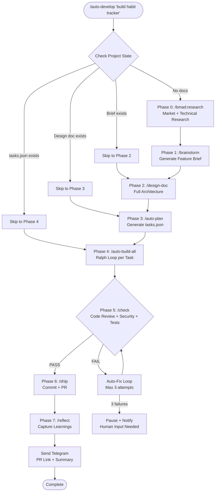
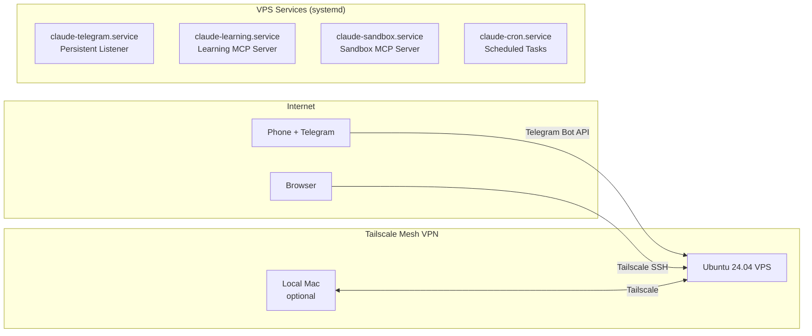

# Design Document: Enterprise Agent Platform

**Created:** 2026-03-24
**Status:** Draft
**Author:** Claude Code (Opus 4.6)
**Brief:** [brief.md](brief.md)
**Research:** [research-enterprise-upgrade.md](../research/research-enterprise-upgrade.md)

---

## 1. Introduction

### 1.1 Purpose

This design document specifies the architecture and implementation plan for upgrading claude-super-setup into a portable, enterprise-grade, always-on AI development and personal assistant platform. It covers 8 pillars: portability, enterprise dev processes, Gemini media, voice input, personal assistant, VS Code integration, Smart Hub dashboard, and a fully autonomous development agent.

### 1.2 Problem Statement

claude-super-setup is powerful (80+ commands, 50+ agents, 12 hooks) but local-only. It dies when the laptop sleeps, can't be reproduced on a new machine, lacks Google-level development rigor, has no voice/media capabilities, and requires manual command chaining. The user manages 5+ active projects and needs an always-on AI brain accessible from phone, VPS, or any computer.

### 1.3 Solution Overview

Extend the existing infrastructure (don't replace) with:
- One-command VPS deployment via `setup-vps.sh` + chezmoi
- Google/Stripe-level process gates embedded in existing commands
- Gemini MCP for media generation, Whisper for voice input
- Proactive assistant behaviors via cron jobs
- `/auto-develop` command that chains the entire SDLC autonomously

### 1.4 Scope

**In scope:** All 8 pillars from the brief (portability, enterprise process, Gemini, voice, assistant, VS Code, Smart Hub, autonomous agent)

**Out of scope:** Multi-model reasoning, OpenClaw, WhatsApp/Discord/Slack, mobile app, real-time voice (Pipecat design only)

### 1.5 Key Constraints

- Must build on existing architecture — extend, don't replace
- Must not break any existing functionality (Ghost Mode, Telegram, overnight.sh)
- VPS must work on Ubuntu 24.04 LTS with Node 22 + Python 3.12
- Solo developer — leverage AI agents for implementation
- Full design doc first, then incremental implementation

---

## 2. System Architecture

### 2.1 System Overview

```mermaid
graph TB
    subgraph Phone["Phone (Telegram)"]
        TG[Telegram App]
        Voice[Voice Notes]
    end

    subgraph VPS["VPS / Local Machine"]
        subgraph Claude["Claude Code Runtime"]
            Listener[Telegram Listener<br/>--channels flag]
            Dispatch[/telegram-dispatch]
            AutoDev[/auto-develop]
            Ghost[Ghost Mode<br/>ghost-watchdog.sh]
        end

        subgraph MCP["MCP Servers"]
            Context7[Context7<br/>Library Docs]
            Learning[Learning Ledger<br/>SQLite]
            Sandbox[Sandbox<br/>Docker]
            Gemini[Gemini MCP<br/>37 tools]
            Gmail[Gmail MCP]
            Calendar[Google Calendar MCP]
        end

        subgraph Services["Background Services"]
            Cron[Cron Jobs<br/>Morning Brief / EOD]
            Whisper[Voice Transcriber<br/>OGG → Whisper API]
            SystemD[systemd<br/>Service Manager]
        end

        subgraph Storage["Persistent State"]
            Queue[(telegram-queue.json)]
            Sessions[(telegram-sessions.json)]
            Tasks[(tasks.json)]
            Config[(ghost-config.json)]
            Ledger[(learning.db)]
            Metrics[(metrics.jsonl)]
        end
    end

    subgraph External["External Services"]
        Anthropic[Anthropic API<br/>Claude Models]
        GeminiAPI[Google Gemini API<br/>Image + Video]
        WhisperAPI[OpenAI Whisper API<br/>Speech-to-Text]
        GitHub[GitHub<br/>PRs + Issues]
        GmailAPI[Gmail API]
        CalAPI[Google Calendar API]
    end

    TG -->|messages| Listener
    Voice -->|OGG files| Whisper
    Whisper -->|text| Listener
    Listener --> Dispatch
    Dispatch -->|spawn screen| Ghost
    Dispatch -->|inline| AutoDev
    AutoDev -->|chains| Ghost

    Claude --> MCP
    Claude --> External
    Cron -->|trigger| Dispatch
    SystemD -->|manages| Listener
    SystemD -->|manages| Learning
    SystemD -->|manages| Sandbox

    Gemini --> GeminiAPI
    Gmail --> GmailAPI
    Calendar --> CalAPI
    Claude --> Anthropic
    Claude --> GitHub
```

### 2.2 Autonomous Development Pipeline



### 2.3 VPS Deployment Architecture



### 2.4 Enterprise Dev Process Flow

```mermaid
stateDiagram-v2
    [*] --> Idea: Raw idea or requirement

    Idea --> PRFAQ: Amazon PR/FAQ Gate
    PRFAQ --> Research: /bmad:research
    Research --> Brief: /brainstorm
    Brief --> DesignDoc: /design-doc

    state DesignDoc {
        [*] --> Goals
        Goals --> Design
        Design --> Alternatives: Alternatives Considered
        Alternatives --> CrossCutting: Cross-Cutting Concerns
        CrossCutting --> Review
        Review --> [*]
    }

    DesignDoc --> Plan: /auto-plan
    Plan --> Build: /auto-build-all

    state Build {
        [*] --> Implement
        Implement --> UnitTest: Small (SMURF)
        UnitTest --> IntegrationTest: Medium (SMURF)
        IntegrationTest --> [*]
    }

    Build --> CodeReview: /check (3-gate)

    state CodeReview {
        [*] --> Correctness: Gate 1: Peer Review
        Correctness --> Ownership: Gate 2: Code Owner
        Ownership --> Readability: Gate 3: Readability
        Readability --> [*]
    }

    CodeReview --> FeatureFlag: Wrap in Flag
    FeatureFlag --> Canary: Staged Rollout
    Canary --> Ship: /ship
    Ship --> Monitor: Observe
    Monitor --> [*]
    Monitor --> PostMortem: If incident
    PostMortem --> [*]
```



---

## 3. Data Structures

### 3.1 Telegram Queue (`~/.claude/telegram-queue.json`)

```typescript
interface TelegramQueue {
  version: 1;
  queue: QueueEntry[];
}

interface QueueEntry {
  id: string;              // UUID v4
  command: string;         // e.g., "ghost", "auto-develop"
  args: string;            // e.g., "build habit tracker"
  chat_id: string;         // Telegram chat ID
  message_id: string;      // Original message ID
  project_dir: string;     // Absolute path
  status: 'pending' | 'running' | 'completed' | 'failed' | 'awaiting_confirm' | 'cancelled';
  enqueued_at: string;     // ISO 8601
  started_at: string | null;
  finished_at: string | null;
  screen_name: string | null;
  log_file: string | null;
  result_sent: boolean;
}
```

### 3.2 Session Registry (`~/.claude/telegram-sessions.json`)

```typescript
interface SessionRegistry {
  sessions: SessionEntry[];
}

interface SessionEntry {
  session_name: string;     // e.g., "dispatch-ghost-20260324-1400"
  screen_name: string;      // screen session name
  command: string;
  args: string;
  chat_id: string;
  project_dir: string;
  started_at: string;       // ISO 8601
  completed_at: string | null;
  exit_code: number | null;
  log_file: string;
}
```

### 3.3 Ghost Config (`~/.claude/ghost-config.json`)

```typescript
interface GhostConfig {
  feature: string;
  trust: 'conservative' | 'balanced' | 'aggressive';
  budget_usd: number;
  max_hours: number;
  max_tasks: number;
  notify_url: string;
  telegram_enabled: string;  // "true" | "false"
  telegram_chat_id: string;
  project_dir: string;
  branch: string;
  started: string;           // ISO 8601
  session_id: string | null;
  pr_url: string | null;
  status: GhostStatus;
}

type GhostStatus =
  | 'starting' | 'running' | `running_attempt_${number}`
  | 'complete' | 'blocked_guardrail' | 'timeout'
  | 'exhausted' | 'budget_exhausted'
  | 'stopped' | 'stopped_emergency';
```

### 3.4 Feature Flags (`~/.claude/feature-flags.json`)

```typescript
interface FeatureFlags {
  version: 1;
  flags: Record<string, FeatureFlag>;
}

interface FeatureFlag {
  name: string;           // kebab-case identifier
  enabled: boolean;       // current state
  description: string;    // what this flag controls
  created_at: string;     // ISO 8601
  rollout_pct: number;    // 0-100 for gradual rollout
  owner: string;          // who created it
  expires_at: string | null; // auto-cleanup date
}
```

### 3.5 Cron Schedule (`~/.claude/cron-schedule.json`)

```typescript
interface CronSchedule {
  version: 1;
  jobs: CronJob[];
}

interface CronJob {
  id: string;              // UUID
  name: string;            // human-readable
  cron_expression: string; // standard cron syntax
  command: string;         // slash command to execute
  args: string;
  chat_id: string;         // Telegram chat for results
  project_dir: string;
  enabled: boolean;
  last_run: string | null;
  next_run: string | null;
  created_at: string;
}
```

### 3.6 MCP Config Template (`config/mcp.json.tmpl`)

```json
{
  "mcpServers": {
    "context7": {
      "command": "npx",
      "args": ["-y", "@upstash/context7-mcp"]
    },
    "learning": {
      "command": "uv",
      "args": ["run", "python3", "{{ .chezmoi.homeDir }}/.claude/mcp-servers/learning-server.py"]
    },
    "sandbox": {
      "command": "uv",
      "args": ["run", "python3", "{{ .chezmoi.homeDir }}/.claude/mcp-servers/sandbox-server.py"]
    },
    "gemini": {
      "command": "npx",
      "args": ["-y", "@rlabs-inc/gemini-mcp"],
      "env": {
        "GEMINI_API_KEY": "{{ .gemini_api_key }}",
        "GEMINI_TOOL_PRESET": "media"
      }
    }
  }
}
```

---

## 4. Implementation Details

### 4.1 Pillar 1: Portable Setup

#### `scripts/setup-vps.sh`

```bash
#!/bin/bash
# Usage: curl -sSL https://raw.githubusercontent.com/Calebmambwe/claude-super-setup/main/scripts/setup-vps.sh | bash
# Or: bash scripts/setup-vps.sh [--dry-run] [--skip-docker] [--skip-tailscale]

# Phase 1: System deps
apt-get update && apt-get install -y git curl jq tmux screen ffmpeg build-essential

# Phase 2: Runtime
curl -o- https://raw.githubusercontent.com/nvm-sh/nvm/v0.40.0/install.sh | bash
nvm install 22 && nvm use 22
curl -LsSf https://astral.sh/uv/install.sh | sh

# Phase 3: Claude Code
npm install -g @anthropic-ai/claude-code

# Phase 4: Auth
echo "Run: claude setup-token (on your local machine)"
echo "Then set: export CLAUDE_CODE_OAUTH_TOKEN=<token>"

# Phase 5: Repos
git clone https://github.com/Calebmambwe/claude-super-setup.git ~/.claude-super-setup
cd ~/.claude-super-setup && bash install.sh --symlink
git clone https://github.com/Calebmambwe/smart-desk.git ~/smart-desk
cd ~/smart-desk && uv sync

# Phase 6: chezmoi (secrets)
sh -c "$(curl -fsLS get.chezmoi.io)" -- init --apply $GITHUB_USERNAME

# Phase 7: systemd services
sudo cp config/systemd/*.service /etc/systemd/system/
sudo systemctl daemon-reload
sudo systemctl enable claude-telegram claude-learning

# Phase 8: Tailscale (optional)
curl -fsSL https://tailscale.com/install.sh | sh
sudo tailscale up

# Phase 9: Health check
bash scripts/inventory-check.sh
```

#### systemd Unit Files

**`config/systemd/claude-telegram.service`**
```ini
[Unit]
Description=Claude Code Telegram Listener
After=network.target

[Service]
Type=simple
User=%i
WorkingDirectory=%h/claude_super_setup
ExecStart=/usr/bin/screen -DmS claude-telegram /usr/local/bin/claude --dangerously-skip-permissions --channels plugin:telegram@claude-plugins-official
ExecStop=/usr/bin/screen -X -S claude-telegram quit
Restart=on-failure
RestartSec=30
Environment=ANTHROPIC_API_KEY=
Environment=HOME=%h

[Install]
WantedBy=multi-user.target
```

**`config/systemd/claude-learning.service`**
```ini
[Unit]
Description=Claude Code Learning MCP Server
After=network.target

[Service]
Type=simple
User=%i
ExecStart=/usr/local/bin/uv run python3 %h/.claude/mcp-servers/learning-server.py
Restart=on-failure
RestartSec=10

[Install]
WantedBy=multi-user.target
```

### 4.2 Pillar 2: Enterprise Dev Process

#### Enhanced Design Doc Template

Add to `~/.claude/config/bmad/templates/architecture.md`:
```markdown
## Alternatives Considered

| Alternative | Pros | Cons | Why Not |
|------------|------|------|---------|
| {Option A} | ... | ... | ... |
| {Option B} | ... | ... | ... |

## Cross-Cutting Concerns

### Security
{How this design handles authentication, authorization, data protection}

### Observability
{Logging, metrics, alerting, tracing strategy}

### Internationalization
{i18n approach, if applicable}

### Performance
{Expected load, bottlenecks, optimization strategy}
```

#### SMURF Test Classification

Add to `/generate-tests` command — tag each test:
```typescript
// @test-size: small (unit, <100ms, no I/O)
// @test-size: medium (integration, <5s, DB/network)
// @test-size: large (E2E, <60s, full system)
```

#### 3-Gate Code Review in `/check`

Enhance the existing parallel check to run 3 gates:
1. **Gate 1 — Correctness** (existing `code-reviewer` agent): logic bugs, edge cases
2. **Gate 2 — Ownership** (new): verify changes are in files the author should modify
3. **Gate 3 — Readability** (new `readability-reviewer` agent): naming, clarity, comments

#### Feature Flag System

Simple JSON-based flags at `~/.claude/feature-flags.json`. New commands:
- `/flag create <name> --description "..."` — create a flag (disabled by default)
- `/flag enable <name>` — enable a flag
- `/flag disable <name>` — disable a flag
- `/flag list` — show all flags
- `/flag cleanup` — remove expired flags

### 4.3 Pillar 3: Gemini Media Integration

#### MCP Setup (one-time)

```bash
# Add to ~/.mcp.json via claude CLI
claude mcp add gemini -s user -- env GEMINI_API_KEY=$GEMINI_API_KEY npx -y @rlabs-inc/gemini-mcp

# Alternative: fal.ai (cheaper video)
claude mcp add --transport http fal-ai https://mcp.fal.ai/mcp --header "Authorization: Bearer $FAL_KEY"
```

#### `/prototype` Command

```markdown
---
name: prototype
description: Generate UI mockup images from a text description using Gemini
---

1. Take the UI description from $ARGUMENTS
2. Call Gemini image generation MCP tool with a detailed prompt
3. Save generated image to `docs/{project}/mockups/`
4. If in Telegram context, send image via reply
5. Ask "Iterate on this mockup? Describe changes."
```

#### `/demo-video` Command

```markdown
---
name: demo-video
description: Generate a short demo video from mockup images using Veo
---

1. Read mockup images from `docs/{project}/mockups/`
2. Generate a video using Veo (first frame = first mockup, last frame = last mockup)
3. Save to `docs/{project}/demos/`
4. If in Telegram context, send video via reply
```

### 4.4 Pillar 4: Voice Brainstorming

#### Voice Message Flow

The Telegram plugin already downloads voice messages as OGG files to `~/.claude/channels/telegram/inbox/`. The enhancement:

1. When a `<channel>` tag has `attachment_kind="voice"`, detect the OGG file
2. Convert OGG to MP3: `ffmpeg -i input.ogg -codec:a libmp3lame output.mp3`
3. Send MP3 to Whisper API: `POST https://api.openai.com/v1/audio/transcriptions`
4. Inject transcription as the message text
5. Process normally (dispatch as command or conversation)

#### `/voice-brief` Command

```markdown
---
name: voice-brief
description: Transcribe voice thoughts into a structured feature brief
---

1. Accept transcribed text (from voice or typed)
2. Use Claude to structure scattered thoughts into:
   - Problem statement
   - Proposed solution
   - Target users
   - Key constraints
3. Write to `docs/{feature-name}/brief.md`
4. Reply with summary
```

### 4.5 Pillar 5: Always-On Personal Assistant

#### Cron Job Definitions

```json
{
  "jobs": [
    {
      "name": "Morning Briefing",
      "cron_expression": "30 7 * * *",
      "command": "morning-brief",
      "args": "",
      "enabled": true
    },
    {
      "name": "End of Day Summary",
      "cron_expression": "0 18 * * *",
      "command": "eod-summary",
      "args": "",
      "enabled": true
    },
    {
      "name": "Weekly Health Report",
      "cron_expression": "0 9 * * 1",
      "command": "weekly-health",
      "args": "",
      "enabled": true
    },
    {
      "name": "PR Review Reminder",
      "cron_expression": "0 */2 * * *",
      "command": "pr-reminder",
      "args": "",
      "enabled": true
    }
  ]
}
```

#### New Commands

- `/morning-brief` — Calendar (next 24h), pending tasks across all projects, overnight ghost run results, unread emails summary
- `/eod-summary` — What was done today (git log), what's blocked, tomorrow's priorities
- `/weekly-health` — All project statuses, learning ledger stats, token usage, task completion rates
- `/pr-reminder` — Open PRs needing review across all repos

### 4.6 Pillar 8: Fully Autonomous Development Agent

#### `/auto-develop` Command

```markdown
---
name: auto-develop
description: Fully autonomous pipeline — raw idea to shipped PR with zero human gates
---

## Process

### Step 1: Parse Arguments
- Feature description (required)
- `--skip-research` — skip market/technical research
- `--skip-design` — skip design doc (go straight to plan)
- `--from-brief <path>` — use existing brief instead of generating
- `--project-dir <path>` — target project (default: cwd)
- `--budget <usd>` — max API spend (default: 50)
- `--telegram` — enable Telegram progress notifications

### Step 2: Detect Project State
Read project directory to determine which phases to skip:
- If `docs/*/brief.md` exists → skip research + brainstorm
- If `docs/*/design-doc.md` exists → skip design
- If `tasks.json` exists with pending tasks → skip plan, go to build
- If all tasks complete → skip build, go to check

### Step 3: Execute Pipeline

Phase 0 (if needed): Run /bmad:research
  → Save to docs/{feature}/research.md
  → Notify: "Research complete. Found N insights."

Phase 1 (if needed): Run /brainstorm
  → Save to docs/{feature}/brief.md
  → Notify: "Brief created: {feature name}"

Phase 2 (if needed): Run /design-doc {feature}
  → Save to docs/{feature}/design-doc.md
  → Notify: "Design doc complete. N milestones planned."

Phase 3: Run /auto-plan
  → Generates tasks.json from design doc
  → Notify: "Plan ready. N tasks across M milestones."

Phase 4: Run /auto-build-all
  → Ralph Loop per task (implement → test → fix)
  → Notify per task: "Task N/M complete: {title}"

Phase 5: Run /check
  → 3-gate review (correctness + ownership + readability)
  → Security audit
  → Test + lint + typecheck
  → If FAIL: auto-fix up to 3 times, then pause

Phase 6: Run /ship
  → Conventional commit + push + PR
  → Notify: "PR created: {url}"

Phase 7: Run /reflect
  → Capture learnings to ledger
  → Notify: "Pipeline complete. N learnings recorded."

### Step 4: Error Handling
- If any phase fails 3 times: stop, notify via Telegram, save state for resume
- Resume with: `/auto-develop --resume` (reads checkpoint)
- All phase outputs saved to disk — pipeline is resumable at any point
```

---

## 5. Conventions & Patterns

### 5.1 File/Folder Structure (New Components)

```
claude_super_setup/
  mcp-servers/                    # NEW: tracked MCP server source
    learning-server.py
    sandbox-server.py
  config/
    systemd/                      # NEW: systemd unit files
      claude-telegram.service
      claude-learning.service
      claude-sandbox.service
    mcp.json.tmpl                 # NEW: chezmoi template for ~/.mcp.json
  scripts/
    setup-vps.sh                  # NEW: VPS bootstrap
  commands/
    auto-develop.md               # NEW: Pillar 8
    prototype.md                  # NEW: Pillar 3
    demo-video.md                 # NEW: Pillar 3
    voice-brief.md                # NEW: Pillar 4
    morning-brief.md              # NEW: Pillar 5
    eod-summary.md                # NEW: Pillar 5
    weekly-health.md              # NEW: Pillar 5
    pr-reminder.md                # NEW: Pillar 5
    flag.md                       # NEW: Pillar 2
    telegram-dispatch.md          # EXISTS (just built)
    telegram-queue.md             # EXISTS (just built)
    telegram-cron.md              # EXISTS (just built)
    telegram-parallel.md          # EXISTS (just built)
```

### 5.2 Command Naming

- Pipeline commands: `auto-*` prefix (auto-develop, auto-plan, auto-build, auto-ship)
- Telegram meta-commands: `telegram-*` prefix
- Personal assistant: descriptive names (morning-brief, eod-summary)
- Enterprise process: action names (flag, prototype, demo-video)

### 5.3 Notification Pattern

All long-running commands follow the same pattern:
1. React with emoji on Telegram (start)
2. Send "Queued/Started" reply
3. Send progress at milestones
4. Send completion with results (new reply, not edit — triggers push notification)
5. On failure: send error + log tail + suggestion

### 5.4 State File Pattern

All state files use JSON with a `version` field for forward compatibility:
```json
{ "version": 1, "data": [...] }
```

Updates use atomic write (write to `.tmp.$$`, then `mv`) to prevent corruption.

### 5.5 Error Handling

- All notification channels fail silently (`|| true`)
- All spawned sessions use `claude -p` (headless, no `--channels`)
- Pipeline phases save checkpoints for resumability
- Max 3 auto-fix attempts before pausing for human input

---

## 6. Development Milestones

### Milestone 1: Portability Foundation
**Deliverable:** One-command VPS deployment + MCP servers tracked in repo

**Definition of Done:**
- [ ] `mcp-servers/learning-server.py` copied into repo and tracked
- [ ] `mcp-servers/sandbox-server.py` copied into repo and tracked
- [ ] `config/mcp.json.tmpl` created with chezmoi template syntax
- [ ] `config/systemd/claude-telegram.service` created
- [ ] `config/systemd/claude-learning.service` created
- [ ] `config/systemd/claude-sandbox.service` created
- [ ] `scripts/setup-vps.sh` created with `--dry-run` mode
- [ ] `install.sh` updated to handle MCP server installation
- [ ] Health check passes after fresh install

**Depends on:** Nothing

---

### Milestone 2: Autonomous Development Agent
**Deliverable:** `/auto-develop` command chains the full SDLC

**Definition of Done:**
- [ ] `commands/auto-develop.md` created with full pipeline logic
- [ ] Phase detection works (skips phases based on existing artifacts)
- [ ] `--skip-research`, `--skip-design`, `--from-brief` flags work
- [ ] Telegram progress notifications at each phase transition
- [ ] Error handling: pauses after 3 failures, saves checkpoint
- [ ] Resume support: `--resume` reads checkpoint and continues
- [ ] End-to-end test: idea → PR in one command

**Depends on:** Milestone 1 (for tracked MCP servers)

---

### Milestone 3: Gemini Media + Voice
**Deliverable:** Image/video generation and voice transcription working

**Definition of Done:**
- [ ] Gemini MCP added to `config/mcp.json.tmpl`
- [ ] `commands/prototype.md` generates UI mockups from description
- [ ] `commands/demo-video.md` generates video from mockups
- [ ] Voice message transcription (OGG → Whisper → text) working
- [ ] `commands/voice-brief.md` structures voice into feature brief
- [ ] fal.ai MCP documented as alternative

**Depends on:** Milestone 1

---

### Milestone 4: Enterprise Process Upgrades
**Deliverable:** Google-level design docs, SMURF testing, 3-gate review, feature flags

**Definition of Done:**
- [ ] Design doc template enhanced (Alternatives + Cross-Cutting)
- [ ] `/generate-tests` tags tests with SMURF size classification
- [ ] `/check` runs 3-gate review (correctness + ownership + readability)
- [ ] `commands/flag.md` manages feature flags (create/enable/disable/list)
- [ ] `/brainstorm` includes optional PR/FAQ step
- [ ] `/post-mortem` uses Google SRE template
- [ ] `/api-spec` includes API review gate

**Depends on:** Nothing (can parallel with Milestone 2-3)

---

### Milestone 5: Personal Assistant
**Deliverable:** Proactive cron jobs + assistant behaviors

**Definition of Done:**
- [ ] `commands/morning-brief.md` — calendar + tasks + overnight results
- [ ] `commands/eod-summary.md` — daily done/blocked/tomorrow
- [ ] `commands/weekly-health.md` — all projects health report
- [ ] `commands/pr-reminder.md` — open PR notifications
- [ ] Cron schedule configured via `/telegram-cron`
- [ ] Gmail triage integrated (summarize unread)
- [ ] Calendar awareness (don't ghost-run during meetings)

**Depends on:** Milestone 1 (VPS for always-on), Milestone 3 (voice)

---

### Milestone 6: VS Code + Smart Hub + Polish
**Deliverable:** Agent Team presets, web dashboard, documentation

**Definition of Done:**
- [ ] Agent Teams presets: `review`, `feature`, `debug` defined in settings
- [ ] Remote Control documented as default startup
- [ ] Smart Hub API endpoints for pipeline/queue/metrics
- [ ] Web dashboard accessible via browser
- [ ] All new commands documented
- [ ] AGENTS.md updated with full architecture
- [ ] README.md updated with new capabilities
- [ ] CI pipeline validates new components

**Depends on:** All previous milestones

---

## 7. Project Setup & Tooling

### 7.1 Prerequisites

- Claude Code CLI (`npm install -g @anthropic-ai/claude-code`)
- Node.js 22 LTS (via nvm)
- Python 3.12+ (via uv)
- jq, screen, tmux, ffmpeg
- Docker (optional, for sandbox)
- Tailscale (optional, for VPS remote access)

### 7.2 Quick Start (Existing Machine)

```bash
cd ~/claude_super_setup
git checkout -b feat/enterprise-agent-platform
# Implementation happens via ghost-run
```

### 7.3 Quick Start (New VPS)

```bash
curl -sSL https://raw.githubusercontent.com/Calebmambwe/claude-super-setup/main/scripts/setup-vps.sh | bash
```

### 7.4 Environment Variables

| Variable | Required | Description |
|----------|----------|-------------|
| `ANTHROPIC_API_KEY` | Yes | Claude API access |
| `CLAUDE_CODE_OAUTH_TOKEN` | VPS only | Headless auth (from `claude setup-token`) |
| `GEMINI_API_KEY` | For Pillar 3 | Google Gemini API |
| `OPENAI_API_KEY` | For Pillar 4 | Whisper transcription |
| `FAL_KEY` | Optional | fal.ai video generation (cheaper alternative) |
| `TELEGRAM_BOT_TOKEN` | For Telegram | Already in `~/.claude/channels/telegram/.env` |

### 7.5 Key Dependencies

| Package | Purpose | Why This One |
|---------|---------|-------------|
| `@rlabs-inc/gemini-mcp` | Gemini integration (37 tools) | Most complete Gemini MCP, actively maintained |
| `chezmoi` | Dotfiles management | Handles templates + encrypted secrets across machines |
| `@upstash/context7-mcp` | Library docs | Already in use, verified reliable |
| `ffmpeg` | Voice message conversion | Standard, available everywhere |

---

## 8. Alternatives Considered

| Decision | Chosen | Alternative | Why Not Alternative |
|----------|--------|-------------|-------------------|
| Dotfiles manager | chezmoi | GNU Stow | Stow can't template paths or encrypt secrets |
| VPS auth | `claude setup-token` | API key only | API key lacks Remote Control capability |
| Gemini integration | RLabs MCP (37 tools) | Direct SDK wrapper | MCP avoids boilerplate, works with all agents |
| Voice STT | Whisper API ($0.006/min) | Deepgram Nova-3 | Simpler for async Telegram voice; Deepgram for real-time later |
| Feature flags | Simple JSON file | LaunchDarkly/Flagsmith | Solo developer — JSON is sufficient, no external service needed |
| Service manager | systemd | pm2 / supervisor | Native Ubuntu, no extra deps |
| Learning storage | SQLite + rsync | PostgreSQL | SQLite is simpler, rsync for backup is sufficient at current scale |
| Session manager | screen (Ghost Mode) | tmux | Ghost Mode already uses screen; standardize later |

---

## 9. Cross-Cutting Concerns

### Security
- API keys encrypted via chezmoi (age encryption) — never in plaintext in repo
- Telegram allowlist (`access.json`) restricts who can send commands
- VPS secured with UFW (SSH + Tailscale only) + fail2ban
- `permissions.deny` blocks destructive commands (rm -rf, sudo, force push)
- Spawned sessions use `--dangerously-skip-permissions` but within Ghost Mode guardrails

### Observability
- All commands log to `~/.claude/logs/`
- Session metrics in `~/.claude/metrics.jsonl`
- Learning ledger tracks corrections and successes
- Ghost Mode notifications at every phase transition
- `/pipeline-status` command shows real-time dashboard

### Portability
- chezmoi templates handle path differences (Mac vs Ubuntu)
- MCP config uses `{{ .chezmoi.homeDir }}` for home directory
- systemd units use `%h` for home directory substitution
- `install.sh` supports both symlink and copy modes

### Reliability
- Ghost Mode has crash recovery (5 attempts, exponential backoff)
- Telegram dispatch runner auto-restarts via screen
- systemd services restart on failure
- Pipeline checkpoints enable resume after crash
- All notification channels fail silently (no blocking)

---

*Generated by BMAD Method v6 - Technical Lead*
*Brief: docs/enterprise-agent-platform/brief.md*
*Research: docs/research/research-enterprise-upgrade.md*
