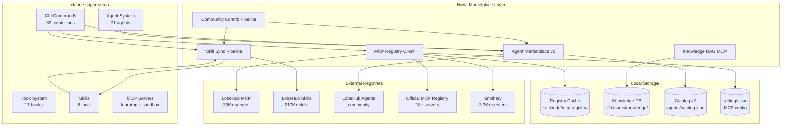
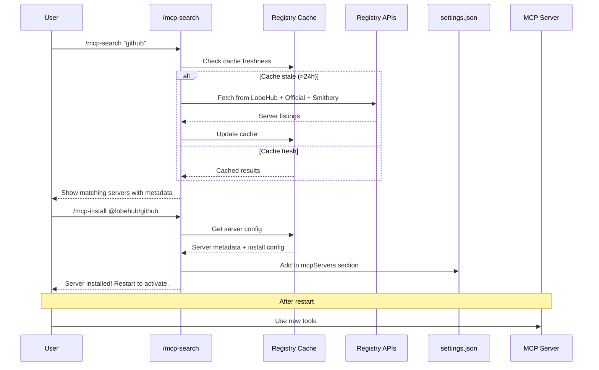
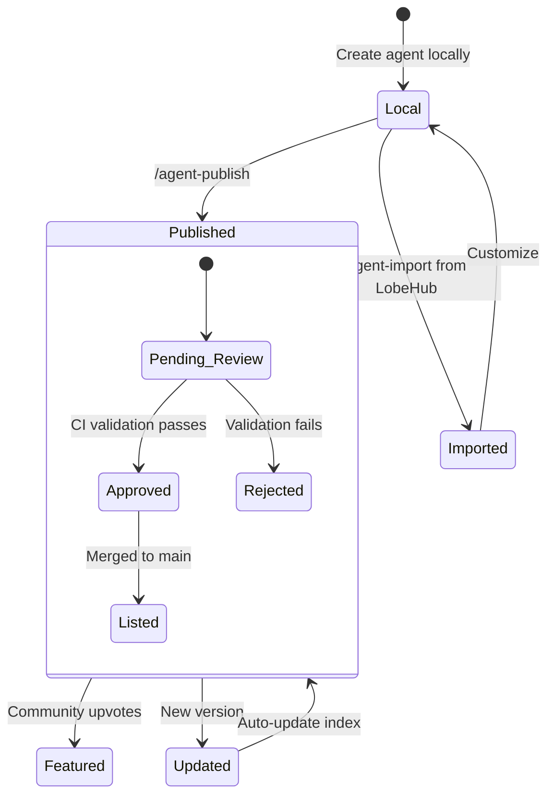
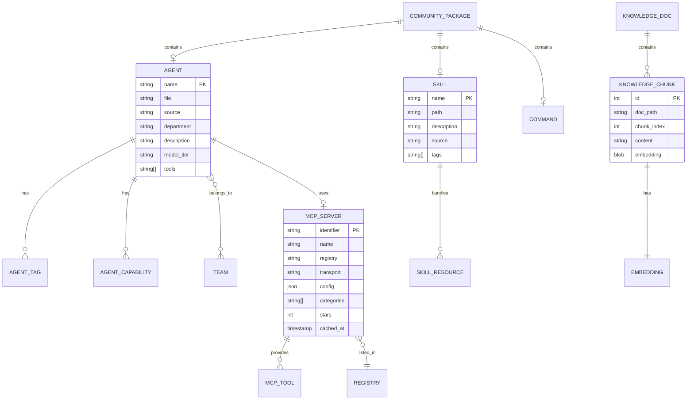

# Design Document: LobeHub Marketplace Integration & Agent Ecosystem

**Date:** 2026-03-26
**Author:** Claude (Technical Lead)
**Status:** Draft
**Input:** [Research Report](./research-lobehub-mcp-ecosystem.md)

---

## 1. Introduction

### 1.1 Purpose

This document defines the implementation-ready design for integrating claude-super-setup with the LobeHub ecosystem and building our own marketplace layer. It covers data structures, APIs, system architecture, and milestones for transforming claude-super-setup from a local CLI framework into a marketplace-connected agent platform.

### 1.2 Problem Statement

claude-super-setup has powerful capabilities (89 commands, 71 agents, 17 hooks, autonomous pipelines) but operates as an isolated system. We cannot:
- Discover or install MCP servers from the 39K+ available in LobeHub and other registries
- Share our agents, skills, or commands with the community
- Consume community-created skills compatible with our SKILL.md format
- Do semantic search across project documentation or codebases
- Enable community contributions to our agent/skill ecosystem

### 1.3 Solution Overview

Build five interconnected subsystems:

1. **MCP Registry Client** — Search, discover, and install MCP servers from multiple registries
2. **Skill Sync Pipeline** — Bidirectional sync of SKILL.md skills with LobeHub's marketplace
3. **Agent Marketplace** — Enhanced catalog with search, install, export, and community contributions
4. **Knowledge RAG MCP Server** — pgvector-backed semantic search for project docs
5. **Community Contribution Pipeline** — GitHub PR workflow for agents, skills, commands, and hooks

### 1.4 Scope

**In scope:**
- MCP registry search/install CLI commands
- Skill import/export with LobeHub format
- Agent catalog v2 with marketplace features
- Knowledge RAG MCP server (local pgvector or SQLite FTS)
- Community contribution templates and validation
- Agent format converter (our MD <-> LobeHub JSON)

**Out of scope:**
- Web-based marketplace UI (future phase)
- Monetization/payment processing
- LobeChat plugin development
- Multi-provider LLM support (we stay Claude-only)
- Desktop application

### 1.5 Key Constraints

- **CLI-first:** All features must work from terminal and Telegram dispatch
- **No new runtime deps for core:** MCP servers can have deps, but commands/agents stay dependency-light
- **Backward compatible:** Existing catalog.json, agent markdown files, and SKILL.md format must continue to work
- **Offline-capable:** Core features work without internet; marketplace features degrade gracefully
- **Python for MCP servers, Shell/Markdown for commands:** Maintain existing language boundaries

### 1.6 Alternatives Considered

#### Decision: MCP Server Storage Format

**Chosen:** JSON registry cache at `~/.claude/mcp-registry/cache.json` + auto-generated settings.json entries

**Why:** Leverages existing Claude Code settings.json MCP configuration. No new runtime, no new database. Cache enables offline browsing.

**Rejected:**
- SQLite database for MCP registry: Over-engineered for a cache of server metadata. settings.json is the actual config source.
- Direct API calls without cache: Too slow for search/browse UX, fails offline.

**Revisit if:** Registry grows beyond 100K entries (cache file too large), or we need full-text search across server descriptions.

#### Decision: Knowledge Base Backend

**Chosen:** SQLite + sqlite-vss (vector search extension) for local semantic search

**Why:** Zero infrastructure requirement. Works on Mac and Linux. No PostgreSQL dependency. sqlite-vss provides pgvector-equivalent capabilities in a single file. Fits our "everything is a file" philosophy.

**Rejected:**
- PostgreSQL + pgvector: Requires running a database server. Too heavy for a CLI tool's knowledge feature.
- ChromaDB: Additional Python dependency, less mature, harder to debug.
- Plain text search (ripgrep): Already have this. Semantic search is the gap we're filling.

**Revisit if:** Embedding quality from local models is insufficient, or project sizes exceed SQLite limits (~280TB theoretical).

#### Decision: Agent Format for Marketplace

**Chosen:** Keep Markdown as primary, build JSON export adapter for LobeHub compatibility

**Why:** Our Markdown agents are richer (tools, capabilities, teams, model tiers) than LobeHub's JSON. Export loses some fidelity but enables marketplace publishing. Import enriches LobeHub JSON with our metadata.

**Rejected:**
- Switch to JSON-only: Would lose the human-readable, version-control-friendly Markdown format that powers our agent system.
- Dual-format maintenance: Keeping both in sync is error-prone. Single source of truth (MD) with generated export is cleaner.

**Revisit if:** LobeHub's JSON format adds fields that can't be derived from our Markdown, or community demands native JSON agents.

#### Decision: Community Contribution Model

**Chosen:** GitHub PR-based with validation scripts + auto-indexing CI

**Why:** Mirrors LobeHub's proven model. Uses existing GitHub infrastructure. PR review ensures quality. CI auto-generates index files.

**Rejected:**
- NPM/PyPI package-based: Too heavyweight for agent definitions (mostly text files).
- Git submodules for community agents: Painful to manage, version conflicts.

**Revisit if:** Contribution volume exceeds what PR review can handle (>50 PRs/week), requiring automated approval.

---

## 2. System Architecture Diagrams

### 2.1 System Overview



### 2.2 MCP Server Install Flow



### 2.3 Skill Sync Flow

```mermaid
flowchart LR
    subgraph "Export (Publish)"
        LS[Local SKILL.md] --> Conv1[Converter]
        Conv1 --> LHFormat[LobeHub Format]
        LHFormat --> PR1[GitHub PR to<br/>lobe-chat-agents]
    end

    subgraph "Import (Consume)"
        LHMarket[LobeHub<br/>Skills Market] --> Search[npx skills find]
        Search --> Conv2[Converter]
        Conv2 --> Install[~/.claude/skills/<br/>imported/]
    end

    subgraph "Bidirectional Sync"
        SyncCmd[/skill-sync] --> Export
        SyncCmd --> Import
    end
```

### 2.4 Knowledge RAG Pipeline

```mermaid
flowchart TD
    subgraph "Ingestion"
        Docs[Project Docs<br/>*.md, *.txt] --> Parse[File Parser]
        Code[Source Code<br/>*.ts, *.py] --> Parse
        Parse --> Chunk[Text Chunker<br/>512 tokens/chunk]
        Chunk --> Embed[Embedding<br/>local model]
        Embed --> Store[(SQLite + vss<br/>~/.claude/knowledge/)]
    end

    subgraph "Query"
        Query[User Query] --> QEmbed[Query Embedding]
        QEmbed --> VSearch[Vector Search<br/>top-k=10]
        VSearch --> Store
        Store --> Results[Relevant Chunks]
        Results --> Context[Augmented Context]
    end
```

### 2.5 Agent Marketplace State Machine



### 2.6 Entity Relationship Diagram



---

## 3. Data Structures

### 3.1 MCP Registry Cache Entry

**Purpose:** Cached metadata for discovered MCP servers across all registries

**File:** `~/.claude/mcp-registry/cache.json`

```typescript
interface MCPRegistryCache {
  version: "1.0.0";
  last_updated: string;          // ISO 8601
  registries: {
    [registryId: string]: {
      name: string;              // "lobehub", "official", "smithery"
      url: string;               // API base URL
      last_fetched: string;      // ISO 8601
      server_count: number;
    };
  };
  servers: MCPServerEntry[];
}

interface MCPServerEntry {
  identifier: string;            // unique ID across registries
  name: string;                  // display name
  description: string;           // what it does
  author: string;                // creator
  registry: string;              // which registry
  registry_url: string;          // link to registry page
  transport: "stdio" | "http" | "https";
  categories: string[];          // ["development", "github"]
  tags: string[];                // more granular tags
  stars: number;                 // popularity signal
  install_config: MCPInstallConfig;
  last_updated: string;          // when server was last updated
  cached_at: string;             // when we cached this
}

interface MCPInstallConfig {
  // For stdio transport
  command?: string;              // "npx", "uvx", "node"
  args?: string[];               // ["-y", "@lobehub/github-mcp"]
  // For http transport
  url?: string;                  // "https://mcp.example.com"
  // Common
  env?: Record<string, string>;  // required env vars (names only, not values)
  env_descriptions?: Record<string, string>; // descriptions for each env var
}
```

**Validation:** JSON Schema at `schemas/mcp-registry-cache.schema.json`

### 3.2 Agent Catalog v2

**Purpose:** Enhanced agent registry with marketplace metadata

**File:** `agents/catalog.json` (extends existing schema)

```typescript
interface AgentCatalogV2 {
  $schema: string;
  version: "2.0.0";              // bumped from 1.0.0
  model_tiers: Record<string, ModelTier>;
  teams: Record<string, TeamDefinition>;
  agents: AgentEntryV2[];
  // NEW in v2
  marketplace: {
    last_sync: string;           // ISO 8601
    remote_count: number;        // total agents in remote registries
    local_count: number;         // our agents
    imported_count: number;      // imported from external
  };
}

interface AgentEntryV2 {
  // Existing fields (backward compatible)
  name: string;
  file: string;
  source: "core" | "community" | "project" | "imported"; // added "imported"
  department: string;
  description: string;
  model_tier: "haiku" | "sonnet" | "opus" | "custom";
  capabilities: string[];
  tools?: string[];
  teams?: string[];
  // NEW in v2
  source_repo?: string;          // GitHub URL if community/imported
  lobehub_id?: string;           // LobeHub marketplace identifier
  version?: string;              // semver for tracking updates
  author?: string;               // creator attribution
  tags?: string[];               // search/filter tags
  downloads?: number;            // popularity signal
  rating?: number;               // 0-5 community rating
  last_updated?: string;         // ISO 8601
  install_method?: "local" | "git" | "lobehub" | "url";
}
```

**Migration:** v1 -> v2 is additive. All new fields are optional. Existing agents gain `version: "1.0.0"` and `install_method: "local"` defaults.

### 3.3 Skill Registry Entry

**Purpose:** Track installed and available skills with sync metadata

**File:** `~/.claude/skill-registry.json`

```typescript
interface SkillRegistry {
  version: "1.0.0";
  installed: SkillEntry[];
  available_remote: number;      // count from LobeHub
  last_sync: string;             // ISO 8601
}

interface SkillEntry {
  name: string;                  // SKILL.md frontmatter name
  path: string;                  // local path
  description: string;
  source: "local" | "lobehub" | "github";
  source_url?: string;           // where it came from
  version?: string;
  tags?: string[];
  installed_at: string;          // ISO 8601
  updated_at?: string;
}
```

### 3.4 Knowledge Base Schema

**Purpose:** SQLite schema for document chunks and embeddings

**Database:** `~/.claude/knowledge/{project-hash}.db`

```sql
-- Documents ingested into the knowledge base
CREATE TABLE documents (
    id INTEGER PRIMARY KEY AUTOINCREMENT,
    file_path TEXT NOT NULL UNIQUE,
    file_hash TEXT NOT NULL,           -- SHA-256 for change detection
    file_type TEXT NOT NULL,           -- "markdown", "python", "typescript"
    title TEXT,                        -- extracted or filename
    chunk_count INTEGER DEFAULT 0,
    ingested_at TEXT NOT NULL,         -- ISO 8601
    updated_at TEXT                    -- ISO 8601
);

-- Text chunks with optional embeddings
CREATE TABLE chunks (
    id INTEGER PRIMARY KEY AUTOINCREMENT,
    document_id INTEGER NOT NULL REFERENCES documents(id) ON DELETE CASCADE,
    chunk_index INTEGER NOT NULL,      -- order within document
    content TEXT NOT NULL,             -- the text chunk
    token_count INTEGER NOT NULL,      -- approximate token count
    embedding BLOB,                    -- vector embedding (float32 array)
    created_at TEXT NOT NULL           -- ISO 8601
);

-- Full-text search index (fallback when embeddings unavailable)
CREATE VIRTUAL TABLE chunks_fts USING fts5(content, content='chunks', content_rowid='id');

-- Triggers to keep FTS in sync
CREATE TRIGGER chunks_ai AFTER INSERT ON chunks BEGIN
    INSERT INTO chunks_fts(rowid, content) VALUES (new.id, new.content);
END;

CREATE TRIGGER chunks_ad AFTER DELETE ON chunks BEGIN
    INSERT INTO chunks_fts(chunks_fts, rowid, content) VALUES ('delete', old.id, old.content);
END;

-- Indexes
CREATE INDEX idx_chunks_document ON chunks(document_id);
CREATE INDEX idx_documents_path ON documents(file_path);
```

**Vector Search:** If sqlite-vss is available, add:
```sql
CREATE VIRTUAL TABLE chunks_vss USING vss0(embedding(384));
-- 384 dimensions for all-MiniLM-L6-v2 or similar small model
```

**Fallback:** If sqlite-vss is not available, use FTS5 full-text search only (still useful).

### 3.5 Community Package Manifest

**Purpose:** Defines a community contribution package

**File:** `package.yaml` in PR submissions

```yaml
# Community Package Manifest
name: "my-awesome-agent"
version: "1.0.0"
type: "agent"                    # agent | skill | command | hook | team
author: "contributor-name"
description: "One-line description"
homepage: "https://github.com/..."
license: "MIT"

# What's included
artifacts:
  - path: "agents/community/my-agent.md"
    type: "agent"
  - path: "skills/my-skill/SKILL.md"
    type: "skill"

# Requirements
requires:
  claude_super_setup: ">=1.0.0"
  mcp_servers: ["learning-server"]  # optional dependencies

# Metadata
tags: ["development", "testing", "CI"]
categories: ["engineering"]
model_tier: "sonnet"              # recommended model

# Testing
test_command: "bash tests/test-my-agent.sh"
```

---

## 4. Implementation Details

### 4.1 MCP Registry Client

#### `/mcp-search` Command

**Purpose:** Search MCP servers across multiple registries

**File:** `commands/mcp-search.md`

**Behavior:**
1. Check cache freshness (`~/.claude/mcp-registry/cache.json`)
2. If stale (>24h) or missing, fetch from registries in parallel
3. Search cached entries by query (name, description, tags, categories)
4. Display results with: name, description, registry, transport, stars, install status

**Search Algorithm:**
```
score = 0
if query in server.name (case-insensitive): score += 10
if query in server.tags: score += 5
if query in server.categories: score += 3
if query in server.description: score += 1
sort by (score DESC, stars DESC)
return top 20
```

**Output Format:**
```
MCP Server Search: "github"

 # | Name                  | Registry  | Transport | Stars | Status
---|----------------------|-----------|-----------|-------|--------
 1 | @lobehub/github      | lobehub   | stdio     | 1.2K  | installed
 2 | github-mcp-server    | official  | stdio     | 890   | available
 3 | gh-notifications     | smithery  | http      | 234   | available

Install: /mcp-install <name-or-number>
```

#### `/mcp-install` Command

**Purpose:** Install an MCP server from a registry

**File:** `commands/mcp-install.md`

**Behavior:**
1. Resolve server from cache by name/identifier
2. Check if already installed in settings.json
3. Prompt for required environment variables
4. Generate settings.json entry with correct transport config
5. Add to settings.json (merge, don't overwrite)
6. Validate by checking if command/binary exists
7. Report success and note restart requirement

**settings.json integration:**
```json
{
  "mcpServers": {
    "github": {
      "command": "npx",
      "args": ["-y", "@lobehub/github-mcp"],
      "env": {
        "GITHUB_TOKEN": "${GITHUB_TOKEN}"
      }
    }
  }
}
```

#### `/mcp-list` Command

**Purpose:** List installed MCP servers and their status

#### `/mcp-remove` Command

**Purpose:** Remove an MCP server from settings.json

#### Registry Fetch Script

**File:** `scripts/mcp-registry-fetch.py`

**Registries to fetch from:**

| Registry | API Endpoint | Format |
|----------|-------------|--------|
| Official MCP Registry | `https://registry.modelcontextprotocol.io/api/v0/servers` | JSON API |
| LobeHub MCP Index | `https://chat-mcp.lobehub.com/index.json` (estimated) | JSON index |
| Smithery | `https://smithery.ai/api/servers` (estimated) | JSON API |

**Fetch Strategy:**
- Parallel HTTP requests to all registries
- Normalize to common `MCPServerEntry` format
- Deduplicate by identifier
- Cache locally with TTL metadata
- Fail gracefully per-registry (one failure shouldn't block others)

### 4.2 Skill Sync Pipeline

#### `/skill-import` Command

**Purpose:** Import a skill from LobeHub or GitHub

**Behavior:**
1. Accept identifier: LobeHub skill ID, GitHub URL, or search query
2. If search query, use `npx skills find <query>` under the hood
3. Download SKILL.md + bundled resources
4. Install to `~/.claude/skills/imported/<skill-name>/`
5. Update skill registry
6. Report success

#### `/skill-export` Command

**Purpose:** Prepare a local skill for publishing to LobeHub

**Behavior:**
1. Read local SKILL.md
2. Validate required frontmatter (name, description)
3. Add LobeHub-compatible metadata (tags, categories)
4. Generate a PR-ready directory structure
5. Optionally create GitHub PR to lobe-chat-agents repo

#### `/skill-search` Command

**Purpose:** Search for skills across local and remote sources

**Behavior:**
1. Search local installed skills
2. Search LobeHub skills marketplace (via API or `npx skills find`)
3. Display merged results with source indicator

### 4.3 Agent Marketplace Commands

#### `/agent-search` Command

**Purpose:** Search for agents in local catalog and remote registries

#### `/agent-import` Command

**Purpose:** Import an agent from LobeHub into local format

**Conversion (LobeHub JSON -> Our Markdown):**
```
LobeHub JSON                    →  Our Markdown
─────────────                      ─────────────
meta.title                      →  # {title} (H1 heading)
meta.description                →  YAML frontmatter: description
config.systemRole               →  Main body content
meta.tags                       →  YAML frontmatter: tags
config.model                    →  YAML frontmatter: model_tier (mapped)
config.params                   →  Appended as config section
plugins                         →  YAML frontmatter: tools
author                          →  YAML frontmatter: author
```

#### `/agent-export` Command

**Purpose:** Export our Markdown agent to LobeHub JSON format

**Conversion (Our Markdown -> LobeHub JSON):**
```
Our Markdown                    →  LobeHub JSON
─────────────                      ─────────────
YAML frontmatter.name           →  identifier + meta.title
Body content (system prompt)    →  config.systemRole
frontmatter.model_tier          →  config.model (mapped to provider model)
frontmatter.tools               →  plugins
frontmatter.description         →  meta.description
frontmatter.tags                →  meta.tags
```

#### `/agent-publish` Command

**Purpose:** Publish an agent to the community

**Behavior:**
1. Validate agent markdown against schema
2. Generate LobeHub JSON export
3. Create community package manifest
4. Fork/clone lobe-chat-agents repo
5. Create PR with agent + metadata
6. Report PR URL

### 4.4 Knowledge RAG MCP Server

**File:** `mcp-servers/knowledge-rag-server.py`

**MCP Tools Exposed:**

| Tool | Description |
|------|-------------|
| `knowledge_ingest` | Ingest files/directories into the knowledge base |
| `knowledge_search` | Semantic search across ingested documents |
| `knowledge_status` | Show knowledge base statistics |
| `knowledge_clear` | Clear knowledge base for a project |

#### `knowledge_ingest` Tool

**Parameters:**
- `path`: File or directory to ingest
- `project_dir`: Project root (determines which DB to use)
- `file_types`: Optional filter (default: `["md", "txt", "py", "ts", "tsx", "js", "json"]`)
- `force`: Re-ingest even if file hash unchanged

**Algorithm:**
1. Hash project_dir to determine database file
2. Walk directory, filter by file_types
3. For each file:
   a. Compute SHA-256 hash
   b. Skip if hash matches existing document
   c. Parse file content (strip code comments for source files)
   d. Chunk into ~512 token segments with 50-token overlap
   e. Generate embeddings (if model available) or just store text
   f. Insert into documents + chunks tables
4. Update FTS index
5. Return ingestion stats

**Chunking Strategy:**
- Markdown: Split on `##` headings, then by paragraphs, then by sentences
- Source code: Split on function/class boundaries, then by logical blocks
- Max chunk size: 512 tokens
- Overlap: 50 tokens between consecutive chunks

#### `knowledge_search` Tool

**Parameters:**
- `query`: Search query text
- `project_dir`: Project root
- `top_k`: Number of results (default: 5)
- `file_type`: Optional filter

**Algorithm:**
1. If embeddings available: embed query, vector search via sqlite-vss
2. Fallback: FTS5 full-text search with BM25 ranking
3. Return top_k chunks with: file_path, chunk content, relevance score

#### Embedding Strategy

**Primary:** Use local model via `sentence-transformers` if installed
- Model: `all-MiniLM-L6-v2` (384 dimensions, fast, small)
- Install: `uv pip install sentence-transformers`

**Fallback:** FTS5 only (still useful, just not semantic)

**Future:** Optional Claude API embeddings via `voyage-3-lite` for higher quality

### 4.5 Community Contribution Pipeline

#### Contribution Workflow

1. **Contributor** creates agent/skill/command following templates
2. **Contributor** runs `/community-validate` to check format
3. **Contributor** creates PR to `lobehub/lobe-chat-agents` (for agents) or our repo
4. **CI** runs validation (schema check, lint, test)
5. **CI** auto-generates index entry
6. **Maintainer** reviews and merges
7. **CI** publishes to marketplace index

#### `/community-validate` Command

**Purpose:** Validate a contribution before PR submission

**Checks:**
- [ ] Markdown frontmatter matches schema
- [ ] Required fields present (name, description, model_tier)
- [ ] No duplicate identifier in catalog
- [ ] System prompt is non-empty and reasonable length
- [ ] Tags are from approved list or flagged for review
- [ ] File naming convention matches (kebab-case.md)
- [ ] Package manifest (if present) is valid YAML

#### PR Templates

**File:** `.github/PULL_REQUEST_TEMPLATE/agent-submission.md`

```markdown
## Agent Submission

**Agent Name:**
**Category:**
**Description:**

### Checklist
- [ ] Agent follows naming convention (kebab-case.md)
- [ ] Frontmatter includes all required fields
- [ ] System prompt is well-written and tested
- [ ] Tags are relevant and accurate
- [ ] Tested with at least 3 conversation turns
- [ ] No sensitive data in system prompt
```

#### CI Validation Script

**File:** `scripts/validate-contribution.sh`

**Runs on PR:**
1. Parse frontmatter with `yq` or Python
2. Validate against JSON Schema
3. Check for duplicate names
4. Lint markdown
5. If agent: test that system prompt parses correctly
6. If skill: test that SKILL.md frontmatter is valid
7. Auto-generate updated index.json entry

---

## 5. Conventions & Patterns

### 5.1 File/Folder Structure (New Additions)

```
claude-super-setup/
  commands/
    mcp-search.md            # NEW
    mcp-install.md           # NEW
    mcp-list.md              # NEW
    mcp-remove.md            # NEW
    skill-import.md          # NEW
    skill-export.md          # NEW
    skill-search.md          # NEW
    agent-search.md          # NEW
    agent-import.md          # NEW
    agent-export.md          # NEW
    agent-publish.md         # NEW
    community-validate.md    # NEW
    knowledge-ingest.md      # NEW
    knowledge-search.md      # NEW
  mcp-servers/
    learning-server.py       # existing
    sandbox-server.py        # existing
    knowledge-rag-server.py  # NEW
  scripts/
    mcp-registry-fetch.py    # NEW
    agent-converter.py       # NEW — MD <-> JSON converter
    validate-contribution.sh # NEW
    skill-sync.sh            # NEW
  schemas/
    catalog.schema.json      # UPDATED to v2
    mcp-registry-cache.schema.json  # NEW
    skill-registry.schema.json      # NEW
    community-package.schema.json   # NEW
  docs/lobehub-marketplace/
    research-lobehub-mcp-ecosystem.md  # existing
    design-doc.md            # this file
```

### 5.2 Naming Conventions

- **Commands:** `kebab-case.md` with verb-noun pattern (e.g., `mcp-search.md`, `agent-import.md`)
- **MCP servers:** `kebab-case-server.py` (e.g., `knowledge-rag-server.py`)
- **Scripts:** `kebab-case.py` or `kebab-case.sh` depending on language
- **Schemas:** `kebab-case.schema.json`
- **Registry identifiers:** `@registry/server-name` pattern (e.g., `@lobehub/github`)

### 5.3 Error Handling Pattern

All new commands follow this pattern:
```markdown
## Error Handling
- Network failures: Show cached results with "offline mode" indicator
- Missing dependencies: Clear message with install instructions
- Invalid input: Show usage help with examples
- Registry API changes: Graceful degradation to cached data
```

### 5.4 Cache Management

- **MCP Registry cache:** TTL 24 hours, refreshable via `--fresh` flag
- **Skill registry:** Updated on install/remove, synced on `skill-search`
- **Knowledge DB:** Per-project, auto-updated on file changes (hash-based)

---

## 5B. Cross-Cutting Concerns

### 5B.1 Security

- **MCP server trust:** Display registry verification status, warn on unverified servers
- **Environment variables:** Never store actual values in cache; use `${VAR}` placeholders
- **Community contributions:** All PRs require review; automated schema validation catches malformed content
- **Knowledge base:** Local-only by default; no data leaves the machine unless explicitly synced
- **Input sanitization:** All search queries sanitized before passing to APIs or SQLite

### 5B.2 Observability

- **Logging:** All new scripts use Python `logging` module (not print)
- **Metrics:** `/metrics` command tracks: MCP installs, skill imports, knowledge queries, agent exports
- **Telemetry hook:** Existing `telemetry.sh` extended to track marketplace interactions

### 5B.3 Error Handling

- **Error taxonomy:**
  - Network errors: retry once, then fall back to cache
  - Schema validation errors: report clearly with field-level messages
  - Missing dependency errors: provide exact install command
  - Registry API errors: per-registry failure isolation
- **Error response format:** All commands output errors as: `Error: [category] description\nFix: suggested action`

### 5B.4 Testing Strategy

- **Unit tests:** Python tests for converter, fetcher, RAG server (pytest)
- **Integration tests:** Shell tests for commands (test real MCP install/search flow)
- **Validation tests:** Schema validation against sample agents/skills
- **Coverage target:** 80%+ for Python code, smoke tests for all commands

### 5B.5 Deployment & Operations

- **Install:** All new components install via existing `install.sh` (updated)
- **Dependencies:** knowledge-rag-server requires `uv pip install sentence-transformers sqlite-vss` (optional)
- **Compatibility:** Mac + Linux (VPS). sqlite-vss may need binary for ARM Mac.
- **Rollback:** git revert on agent catalog changes; MCP server removal via `/mcp-remove`

### 5B.6 Performance

- **Registry cache:** Entire cache loads in <100ms (JSON file ~5MB max)
- **Knowledge search:** sqlite-vss query <50ms for 100K chunks
- **Skill sync:** Parallel fetch, <5s for full sync
- **Agent conversion:** <100ms per agent (text processing only)

---

## 6. Development Milestones

### Milestone 1: MCP Registry Client

**Deliverable:** Users can search, install, list, and remove MCP servers from multiple registries

**Definition of Done:**
- [ ] `scripts/mcp-registry-fetch.py` fetches from 3 registries (LobeHub, Official, Smithery)
- [ ] `~/.claude/mcp-registry/cache.json` populated with normalized server entries
- [ ] `schemas/mcp-registry-cache.schema.json` created and validates cache
- [ ] `commands/mcp-search.md` shows search results with metadata
- [ ] `commands/mcp-install.md` adds server to settings.json correctly
- [ ] `commands/mcp-list.md` shows installed servers and their source
- [ ] `commands/mcp-remove.md` removes server from settings.json
- [ ] Offline mode works (shows cached results when network unavailable)
- [ ] Tests pass for fetch, search, install, remove

**Depends on:** Nothing

---

### Milestone 2: Agent Marketplace v2

**Deliverable:** Enhanced agent catalog with search, import/export, and LobeHub compatibility

**Definition of Done:**
- [ ] `schemas/catalog.schema.json` updated to v2 (backward compatible)
- [ ] `agents/catalog.json` migrated to v2 format
- [ ] `scripts/agent-converter.py` converts MD <-> LobeHub JSON
- [ ] `commands/agent-search.md` searches local + remote agents
- [ ] `commands/agent-import.md` imports LobeHub agents to local MD format
- [ ] `commands/agent-export.md` exports local agents to LobeHub JSON
- [ ] Agent converter has tests for both directions
- [ ] Existing agent functionality unaffected (backward compat verified)

**Depends on:** Nothing (parallel with Milestone 1)

---

### Milestone 3: Skill Sync Pipeline

**Deliverable:** Users can import skills from LobeHub and export local skills

**Definition of Done:**
- [ ] `~/.claude/skill-registry.json` tracks installed skills with source
- [ ] `schemas/skill-registry.schema.json` created
- [ ] `commands/skill-import.md` installs skills from LobeHub/GitHub
- [ ] `commands/skill-export.md` prepares skills for publishing
- [ ] `commands/skill-search.md` searches local + remote skills
- [ ] Imported skills work correctly with Claude Code
- [ ] Export produces valid LobeHub-compatible format

**Depends on:** Nothing (parallel with Milestones 1-2)

---

### Milestone 4: Knowledge RAG MCP Server

**Deliverable:** Semantic search over project documentation and code

**Definition of Done:**
- [ ] `mcp-servers/knowledge-rag-server.py` implements 4 MCP tools
- [ ] SQLite database created per-project with documents + chunks tables
- [ ] FTS5 full-text search works as baseline
- [ ] sqlite-vss vector search works when available
- [ ] `commands/knowledge-ingest.md` triggers ingestion
- [ ] `commands/knowledge-search.md` queries the knowledge base
- [ ] Chunking handles Markdown and source code correctly
- [ ] Change detection skips unchanged files (hash-based)
- [ ] Tests cover ingestion, search, and edge cases

**Depends on:** Nothing (parallel with Milestones 1-3)

---

### Milestone 5: Community Contribution Pipeline

**Deliverable:** Contributors can submit, validate, and publish agents/skills

**Definition of Done:**
- [ ] `schemas/community-package.schema.json` defines package manifest
- [ ] `commands/community-validate.md` validates contributions locally
- [ ] PR template for agent/skill submissions created
- [ ] `scripts/validate-contribution.sh` runs in CI
- [ ] Auto-index generation on merge
- [ ] CONTRIBUTING.md updated with marketplace submission guide
- [ ] At least one example community contribution tested end-to-end

**Depends on:** Milestones 2 + 3 (needs catalog v2 and skill registry)

---

### Milestone 6: Integration & Polish

**Deliverable:** All subsystems working together, docs updated, tests green

**Definition of Done:**
- [ ] `install.sh` updated to install new components
- [ ] All new commands accessible via Telegram dispatch
- [ ] `/dashboard` shows marketplace stats
- [ ] `AGENTS.md` updated with new patterns/gotchas
- [ ] `README.md` updated with marketplace features
- [ ] All tests passing (unit + integration)
- [ ] Existing functionality verified (regression check)
- [ ] Performance benchmarks meet targets

**Depends on:** All previous milestones

---

## 7. Project Setup & Tooling

### 7.1 Prerequisites

- Python >= 3.12 (for MCP servers and scripts)
- `uv` (Python package manager)
- `jq` (JSON processing in shell)
- `yq` (YAML processing, optional)
- Node.js >= 22 (for `npx skills` CLI)
- SQLite >= 3.40 (with FTS5 support)

### 7.2 Optional Dependencies

| Package | Purpose | Install Command |
|---------|---------|----------------|
| `sentence-transformers` | Embedding generation for RAG | `uv pip install sentence-transformers` |
| `sqlite-vss` | Vector similarity search | `uv pip install sqlite-vss` |
| `mcp` | MCP SDK for server development | `uv pip install mcp` |

### 7.3 New Environment Variables

| Variable | Required | Description | Example |
|----------|----------|-------------|---------|
| `MCP_REGISTRY_CACHE_TTL` | No | Cache TTL in hours (default: 24) | `48` |
| `KNOWLEDGE_EMBEDDING_MODEL` | No | Embedding model name | `all-MiniLM-L6-v2` |
| `KNOWLEDGE_CHUNK_SIZE` | No | Tokens per chunk (default: 512) | `256` |
| `LOBEHUB_API_URL` | No | LobeHub API base URL | `https://chat-mcp.lobehub.com` |

### 7.4 New Scripts

| Script | Description |
|--------|-------------|
| `scripts/mcp-registry-fetch.py` | Fetch and normalize MCP server listings from registries |
| `scripts/agent-converter.py` | Convert agents between our MD format and LobeHub JSON |
| `scripts/validate-contribution.sh` | Validate community contributions against schemas |
| `scripts/skill-sync.sh` | Sync skills between local and LobeHub |

### 7.5 Verification Commands

After implementation, run:
```bash
# Python tests
cd mcp-servers && pytest -v && cd ..

# Schema validation
python3 scripts/validate-contribution.sh --check-all

# Integration smoke test
/mcp-search github          # should return results
/mcp-list                    # should show installed servers
/skill-search "testing"      # should search local + remote
/knowledge-ingest .          # should ingest current project
/knowledge-search "how does" # should return relevant chunks
```

---

## Summary

This design document covers 5 interconnected subsystems across 6 milestones:

| Subsystem | Commands | Scripts | Schemas | MCP Tools |
|-----------|----------|---------|---------|-----------|
| MCP Registry Client | 4 | 1 | 1 | 0 |
| Agent Marketplace v2 | 4 | 1 | 1 (update) | 0 |
| Skill Sync Pipeline | 3 | 1 | 1 | 0 |
| Knowledge RAG | 2 | 0 | 0 | 4 (1 server) |
| Community Pipeline | 1 | 1 | 1 | 0 |
| **Total** | **14 commands** | **4 scripts** | **4 schemas** | **4 MCP tools** |

**Architecture Diagrams:** 6 Mermaid diagrams (system overview, request flow, skill sync, RAG pipeline, state machine, ER diagram)

**Milestones 1-4 can run in parallel.** Milestone 5 depends on 2+3. Milestone 6 depends on all.

---

*Generated by BMAD Method v6 - Technical Lead*
*Design Duration: ~45 minutes*
*Based on: [Research Report](./research-lobehub-mcp-ecosystem.md)*
