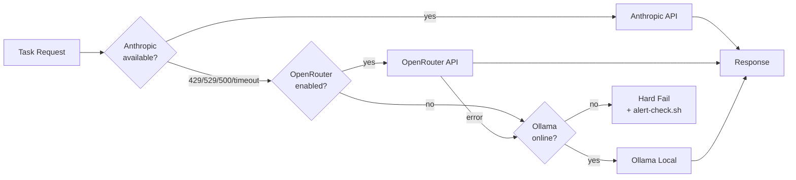
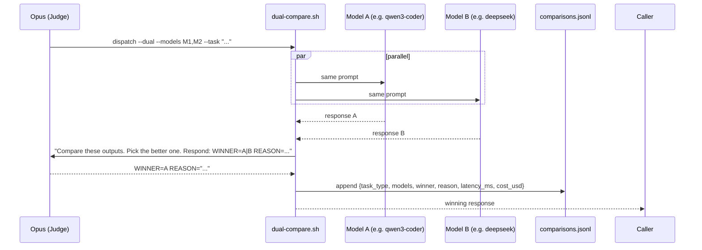

# Design Document: Multi-Model Orchestration

**Feature:** `multi-model-orchestration`
**Status:** Design Complete — Ready for M1 implementation
**Author:** Architecture Planner Agent
**Date:** 2026-03-26

---

## Overview

Extend the existing Claude Code pipeline to dispatch subtasks to optimal models via OpenRouter while keeping Opus 4.6 as the sole orchestrator and judge. The system is implemented entirely as shell scripts and Claude Code command skills — no separate service or daemon required. The foundational routing config (`config/model-routing.json`) and OpenRouter benchmark script (`scripts/openrouter-benchmark.sh`) already exist; this design builds the active dispatch layer on top of them.

---

## System Architecture

```mermaid
flowchart TD
    subgraph Orchestrator["Orchestrator Layer (Opus 4.6 — NEVER replaced)"]
        OPS[Opus Brain]
        CLASSIFY[Task Classifier\ntask-route.sh]
        JUDGE[Auto-Judge\ncommands/judge.md]
    end

    subgraph Dispatch["Dispatch Layer"]
        ROUTER[Model Router\nscripts/model-router.sh]
        COMPARE[Dual Comparator\nscripts/dual-compare.sh]
        REGISTRY[Model Registry\nconfig/model-routing.json]
    end

    subgraph Clients["Provider Clients"]
        ORC[OpenRouter Client\nscripts/openrouter-client.sh]
        ANT[Anthropic\nexisting]
        OLL[Ollama\nexisting]
    end

    subgraph Specialized["Specialized Capabilities"]
        VOICE[Voice Transcription\nscripts/transcribe-voice.sh\n(already exists)]
        IMG[Image Generation\nGemini MCP\n(already exists)]
        EMB[Embeddings\nscripts/embed.sh]
    end

    subgraph Observability["Observability"]
        COSTLOG[Cost Logger\nhooks/cost-tracker.sh]
        DASH[Dashboard\ncommands/dashboard.md\n(add model section)]
        COMPLOG[~/.claude/logs/comparisons.jsonl]
    end

    OPS --> CLASSIFY
    CLASSIFY --> ROUTER
    ROUTER --> REGISTRY
    ROUTER --> ORC
    ROUTER --> ANT
    ROUTER --> OLL
    ROUTER --> SPECIALIZED

    OPS --> JUDGE
    JUDGE --> COMPARE
    COMPARE --> ORC

    ORC --> COSTLOG
    COSTLOG --> DASH
    COMPARE --> COMPLOG
```

---

## Fallback Chain



Fallback triggers are already defined in `config/model-routing.json` (`fallback_policy`). The router script reads them — no duplication.

---

## Dual-Model Comparison Flow



---

## Non-Functional Requirements

- **Latency:** Single-model dispatch must add <200ms overhead over direct API call (auth + routing logic). Dual-model mode is opt-in and inherently 2x latency — acceptable.
- **Reliability:** Fallback chain must achieve 99%+ task completion even when any single provider is down. Zero pipeline failures from model routing.
- **Cost:** Cost logged per request to `~/.claude/logs/model-costs.jsonl` (already the designated file). Hard limit: $50 total enforced by existing `cost_tracking` config.
- **Security:** OpenRouter API key sourced from `~/.claude/.env.local` only. Never logged, never interpolated into output. All user-supplied arguments passed through `jq --arg` or `shlex.quote` equivalent (per AGENTS.md gotcha).
- **Compatibility:** All scripts must run on Linux VPS (bash 4+, curl, jq). No macOS-only calls (`caffeinate`, `osascript` guards already exist in codebase — follow same pattern).
- **Observability:** Every model call appends a structured JSON line to `model-costs.jsonl`. Comparison results go to `comparisons.jsonl`. Both files are already sourced by `/dashboard`.

---

## Files to Change (Dependency Order)

### Milestone 1: OpenRouter Client + Active Routing

| # | File | Change | Type |
|---|------|---------|------|
| 1 | `config/model-routing.json` | Add `specialized` task types: `voice`, `image`, `embedding`. Add `dual_mode` toggle. Add `openrouter.env_key` field pointing to `~/.claude/.env.local`. | Modify |
| 2 | `schemas/model-routing.schema.json` | Create JSON Schema for the routing config (referenced by `$comment` in existing file but not yet created). Validates provider structure, task types, fallback policy. | Create |
| 3 | `scripts/openrouter-client.sh` | Create unified OpenRouter API caller. Auth, retries (3x with exponential backoff), streaming flag, error normalization, per-request cost logging. Extracted and generalized from existing `openrouter-benchmark.sh` pattern. | Create |
| 4 | `scripts/model-router.sh` | Create task-type router. Reads `config/model-routing.json`, accepts `--task-type` and `--prompt` args, resolves provider+model, calls correct client (openrouter-client.sh / Anthropic via `claude -p` / Ollama), implements fallback chain. | Create |
| 5 | `hooks/cost-tracker.sh` | Create PostToolUse hook that intercepts model-dispatch tool calls and appends `{ts, model, task_type, input_tokens, output_tokens, cost_usd, provider}` to `~/.claude/logs/model-costs.jsonl`. | Create |
| 6 | `tests/integration/model-routing.bats` | Integration tests: routing config validation, fallback trigger simulation, cost log format assertion. | Create |

### Milestone 2: Dual-Model Comparator + Auto-Judge

| # | File | Change | Type |
|---|------|---------|------|
| 7 | `scripts/dual-compare.sh` | Create parallel dual-model dispatcher. Accepts `--models M1,M2`, `--task-type`, `--prompt`. Spawns two background `model-router.sh` calls, waits for both, calls Opus as judge via `claude -p`, logs to `comparisons.jsonl`. | Create |
| 8 | `commands/judge.md` | Create `/judge` skill. Opus receives two outputs and a structured rubric. Returns `WINNER=A\|B` + one-line reason. Called internally by `dual-compare.sh`. | Create |
| 9 | `commands/compare.md` | Create `/compare` user-facing skill. Wraps `dual-compare.sh`. Accepts `--dual` flag and task description. Callable from any pipeline or Telegram dispatch. | Create |
| 10 | `~/.claude/logs/comparisons.jsonl` | Log file created on first use. Schema: `{ts, task_type, prompt_hash, model_a, model_b, winner, reason, latency_a_ms, latency_b_ms, cost_a_usd, cost_b_usd}`. | Runtime artifact |
| 11 | `commands/dashboard.md` | Add "Model Usage" section: per-provider cost breakdown, dual-mode win rates, top models by task type. Sources `model-costs.jsonl` and `comparisons.jsonl`. | Modify |
| 12 | `tests/integration/dual-compare.bats` | Tests: parallel dispatch timing, judge output parsing, log format, fallback when one model errors. | Create |

### Milestone 3: Specialized Models + Pipeline Integration

| # | File | Change | Type |
|---|------|---------|------|
| 13 | `scripts/transcribe-voice.sh` | Already exists with Gemini/Whisper support. Verify it logs cost to `model-costs.jsonl`. Add cost-logging call if missing. | Modify (minor) |
| 14 | `scripts/embed.sh` | Create embeddings dispatcher. Routes to OpenRouter embedding model or Ollama `nomic-embed-text`. Returns JSON array of floats. Integrates with `knowledge-rag` MCP drop-in. | Create |
| 15 | `config/model-routing.json` | Add `embedding` model entries for OpenRouter (`text-embedding-3-small` via OpenAI compat layer) and Ollama (`nomic-embed-text`). | Modify |
| 16 | `commands/auto-dev.md` | Add `--dual` flag support: when passed, wraps implementation subtasks in `dual-compare.sh` calls for high-stakes coding tasks. | Modify |
| 17 | `commands/ghost.md` | Add model routing awareness: ghost mode reads `model-routing.json` to decide whether to use cheaper OpenRouter models for `implementation` task types. | Modify |
| 18 | `commands/build.md` | Add `--model` flag to allow explicit model override for a single build run. Default behavior unchanged. | Modify |
| 19 | `hooks/telegram-dispatch-runner.sh` | Ensure `OPENROUTER_API_KEY` is exported from `~/.claude/.env.local` before spawning dispatch screen sessions. | Modify (2 lines) |
| 20 | `AGENTS.md` | Add section: "Multi-Model Routing" with key gotchas discovered during implementation. | Modify |
| 21 | `docs/FEATURES.md` | Update `multi-model-orchestration` row to "Done" status. | Modify |
| 22 | `tests/integration/specialized-models.bats` | Tests: embed.sh output format, transcribe-voice.sh cost logging, pipeline --dual flag wiring. | Create |

---

## Data Model Changes

### config/model-routing.json additions

```jsonc
// Add to "providers.openrouter.models":
"embedding": "openai/text-embedding-3-small",
"voice": "openai/whisper-1",

// Add top-level block:
"specialized": {
  "voice": {
    "primary": "scripts/transcribe-voice.sh",   // existing script
    "notes": "Gemini free primary, Whisper fallback — handled internally"
  },
  "image": {
    "primary": "gemini-mcp:imagen3",             // existing MCP tool
    "notes": "Via @rlabs-inc/gemini-mcp, setup-gemini-mcp.sh required"
  },
  "embedding": {
    "primary": "openrouter:embedding",
    "fallback": "ollama:nomic-embed-text"
  }
},

"dual_mode": {
  "enabled": false,
  "default_models": ["openrouter:code", "openrouter:general"],
  "judge": "anthropic:opus",
  "log_file": "~/.claude/logs/comparisons.jsonl"
}
```

### New log schemas

`~/.claude/logs/model-costs.jsonl` (already exists, add fields):
```jsonc
{
  "ts": "2026-03-26T10:00:00Z",
  "session_id": "abc123",
  "task_type": "implementation",
  "provider": "openrouter",
  "model": "qwen/qwen3-coder",
  "input_tokens": 1200,
  "output_tokens": 340,
  "cost_usd": 0.00019,
  "latency_ms": 2100,
  "fallback_from": null      // or "anthropic" if this was a fallback
}
```

`~/.claude/logs/comparisons.jsonl` (new):
```jsonc
{
  "ts": "2026-03-26T10:01:00Z",
  "task_type": "implementation",
  "prompt_hash": "sha256:abcd...",   // sha256 of prompt, not the prompt itself
  "model_a": "qwen/qwen3-coder",
  "model_b": "deepseek/deepseek-chat-v3-0324",
  "winner": "A",
  "reason": "Output A had correct typing and handled edge case",
  "latency_a_ms": 2100,
  "latency_b_ms": 3900,
  "cost_a_usd": 0.00019,
  "cost_b_usd": 0.00014
}
```

---

## API Contract: openrouter-client.sh

The client is the single point of contact for all OpenRouter calls. Its interface is the internal "contract" other scripts depend on.

```
USAGE:
  scripts/openrouter-client.sh [OPTIONS]

OPTIONS:
  --model       <model-id>       Required. OpenRouter model identifier
  --prompt      <text>           Required (or --prompt-file)
  --prompt-file <path>           Alternative to --prompt
  --task-type   <type>           Optional. Used for cost log tagging
  --stream                       Stream response to stdout (default: false)
  --max-tokens  <n>              Default: 4096
  --temperature <f>              Default: 0.2
  --timeout     <s>              Default: 30
  --retries     <n>              Default: 3
  --dry-run                      Print curl command, do not execute

EXIT CODES:
  0  Success — response written to stdout
  1  Auth error (bad/missing API key)
  2  Model error (invalid model, quota exceeded)
  3  Network error (timeout, unreachable) — after all retries
  4  Rate limit (HTTP 429) — caller should trigger fallback

SIDE EFFECTS:
  Appends one JSON line to ~/.claude/logs/model-costs.jsonl on every call
  (even on error, with cost_usd: 0 and error field set)

ENVIRONMENT:
  OPENROUTER_API_KEY   Required. Sourced from ~/.claude/.env.local
```

---

## model-router.sh Interface

```
USAGE:
  scripts/model-router.sh [OPTIONS]

OPTIONS:
  --task-type   <type>     Required. One of: planning, implementation, review,
                           testing, triage, embedding, voice, image
  --prompt      <text>     Required (or --prompt-file)
  --prompt-file <path>     Alternative to --prompt
  --provider    <name>     Override: anthropic | openrouter | ollama
  --model       <id>       Override specific model (skips routing logic)
  --offline                Force Ollama only (equiv to CLAUDE_OFFLINE=1)

RESOLUTION ORDER:
  1. Explicit --provider/--model flags
  2. CLAUDE_OFFLINE=1 env var → ollama
  3. config/model-routing.json primary for task-type
  4. Fallback chain on provider error

EXIT CODES: same as openrouter-client.sh + 5 = all providers failed
```

---

## dual-compare.sh Interface

```
USAGE:
  scripts/dual-compare.sh [OPTIONS]

OPTIONS:
  --models      <M1,M2>    Comma-separated model pair. Default from
                           model-routing.json dual_mode.default_models
  --task-type   <type>     Passed through to model-router.sh
  --prompt      <text>     Required
  --no-judge               Return both outputs without Opus judging
                           (for manual review)

OUTPUT:
  stdout: winning model's response
  stderr: judge decision summary ("WINNER=A (qwen3-coder) REASON=...")

SIDE EFFECTS:
  Appends one line to ~/.claude/logs/comparisons.jsonl
  Appends two lines to ~/.claude/logs/model-costs.jsonl
```

---

## Frontend Architecture (Dashboard Extension)

The `/dashboard` command is a Claude skill (Markdown file), not a rendered UI. The model section adds a new data source read at Step 1 and a new display block at Step 4.

**Rendering strategy:** Not applicable — this is a terminal text output skill.

**New dashboard section** (added after existing "System Health" block):

```
║  🤖 Model Routing (24h)                              ║
║  ├─ Anthropic:   34 calls  $1.23                      ║
║  ├─ OpenRouter:  89 calls  $0.18 (qwen3: 71)          ║
║  ├─ Ollama:       6 calls  $0.00 (offline fallback)    ║
║  ├─ Fallbacks:    3 events (all recovered)             ║
║  └─ Dual wins:  12 total — qwen3: 8, deepseek: 4      ║
```

**Data sources:** `~/.claude/logs/model-costs.jsonl` and `~/.claude/logs/comparisons.jsonl` — both already in the dashboard's designated source list from AGENTS.md Sprint 6.

---

## Test Strategy

### Unit-level (per script)
- `openrouter-client.sh`: mock curl with a test double that returns fixture JSON. Test auth header injection, retry logic on exit codes 3+4, cost log format, dry-run mode.
- `model-router.sh`: mock both openrouter-client.sh and ollama curl calls. Test routing resolution for each task type, fallback trigger for each exit code, offline mode.
- `dual-compare.sh`: mock model-router.sh. Test parallel execution (both background jobs complete), judge prompt construction, winner parsing, log schema.

### Integration (bats test files, following existing `tests/integration/` pattern)
- `model-routing.bats`: reads real `config/model-routing.json`, validates all task types have valid provider references, validates fallback chain is complete.
- `dual-compare.bats`: runs against real OpenRouter with a low-token test prompt (cost < $0.001). Verifies both models return, Opus judges, log entry written.
- `specialized-models.bats`: verifies `embed.sh` returns a float array, `transcribe-voice.sh` logs cost after a test audio file.

### Edge cases to cover
- OpenRouter returns HTTP 200 with `{"error": {...}}` body (their error format differs from HTTP errors)
- Both models in dual mode fail — should hard-fail with clear error, not return empty string
- `comparisons.jsonl` prompt_hash must be the SHA256 of the prompt, never the raw prompt (prevents PII in logs)
- Ollama `pull_on_first_use: true` — router must handle the pull delay gracefully (extended timeout on first call)
- `OPENROUTER_API_KEY` missing — fail with exit code 1 and message pointing to `~/.claude/.env.local`, never silently use empty string

---

## Risk Areas

| Risk | Likelihood | Impact | Mitigation |
|------|-----------|--------|------------|
| OpenRouter free models return 429/empty mid-pipeline | High | Medium | Free models already flagged as unreliable in brief. Fallback chain handles it. Never use free models as primary for anything non-triage. |
| Dual-mode Opus judge picks inconsistently | Medium | Low | Judge prompt uses structured rubric (correctness > readability > brevity). Log reason always. Win-rate stats in dashboard reveal drift. |
| Cost log grows unbounded | Low | Low | Rotate at 10MB — follow existing `hooks/telemetry.sh` rotate pattern (already at 10MB threshold). |
| `comparisons.jsonl` captures sensitive prompt content | Low | High | Use `sha256sum` of prompt as key, never log prompt text. |
| Telegram dispatch runner doesn't export `OPENROUTER_API_KEY` | High | High | Explicit env source added in M1 to `telegram-dispatch-runner.sh`. Integration test verifies. |
| `model-router.sh` called from pipeline without task-type set | Medium | Medium | `--task-type` is required; script exits 1 with usage message if missing. |

---

## Trade-offs

**Shell scripts vs. TypeScript module**
Chose shell scripts over a TypeScript library. Why: the entire existing toolchain (hooks, dispatch runner, ghost mode) is bash. A TypeScript module would require a build step or Bun runtime assumption, adding a dependency not present in all execution contexts (screen sessions, cron jobs). Cost: shell scripts are harder to unit-test rigorously. Mitigation: bats test framework is already used for integration tests in this codebase.

**Prompt stored as hash vs. full prompt in comparisons log**
Chose SHA256 hash only. Why: prompts frequently contain user code, file contents, or personal project details — logging them creates a PII/IP concern in a flat JSON file. Cost: can't replay a comparison without the original prompt. Acceptable because the purpose of the log is win-rate analysis, not replay.

**Dual-mode is opt-in, not default**
Chose opt-in (`--dual` flag, or `dual_mode.enabled: false` in config). Why: dual mode doubles API calls and latency. Making it default would silently 2x costs and slow every pipeline run. Cost: lower discovery of model quality differences. Mitigation: `/benchmark` command already provides structured quality data; dual mode is for targeted A/B validation of new task types.

**Opus as judge vs. heuristic scoring**
Chose Opus as judge. Why: code quality rubrics are context-dependent — a heuristic (line count, lint passes) misses semantic correctness. Opus already has full context of the task. Cost: judge call adds ~$0.01 per comparison. Acceptable given this is opt-in.

**Voice/image stay as wrappers over existing scripts/MCP**
`transcribe-voice.sh` already exists with Gemini/Whisper routing. Gemini MCP already provides image generation. Rather than re-implementing these under a unified `model-router.sh` interface (which would require audio/binary file handling in bash), they remain as direct calls. `model-routing.json` documents them in the `specialized` block for discovery, but routing scripts don't proxy them. This is the right call for M3 — revisit if a unified interface becomes necessary after 3+ callers need it (anti-abstraction rule).

---

## Load / Capacity Reasoning

Single-model dispatch adds 1 shell subprocess invocation + 1 `jq` parse + 1 `curl` call over what a direct API call would do. Overhead is dominated by network RTT to OpenRouter (~50-150ms from VPS). The bash overhead is negligible (<5ms).

At peak Ghost Mode usage (auto-build-all with 3 parallel agents), maximum concurrent OpenRouter calls = 3. OpenRouter's rate limits are per-API-key at the model level. qwen3-coder's free tier has known instability (noted in brief) — paid tier handles burst easily. No connection pooling needed at this call volume.

Cost log appends are synchronous but tiny (~200 bytes/line). At 100 calls/day the log reaches 20KB/day — well under the 10MB rotation threshold that `telemetry.sh` already enforces.

---

## Milestone Breakdown

### M1 — OpenRouter Client + Active Routing (Sprint 1)
**Goal:** Any pipeline can route a task to OpenRouter instead of Anthropic via `model-router.sh`. Fallback chain works. Costs are logged.

Files: 1-6 from table above + `telegram-dispatch-runner.sh` env fix (item 19).

Done when:
- `scripts/openrouter-client.sh --model qwen/qwen3-coder --prompt "hello" --dry-run` prints valid curl command
- `scripts/model-router.sh --task-type implementation --prompt "write a hello world"` returns a response and appends to `model-costs.jsonl`
- Fallback chain: kill Anthropic key → router falls to OpenRouter; kill both → router falls to Ollama
- `tests/integration/model-routing.bats` passes (all 12+ assertions)

### M2 — Dual-Model Comparator + Auto-Judge (Sprint 2)
**Goal:** `/compare` command exists. `--dual` flag works on `/build`. Win-rate data appears in `/dashboard`.

Files: 7-12 from table above.

Done when:
- `scripts/dual-compare.sh --prompt "write a TS interface" --task-type implementation` returns one response and writes to `comparisons.jsonl`
- `/dashboard` shows "Model Routing" section with 24h cost breakdown and dual-mode wins
- `tests/integration/dual-compare.bats` passes including judge output parsing test

### M3 — Specialized Models + Pipeline Integration (Sprint 3)
**Goal:** Embeddings work via `embed.sh`. Voice and image costs are tracked. Ghost mode and auto-dev use cheaper models for implementation tasks automatically.

Files: 13-22 from table above.

Done when:
- `scripts/embed.sh --text "hello world"` returns a JSON float array
- `scripts/transcribe-voice.sh` appends to `model-costs.jsonl` on completion
- Ghost mode running an `implementation` task uses `openrouter:code` (qwen3-coder) instead of Sonnet unless overridden
- `docs/FEATURES.md` updated, `AGENTS.md` has routing gotchas section
- All three bats test suites pass

---

## Rollback

Per the brief: `config/model-routing.json` has `providers.openrouter.enabled` and `providers.ollama.enabled` flags. Setting `openrouter.enabled: false` instantly makes `model-router.sh` skip OpenRouter entirely and fall through to Ollama or fail gracefully. No code changes, no redeployment. The existing pipeline continues to work exactly as before M1 was shipped.

The `dual_mode.enabled: false` default means M2 has zero impact on pipelines that don't opt in with `--dual`.
