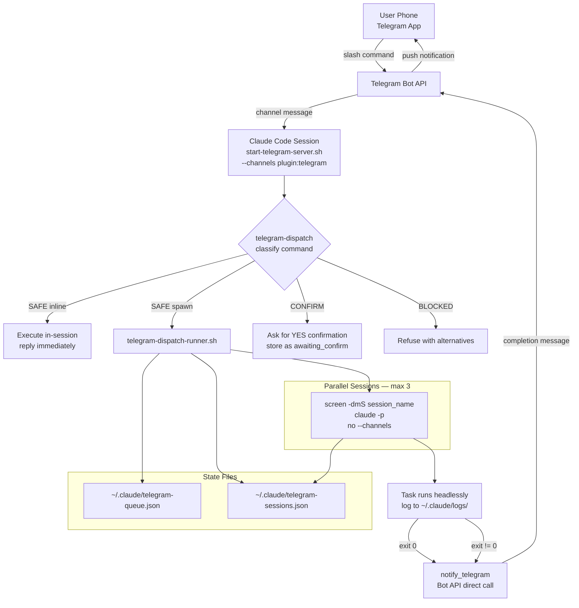

# Remote Control Architecture

The Enterprise Agent Platform can be operated entirely from a mobile device via Telegram. This document describes how inbound commands are received, classified, dispatched, and how results are returned to the user.

---

## Architecture Overview



---

## 1. Telegram Dispatch System

**Command:** `commands/telegram-dispatch.md`

The dispatch system is the entry point for all remote commands. It activates automatically whenever the persistent Telegram listener session receives a message beginning with `/`.

### Listener Session

The listener is started via:

```bash
bash ~/.claude/start-telegram-server.sh
```

This runs Claude with `--channels plugin:telegram@claude-plugins-official`, giving it a live connection to the Telegram Bot API. **This is the only process that holds `--channels`.** All spawned worker sessions use `claude -p` without `--channels` to avoid 409 Conflict errors from the Bot API (only one bot poller per token is permitted at a time).

### Safety Tiers

Every inbound slash command is classified into one of four tiers before any action is taken:

#### SAFE — Inline

Read-only or near-instant commands executed directly in the listener session:

| Command | Description |
|---|---|
| `/ghost-status` | Ghost Mode progress dashboard |
| `/pipeline-status` | Current pipeline phase and task list |
| `/metrics` | Usage and performance metrics |
| `/queue` / `/status` | Task queue and session list |
| `/help` | Available commands by tier |
| `/cancel <session>` | Kill a running screen session |

The result is sent back via `mcp__plugin_telegram_telegram__reply` immediately.

#### SAFE — Spawn

Long-running pipeline commands that would block the listener if run inline. Examples include `/ghost`, `/auto-ship`, `/auto-build-all`, `/check`, `/ship`, `/code-review`, `/security-audit`, `/generate-tests`, `/build`, `/scaffold`, `/refactor`, and others.

Dispatch flow:
1. React to the inbound message with ⏳ (immediate acknowledgement).
2. Generate a session name: `dispatch-<command>-<YYYYMMDD-HHMM>`.
3. Write a queue entry to `~/.claude/telegram-queue.json` with `status: "running"`.
4. Invoke `hooks/telegram-dispatch-runner.sh` to spawn a detached screen session.
5. Reply with the session name and a pointer to `/queue`.

#### CONFIRM

Commands with destructive potential (`/rollback`, `/db-migrate`). The dispatcher stores the command as `status: "awaiting_confirm"` and asks the user to reply `YES`. Any other reply cancels it.

#### BLOCKED

Commands that require interactive multi-turn conversation and cannot run headlessly. These include `/brainstorm`, `/auto-dev`, `/dev`, `/plan`, `/full-pipeline`, all `/bmad:*` commands, and `/telegram:access` / `/telegram:configure`. The dispatcher explains why and suggests autonomous alternatives (`/ghost`, `/auto-ship`, `/auto-build-all`).

### Queue File

`~/.claude/telegram-queue.json` is the persistent record of every dispatched task:

```json
{
  "version": 1,
  "queue": [
    {
      "id": "<uuid>",
      "command": "ghost",
      "args": "\"add dark mode\"",
      "chat_id": "123456789",
      "message_id": "42",
      "project_dir": "/Users/caleb/myproject",
      "status": "completed",
      "enqueued_at": "2026-03-24T14:00:00Z",
      "started_at": "2026-03-24T14:00:01Z",
      "finished_at": "2026-03-24T14:45:00Z",
      "screen_name": "dispatch-ghost-20260324-1400",
      "log_file": "~/.claude/logs/dispatch-dispatch-ghost-20260324-1400.log",
      "result_sent": true
    }
  ]
}
```

The queue is pruned automatically when it exceeds 50 entries: completed entries older than 7 days are removed.

---

## 2. Dispatch Runner

**Script:** `hooks/telegram-dispatch-runner.sh`

The runner is responsible for safely spawning a headless Claude worker session. It is invoked by `/telegram-dispatch` and by cron jobs.

### Security Controls

Before spawning anything, the runner applies three guards:

1. **Session name validation** — `SESSION_NAME` must match `^[a-zA-Z0-9_-]{1,64}$`. Any other value exits with `BLOCKED`.
2. **Project directory validation** — `PROJECT_DIR` must resolve (via `realpath -e`) to a real path under `$HOME`. Paths outside `$HOME` are rejected.
3. **Command allowlist** — only commands explicitly listed in `ALLOWED_COMMANDS` are permitted:
   ```
   ghost auto-ship auto-build auto-build-all auto-dev auto-plan check ship reflect
   pipeline-status ghost-status plan build dev spec code-review security-check
   generate-tests next-task
   ```

### Execution Model

The runner uses a self-re-invocation pattern via a `--inner` flag:

- **Outer call** (from listener session): spawns `screen -dmS <session_name>` and exits immediately.
- **Inner call** (runs inside screen): registers the session, runs `claude -p --dangerously-skip-permissions` with command and args passed as separate exec elements (never concatenated into a shell string), logs all output to `~/.claude/logs/dispatch-<session_name>.log`, updates session registry and queue on completion, then calls `notify_telegram`.

> **Security:** Args MUST be validated against `^[a-zA-Z0-9 _./-]{0,200}$` at the dispatch layer before reaching the runner. The runner MUST pass args via exec array, never shell interpolation:
> ```bash
> # CORRECT — args as discrete exec elements:
> exec claude -p --dangerously-skip-permissions "/$COMMAND" -- "$ARGS"
>
> # WRONG — shell injection risk:
> # claude -p --dangerously-skip-permissions "/$COMMAND $ARGS"
> ```

The critical constraint: `claude -p` is used **without** `--channels`. The listener session retains the exclusive bot connection.

### Session Registry

`~/.claude/telegram-sessions.json` tracks active and completed sessions:

```json
{
  "sessions": [
    {
      "session_name": "dispatch-ghost-20260324-1400",
      "screen_name": "dispatch-ghost-20260324-1400",
      "command": "ghost",
      "args": "\"add dark mode\"",
      "chat_id": "123456789",
      "project_dir": "/Users/caleb/myproject",
      "started_at": "2026-03-24T14:00:01Z",
      "completed_at": "2026-03-24T14:45:00Z",
      "exit_code": 0,
      "log_file": "/Users/caleb/.claude/logs/dispatch-dispatch-ghost-20260324-1400.log"
    }
  ]
}
```

### Completion Notifications

When a worker session exits, the runner calls `notify_telegram` directly via the Telegram Bot API (not through the MCP tool), attaching the last 10 lines of the log as context. This fires regardless of exit code. The listener session also checks for newly completed sessions on every inbound message as a backup delivery mechanism.

---

## 3. Cron Scheduling

**Command:** `commands/telegram-cron.md`

Recurring tasks are managed via the `CronCreate`, `CronList`, and `CronDelete` MCP tools. Each cron job executes the dispatch runner on a schedule, sending results back to the configured `chat_id`.

### Sub-commands

| Sub-command | Action |
|---|---|
| `/cron add "<schedule>: <command>"` | Register a new job |
| `/cron list` | Show all active jobs |
| `/cron remove <id>` | Delete a job |

Natural language schedules are translated to cron expressions:

| Natural language | Cron expression |
|---|---|
| `9am daily` | `0 9 * * *` |
| `every 30min` | `*/30 * * * *` |
| `monday 8am` | `0 8 * * 1` |
| `0 */6 * * *` | (used as-is) |

### Common Schedules

| Schedule | Command | Purpose |
|---|---|---|
| `0 7 * * *` | `/morning-brief` | Daily standup summary at 7am |
| `0 18 * * 1-5` | `/eod-summary` | End-of-day digest at 6pm weekdays |
| `0 9 * * 0` | `/weekly-health` | Weekly project health report on Sundays |
| `0 9,14 * * *` | `/pr-reminder` | PR review reminders at 9am and 2pm |

Each job runs via the dispatch runner, so results flow back through the standard Telegram notification path.

---

## 4. Parallel Session Management

**Command:** `commands/telegram-parallel.md`

The `/parallel` command dispatches up to three commands simultaneously, each in its own screen session.

```
/parallel "/ghost 'dark mode'" "/check" "/auto-build task-3"
```

### Constraints

- Maximum 3 concurrent tasks. Requests for more than 3 are rejected.
- All commands must be in the SAFE (spawn) tier. Any BLOCKED or CONFIRM command in the batch rejects the entire request.
- No two tasks may target the same project branch (would cause git conflicts).

### Session Naming

Parallel sessions use the prefix `parallel-<N>-<command>-<YYYYMMDD-HHMM>` to distinguish them from single-dispatch sessions in the registry.

Each task completes independently. The dispatch runner fires individual Telegram notifications per task. The `/queue` command shows all three in the status table.

---

## 5. Ghost Mode Remote Triggering

**Commands:** `commands/ghost.md`, `commands/ghost-status.md`

Ghost Mode is the fully autonomous overnight pipeline. It can be triggered remotely via Telegram:

```
/ghost "add dark mode" --telegram
```

### Config File

`~/.claude/ghost-config.json` is written before the watchdog launches and is the single source of truth for session state:

```json
{
  "feature": "add dark mode",
  "trust": "conservative",
  "budget_usd": 20,
  "max_hours": 8,
  "max_tasks": 10,
  "notify_url": "https://ntfy.sh/my-topic",
  "telegram_enabled": true,
  "telegram_chat_id": "123456789",
  "project_dir": "/Users/caleb/myproject",
  "branch": "feat/ghost-20260324-1400",
  "started": "2026-03-24T14:00:00Z",
  "session_id": null,
  "pr_url": null,
  "status": "running"
}
```

### Watchdog

`hooks/ghost-watchdog.sh` is a process supervisor that runs inside a `screen` session. It uses the same self-re-invocation pattern as the dispatch runner (`--inner-loop` flag).

**Restart behavior:**
- Max attempts: **3**
- Base backoff: **15 seconds** (doubles on each retry: 15s, 30s, 60s)
- Rate limit detection: if Claude exits in under 60 seconds, backoff extends to **300 seconds** (5 minutes)
- Emergency stop: if `~/.claude/ghost-stop` exists, the watchdog shuts down immediately

**Sleep prevention:** `caffeinate -dims -t <seconds>` runs for the full `max_hours` duration (macOS only).

**Telegram bidirectional mode:** When `--telegram` is passed to `/ghost`, the watchdog launches Claude with `--channels plugin:telegram@claude-plugins-official`, enabling inbound messages from Telegram to reach the running pipeline session. This is mutually exclusive with the persistent listener session — only one process may hold `--channels` per bot token.

**409 Conflict Rule:** If the persistent Telegram listener (`start-telegram-server.sh`) is running, Ghost Mode must NOT enable `--channels`. Stop the listener first, or use Ghost Mode without `--telegram` and rely on outbound-only notifications via `ghost-notify.sh`.

### Status Command

`/ghost-status` is a SAFE inline command that reads `~/.claude/ghost-config.json`, the pipeline checkpoint at `.claude/pipeline-checkpoint.json`, `tasks.json`, and the most recent ghost log file to render a live dashboard. It never modifies state.

---

## 6. Notification Channels

**Script:** `hooks/ghost-notify.sh`

All Ghost Mode events (start, phase transitions, warnings, success, failure) are dispatched through three independent channels. **Every channel fails silently** (`|| true` / `2>/dev/null || true`) to prevent a notification failure from blocking the pipeline.

### Channel 1 — macOS Notifications

Uses `osascript` to fire a native macOS notification with a level-appropriate sound:

| Level | Sound |
|---|---|
| `start` | Glass |
| `phase` | Pop |
| `warning` | Basso |
| `success` | Purr |
| `failure` | Sosumi |

Fails silently when not on macOS.

### Channel 2 — ntfy.sh

Sends an HTTP POST to the configured ntfy.sh topic URL with `Title`, `Priority`, `Tags`, and optionally a `Click` header pointing to the PR URL. Only fires if `notify_url` is set in `ghost-config.json`.

| Level | ntfy Priority |
|---|---|
| `start` | default |
| `phase` | low |
| `warning` | high |
| `success` | high |
| `failure` | urgent |

### Channel 3 — Telegram Bot API

Sends a formatted Markdown message directly via `https://api.telegram.org/bot<TOKEN>/sendMessage`. Requires:
- `TELEGRAM_BOT_TOKEN` in `~/.claude/channels/telegram/.env`
- A `chat_id`, either from `ghost-config.json` or auto-detected from `~/.claude/channels/telegram/access.json` (first entry in `allowFrom`)

Messages use Markdown formatting with level-appropriate emoji and include a linked PR URL when available.

The Telegram Bot API has a 4096-character message limit. The dispatch runner's completion notification truncates log output to 2000 characters (`head -c 2000`) to stay within this limit.

### Access Control

`~/.claude/channels/telegram/access.json` contains the allowlist of Telegram chat IDs permitted to issue commands:

```json
{
  "allowFrom": ["123456789"]
}
```

This file is never modified by commands. Changes require direct terminal access via the `/telegram:access` skill.

---

## File Reference

| Path | Purpose |
|---|---|
| `~/.claude/ghost-config.json` | Ghost Mode active session config and status |
| `~/.claude/ghost-stop` | Emergency stop sentinel — create this file to halt Ghost Mode |
| `~/.claude/ghost-watchdog.pid` | Watchdog process PID for liveness checks |
| `~/.claude/telegram-queue.json` | Persistent task queue (all dispatched commands) |
| `~/.claude/telegram-sessions.json` | Active and completed screen session registry |
| `~/.claude/logs/dispatch-*.log` | Per-session output logs for dispatched commands |
| `~/.claude/logs/ghost-*.log` | Ghost Mode pipeline logs |
| `~/.claude/channels/telegram/.env` | Bot token (`TELEGRAM_BOT_TOKEN=...`) |
| `~/.claude/channels/telegram/access.json` | Allowed Telegram chat IDs |

## Command Reference

| Command file | Invoked as | Description |
|---|---|---|
| `commands/telegram-dispatch.md` | auto (on `/` message) | Core dispatch router |
| `commands/telegram-cron.md` | `/cron` | Manage scheduled tasks |
| `commands/telegram-parallel.md` | `/parallel` | Dispatch up to 3 concurrent tasks |
| `commands/ghost.md` | `/ghost` | Launch autonomous overnight pipeline |
| `commands/ghost-status.md` | `/ghost-status` | Read-only Ghost Mode dashboard |
| `hooks/telegram-dispatch-runner.sh` | (internal) | Spawn headless screen session |
| `hooks/ghost-watchdog.sh` | (internal) | Process supervisor with restart loop |
| `hooks/ghost-notify.sh` | (internal) | Triple-channel notification dispatcher |
