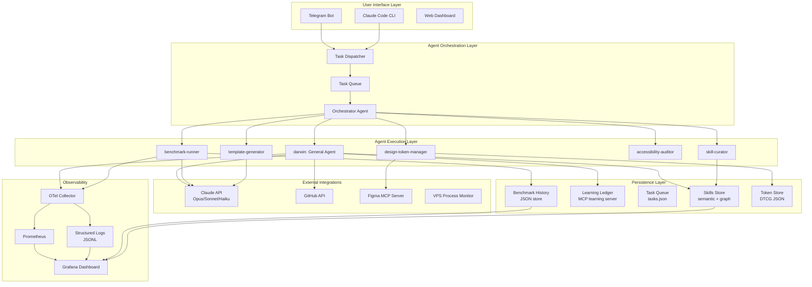
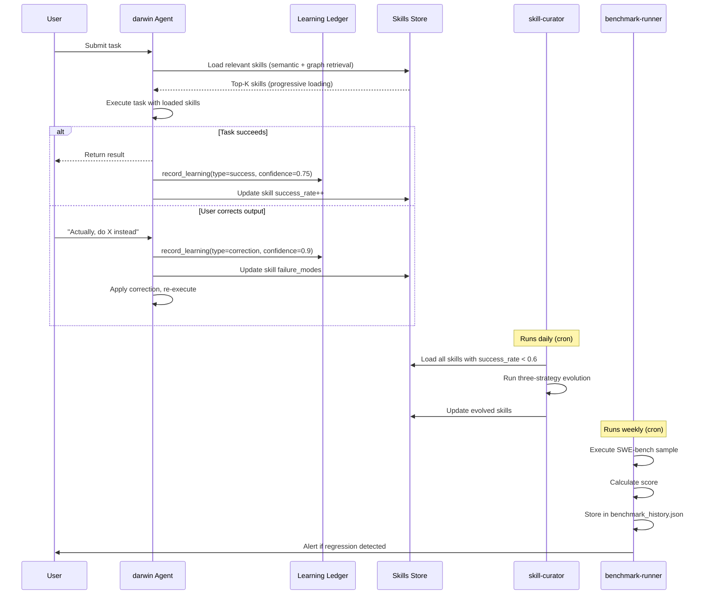
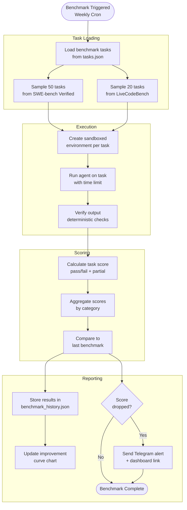
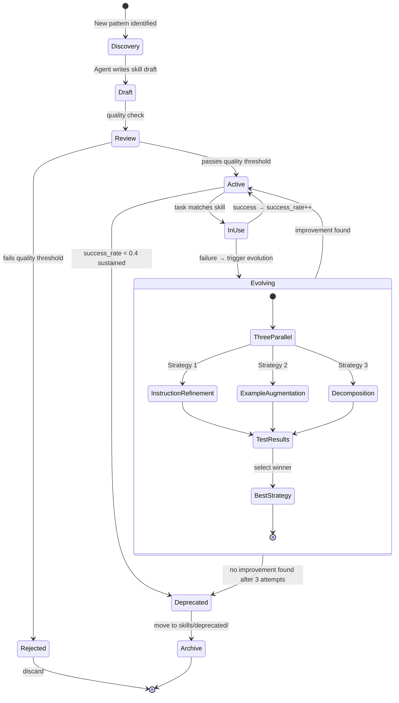
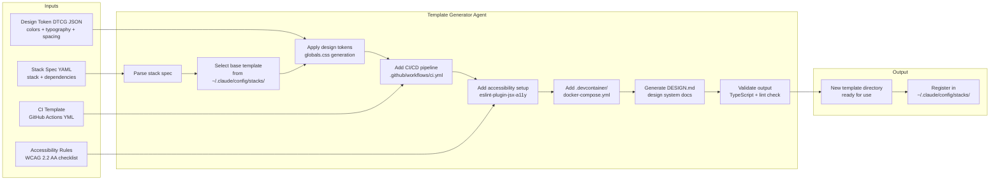
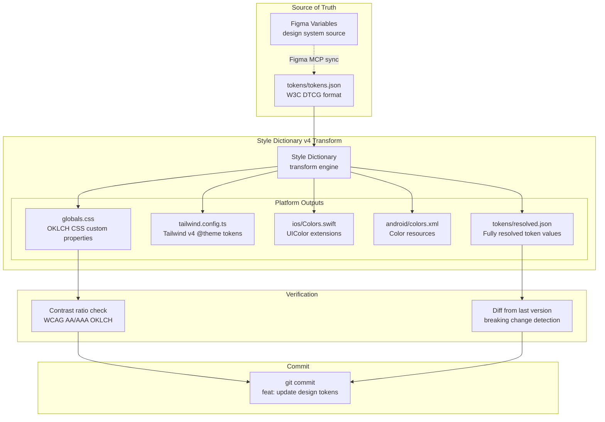
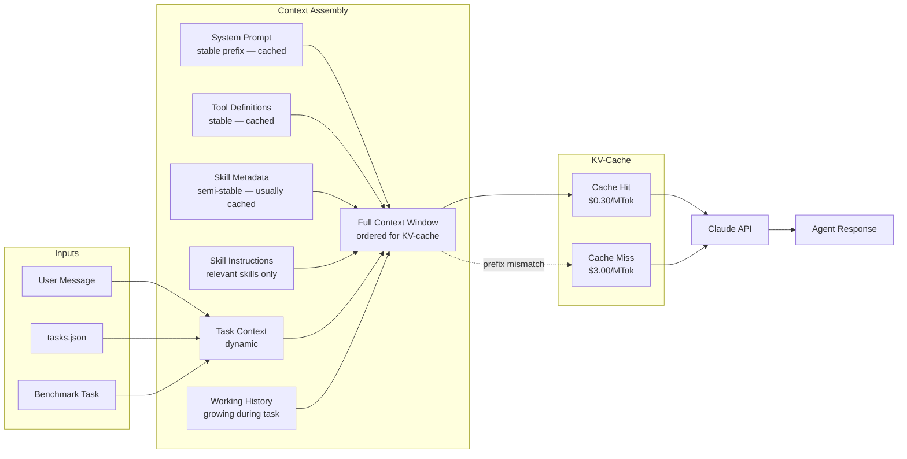

# Self-Improvement Engine: System Architecture

## Overview

This document describes the overall system architecture of the Self-Improvement Engine, with Mermaid diagrams for each major subsystem. The architecture follows three principles: measurement first, skills as the compound asset, and continuous loop over batch updates.

---

## Overall System Architecture

---

## Self-Improvement Feedback Loop

---

## Benchmark Pipeline

---

## Skill Acquisition Flow

---

## Template Generation Pipeline

---

## Design Token Pipeline

---

## Data Flow Architecture

