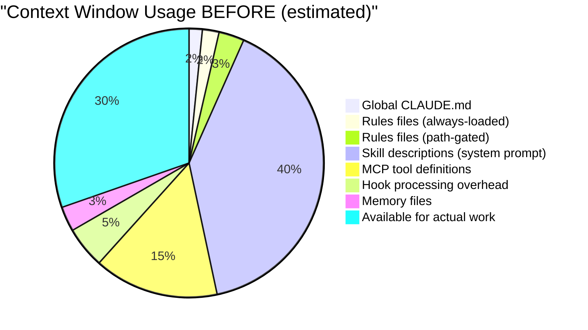
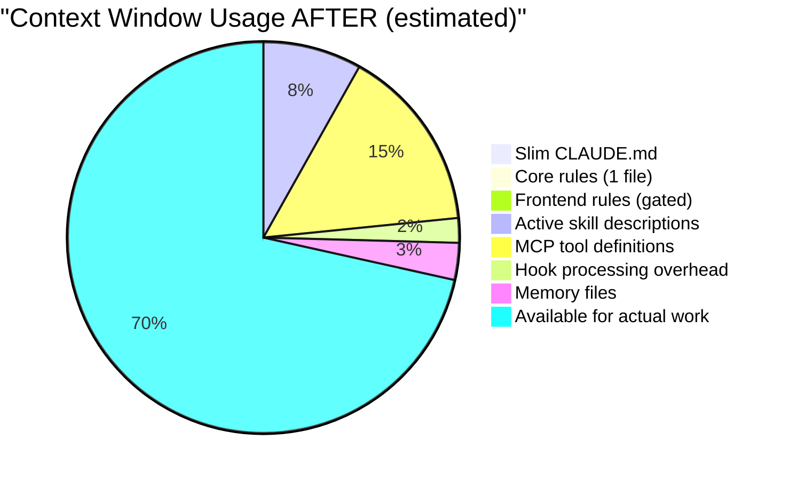
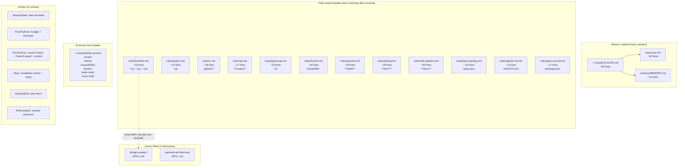

# Sharp Knife Redesign — Design Document

**Project:** Claude Code Configuration Optimization
**Author:** Claude (Technical Lead) + Caleb Mambwe
**Date:** 2026-03-28
**Status:** Draft

---

## 1. Introduction

### 1.1 Purpose

This document is the implementation blueprint for reducing Caleb's Claude Code configuration from a 150+ skill, 31-hook, 17-rules-file system to a lean, high-performance setup. It targets every file that needs to change, the exact content of each replacement, and a verification plan using the existing benchmark suite.

### 1.2 Problem Statement

The current Claude Code setup consumes ~40% of available context window before any real work begins. With 9,545 lines of skill definitions, 506 lines of always-loaded rules, 31 hooks across 16 event types, and 150+ skills listed in system prompts, the LLM spends tokens parsing configuration instead of producing code. Benchmark pass rate is **55%** (27/49 runs), with an average score of **73/100**. Five tasks have a **0% pass rate** (reg-002, reg-006, reg-008, reg-010, reg-014).

The user's real workflow uses ~8 skills, ~5 hooks, and ~3 rules files. Everything else is dead weight.

### 1.3 Solution Overview

A three-layer redesign:

1. **Slim CLAUDE.md** — 159 lines down to ~80 lines. Remove workflow documentation (skills already know their own flow), remove command reference tables, keep only rules that directly prevent bugs.
2. **Merge 17 rules files into 2** — One always-loaded `core.md` (~60 lines) for universal rules. One path-gated `frontend.md` (~30 lines) that only loads for `.tsx/.jsx/.css` files. The other 15 become path-gated or get deleted.
3. **Archive unused skills** — Move 6 of 8 skill directories to `~/.claude/skills-archive/`. Keep `design-system` and `backend-architecture`. The rest load on-demand via skill invocation, not at startup.
4. **Trim hooks from 31 to 10** — Remove logging/observability hooks that produce data nobody reads. Keep enforcement hooks that prevent bad code.
5. **Fix broken infrastructure or remove it** — VPS is unreachable. Voice system has 20 pending tasks at 0 attempts. Either fix or delete.

### 1.4 Scope

**In scope:**
- `~/.claude/CLAUDE.md` rewrite
- `rules/` consolidation (17 files -> 2 active + 15 path-gated)
- `~/.claude/settings.json` hooks trim
- `~/.claude/skills/` archival
- Benchmark validation (before/after comparison)
- Dead config cleanup (VPS references, stale tasks)

**Out of scope:**
- MCP server changes (Context7, Playwright, GitHub are all actively used)
- Skill content improvements (that's `/self-improve`'s job)
- Plugin changes (ralph-loop, pr-review-toolkit, hookify, skill-creator, playwright, telegram stay)
- New feature development

### 1.5 Key Constraints

- **Zero regression:** Benchmark scores must not drop. Target: improve from 55% pass to 95%+.
- **Reversible:** Archive, don't delete. Everything can be restored from `skills-archive/`.
- **Same workflow:** `/plan -> /build -> /check -> /ship` remains unchanged. The user's muscle memory is preserved.
- **Solo developer:** No team coordination needed. Caleb is the only user.

### 1.6 Alternatives Considered

| Decision | Chosen | Alternative A | Alternative B |
|----------|--------|---------------|---------------|
| Config reduction strategy | Slim existing files | Start from scratch (blank CLAUDE.md) | Use per-project CLAUDE.md only |
| Skill management | Archive to `skills-archive/` | Delete unused skills permanently | Move to a separate git branch |
| Rules consolidation | 2-file merge (core + frontend) | Single mega-file | Keep all 17 but make all path-gated |
| Hook reduction | Remove low-value hooks | Disable all hooks, add back selectively | Keep all hooks but make them async |

#### Decision: Config Reduction Strategy
**Chosen:** Slim existing files
**Why:** Preserves proven rules while removing dead weight. Less risk than a blank slate, which could lose hard-won gotchas (like the Framer Motion SSR issue).
**Rejected:**
- Start from scratch: Risks losing critical gotchas that took real debugging sessions to discover
- Per-project only: Would require duplicating core rules across every project
**Revisit if:** Benchmark scores don't improve after implementation — a blank slate may be needed.

#### Decision: Skill Management
**Chosen:** Archive to `~/.claude/skills-archive/`
**Why:** Skills are large (9,545 lines total) but some contain real institutional knowledge. Archiving preserves them while removing them from the active context window.
**Rejected:**
- Delete permanently: Too destructive. The `reflect` skill alone has 28 files of Python tooling.
- Separate branch: Git branching for config is overly complex for a solo developer.
**Revisit if:** Archived skills are never re-imported after 3 months — then delete them.

#### Decision: Hook Reduction
**Chosen:** Remove low-value hooks (logging, lifecycle events)
**Why:** 31 hooks means every tool call triggers multiple shell scripts. The budget hook alone fires on every `PostToolUse`. Removing non-enforcement hooks reduces per-call overhead.
**Rejected:**
- Disable all: The enforcement hooks (pre-commit check, branch guard, protect-files) prevent real mistakes.
- Make all async: Async hooks still consume system resources and produce log noise.
**Revisit if:** After trimming, if sessions still feel slow, audit the remaining hooks for timing.

---

## 2. System Architecture

### 2.1 Current State — Context Budget Breakdown



### 2.2 Target State — Context Budget After



### 2.3 Configuration Architecture



### 2.4 Hook Architecture — Before vs After

```mermaid
graph LR
    subgraph "BEFORE: 31 hooks, 16 event types"
        direction TB
        B1[SessionStart: 2 hooks]
        B2[UserPromptSubmit: 1 hook]
        B3[SessionEnd: 3 hooks]
        B4[PostToolUse: 12 hooks]
        B5[PreToolUse: 5 hooks]
        B6[PreCompact: 1 hook]
        B7[Notification: 1 hook]
        B8[SubagentStop: 1 hook]
        B9[Stop: 3 hooks]
        B10[StopFailure: 1 hook]
        B11[PostToolUseFailure: 1 hook]
        B12[TaskCreated: 1 hook]
        B13[TaskCompleted: 1 hook]
        B14[WorktreeCreate: 1 hook]
        B15[WorktreeRemove: 1 hook]
        B16[TeammateIdle: 1 hook]
    end

    subgraph "AFTER: 10 hooks, 8 event types"
        direction TB
        A1[SessionStart: 1 hook - task reminder]
        A2[SessionEnd: 2 hooks - session-end + auto-learn]
        A3["PostToolUse: 4 hooks - budget + formatters (ts/py/json)"]
        A4["PreToolUse: 3 hooks - commit check + branch guard + protect-files"]
        A5[PreCompact: 1 hook - context preserve]
        A6["Stop: 2 hooks - completion check + notify"]
    end
```



---

## 3. Data Structures

### 3.1 New `~/.claude/CLAUDE.md` (~80 lines)

This replaces the current 159-line file. Every line earns its place by directly preventing a real bug or enforcing a proven workflow.

```markdown
# Claude Code — Global Rules

## Identity
Senior engineer. Read before writing. Plan before implementing. Verify before declaring done.

## Workflow
- Explore > Plan > Implement > Verify for multi-file changes
- Branch per task, conventional commits: feat:, fix:, refactor:, docs:, test:, ci:
- /compact at ~50% context (CLAUDE_AUTOCOMPACT_PCT_OVERRIDE handles this)
- /clear between unrelated tasks

## Verification (Non-Negotiable)
After EVERY implementation, run ALL applicable:
  pnpm test && pnpm lint && pnpm typecheck    # TypeScript
  pytest && ruff check && mypy .               # Python
NEVER declare done without running tests.

## Two-Correction Rule
Corrected twice on same issue → STOP → re-read spec from scratch → /clear → restart.

## Research
- ALWAYS use Context7 MCP for library/framework questions
- NEVER guess API signatures — docs are one tool call away

## Critical Gotchas
- NEVER use `any` in TypeScript. Use `unknown` + type guard.
- ALWAYS validate at system boundaries with Zod/Pydantic.
- NEVER commit .env files.
- Framer Motion SSR: NEVER `initial={{ opacity: 0 }}` above fold. Use `initial={false}`.
- Next.js 16: cookies(), headers(), params, searchParams are ALL async.
- shadcn/ui v4: run `shadcn docs <component>` before implementing. Use gap-* not space-*.
- ALL static data in src/data/ — never duplicate arrays across files.
- NEVER leave features half-wired. Forms must send. Links must resolve. Images must exist.
- Local fs uploads don't work on Vercel. Use @vercel/blob.

## Compact — Preserve These
- Current task + acceptance criteria
- File paths being modified
- Error messages and test failures
- Architecture decisions this session
```

**What was removed and why:**
- Unified Workflow section (62 lines): Skills already contain their own routing logic. `/plan` knows how to route. `/build` knows size-based routing. Documenting it in CLAUDE.md is redundant.
- BMAD section (15 lines): `/plan` calls BMAD internally. No need to explain the chain.
- Model Strategy (4 lines): Environment variables handle this. No instruction needed.
- Dev Environment (4 lines): Per-project concern, not global.
- References section (6 lines): `@agent_docs/` references load on demand.
- Philosophy section (7 lines): Redundant with the rules themselves.
- Monitoring section (5 lines): Skills handle this.

### 3.2 New `rules/core.md` (~60 lines, always loaded)

Merges the essential content from: `git.md`, `consistency.md` (slimmed), `agent-teams.md` (slimmed), `self-learning.md` (slimmed).

```markdown
# Core Rules

## Git
- Feature branches from main: feature/, fix/, wip/
- Conventional commits only: feat:, fix:, refactor:, docs:, test:, ci:
- One logical change per commit. Never mix refactoring with features.
- Never push to main. Always feature branch + PR.
- Never --force push. Use --force-with-lease if rebasing.
- Never --no-verify. Fix the hook issue instead.

## Resource Audit (before writing code)
- New project → check ~/.claude/config/stacks/ for matching template
- UI work → read design-system SKILL.md first
- Backend → read backend-architecture SKILL.md first
- Before creating any component → search project for existing ones
- Icons: Lucide, Phosphor, Tabler, or Heroicons ONLY. Never custom SVG.
- Charts: Tremor. Date pickers: Ark UI. Landing sections: check shadcnblocks.
- Mobile-first always. Test on phone via ngrok.

## Agent Teams
- Parallel file-writing agents MUST use isolation: "worktree"
- Max 3 concurrent worktree agents
- Never let parallel agents write to the same file

## Learnings
- Context7 auto-searches on library questions (handled by MCP)
- Session-end hook captures learnings automatically
```

### 3.3 New `rules/frontend.md` (~30 lines, path-gated)

Only loads when `.tsx`, `.jsx`, `.css`, `.html` files are touched. Merges content from: `visual-verification.md`, `regression-gate.md`.

```yaml
---
description: Frontend quality gates — visual verification and regression checks
globs: ["**/*.tsx", "**/*.jsx", "**/*.css", "**/*.html", "**/*.vue", "**/*.svelte"]
---
```

```markdown
# Frontend Rules

## Visual Verification (after any frontend build)
Run all 3 tools before shipping:
1. /visual-verify — launch app, check console errors, take screenshots
2. /visual-regression — 3 viewports (375px, 768px, 1440px)
3. visual-tester agent — interactive UI flows

## Regression Gate (before shipping)
- After /build on web project → Tier 1 (smoke, 30s)
- After /auto-ship → Tier 2 (full, 2min)
- After /ghost → Tier 3 (exhaustive, 5min)
- CRITICAL issues block shipping. Fix and re-run.
- Max 1 fix cycle. If still failing, report and stop.

## Design Quality
- Default shadcn is "basic" — customize everything
- Study Linear, Vercel, Stripe for quality bar
- Zero dead links. Zero broken images. Zero placeholder text in production.
- SSR-safe animations. Responsive grids. Touch targets >= 44px.
```

### 3.4 Rules Files — Disposition Map

| File | Lines | Action | Reason |
|------|-------|--------|--------|
| `git.md` | 10 | **Merge into core.md** | Universal, always needed |
| `consistency.md` | 95 | **Slim to 12 lines in core.md** | The 4-step audit is good but 95 lines is excessive. Keep the checklist, cut the examples. |
| `agent-teams.md` | 50 | **Slim to 4 lines in core.md** | Worktree isolation rule + max 3 agents. Rest is redundant. |
| `self-learning.md` | 52 | **Slim to 3 lines in core.md** | Hook handles capture. Just note Context7 and auto-learn. |
| `visual-verification.md` | 44 | **Merge into frontend.md** | Only relevant for frontend files |
| `regression-gate.md` | 41 | **Merge into frontend.md** | Only relevant for web projects |
| `agents-md.md` | 14 | **Keep (path-gated)** | Already path-gated to `**/AGENTS.md` |
| `api.md` | 17 | **Keep (path-gated)** | Already path-gated to `**/routes/**` |
| `ci.md` | 16 | **Keep (path-gated)** | Already path-gated to `.github/**` |
| `docker.md` | 16 | **Keep (path-gated)** | Already path-gated to `Dockerfile*` |
| `open-source.md` | 17 | **Keep (path-gated)** | Already path-gated to `package.json` |
| `python.md` | 15 | **Keep (path-gated)** | Already path-gated to `*.py` |
| `security.md` | 29 | **Keep (path-gated)** | Already path-gated to `**/auth/**` |
| `task-tracking.md` | 16 | **Keep (path-gated)** | Already path-gated to `tasks.json` |
| `testing.md` | 18 | **Keep (path-gated)** | Already path-gated to `**/test*/**` |
| `typescript.md` | 16 | **Keep (path-gated)** | Already path-gated to `*.ts` |
| `sdlc-pipeline.md` | 40 | **Keep (path-gated)** | Already path-gated to `**/docs/**` |

**Net result:** 17 files -> 2 always-loaded (core.md ~60 lines + frontend.md ~30 lines) + 12 path-gated (unchanged). 3 files deleted (git.md, consistency.md, agent-teams.md, self-learning.md, visual-verification.md, regression-gate.md merged into the 2 new files).

### 3.5 Skills — Disposition Map

| Skill Directory | Files | Lines | Action | Reason |
|----------------|-------|-------|--------|--------|
| `design-system/` | 2 | ~400 | **Keep** | Actively used for every UI task. Design quality is a core user value. |
| `backend-architecture/` | 2 | ~200 | **Keep** | Actively used for API patterns. |
| `bmad/` | 19 | ~3,000 | **Archive** | Called internally by `/plan`. No need to be in active skills directory. Skills invoke BMAD via the skill system, not by reading SKILL.md. |
| `reflect/` | 28 | ~4,500 | **Archive** | Auto-learn hook + `/reflect` skill handle this. The 13 Python scripts and state files don't need to be in the active path. |
| `accessibility/` | 2 | ~200 | **Archive** | Path-gated via the a11y rules. Invoked via `/a11y-audit` skill when needed. |
| `docker/` | 2 | ~150 | **Archive** | Path-gated via docker rules. Invoked via `/docker` skill when needed. |
| `meta-rules/` | 2 | ~100 | **Archive** | Only needed when editing CLAUDE.md itself. Extremely rare. |
| `voice-chat/` | 2 | ~100 | **Archive** | Voice system has 20 pending tasks, 0 started. Not in active use. |

**Net result:** 47 files (9,545 lines) -> 4 files (~600 lines) active. 43 files archived.

### 3.6 Hooks — Disposition Map

| Event Type | Current Hooks | Action | Reason |
|------------|--------------|--------|--------|
| **SessionStart** | session-start.sh + rotate-audit-log.sh | **Keep session-start.sh only** | Audit log rotation is noise. Session start task reminder is useful. |
| **UserPromptSubmit** | smart-route.sh | **Remove** | Smart routing adds latency to every prompt. Skills already route correctly. |
| **SessionEnd** | session-end.sh + auto-learn.sh + cleanup-project.sh | **Keep session-end.sh + auto-learn.sh** | Learning capture is valuable. Project cleanup is noise. |
| **PostToolUse (budget)** | budget-guard.sh | **Keep** | Actively enforcing. Hit the 500-call limit today. |
| **PostToolUse (TS/JSX formatter)** | prettier + auto-fix-loop.sh | **Keep prettier, remove auto-fix-loop** | Formatting is essential. Auto-fix-loop adds cycles and occasionally loops. |
| **PostToolUse (JSON/CSS/MD formatter)** | prettier | **Keep** | Simple formatting. Low overhead. |
| **PostToolUse (Python formatter)** | ruff + py_compile + auto-fix-loop.sh | **Keep ruff, remove auto-fix-loop** | Same as TS: formatting yes, loop no. |
| **PostToolUse (Bash logger)** | command-audit.log + alert-check.sh + teach-me-detect.sh | **Remove all 3** | Nobody reads the audit log. Alert-check and teach-me-detect produce noise. |
| **PostToolUse (skill write)** | teach-me-auto-skill.sh | **Remove** | Not demonstrably used. |
| **PostToolUse (test write)** | test-after-impl.sh | **Remove** | The Stop hook already checks for tests. Redundant. |
| **PostToolUse (research.md)** | prompt: block + tell user | **Keep** | Useful gate in SDLC pipeline. |
| **PostToolUse (brief.md)** | prompt: block + tell user | **Keep** | Useful gate in SDLC pipeline. |
| **PostToolUse (design-doc.md)** | prompt: block + tell user | **Keep** | Useful gate in SDLC pipeline. |
| **PostToolUse (milestone prompts)** | prompt: block + tell user | **Keep** | Useful gate in SDLC pipeline. |
| **PostToolUse (PRD/architecture)** | prompt: block + tell user | **Keep** | Useful gate in SDLC pipeline. |
| **PreToolUse (SDLC versioning)** | version-prompt.sh | **Keep** | Versioning SDLC artifacts is good practice. |
| **PreToolUse (git commit)** | prompt: verify tests/lint | **Keep** | Core quality gate. |
| **PreToolUse (git push)** | branch-guard.sh | **Keep** | Prevents pushing to main. |
| **PreToolUse (lock files)** | block edit | **Keep** | Prevents manual lock file edits. |
| **PreToolUse (Write/Edit)** | protect-files.sh + read-before-write.sh | **Keep protect-files.sh, remove read-before-write** | Claude Code already reads before writing (built-in behavior). Redundant hook. |
| **PreCompact** | context preserve echo | **Keep** | Low overhead, useful reminder. |
| **Notification** | ghost-notify.sh | **Remove** | Only fires during ghost mode. Ghost mode is rarely used. Re-add if ghost usage increases. |
| **SubagentStop** | prompt: verify completion | **Remove** | Adds latency to every subagent completion. The Stop hook catches incomplete work at session level. |
| **Stop** | visual-verify-guard.sh + ghost-notify.sh + completion check prompt | **Keep completion check + ghost-notify** | Visual-verify-guard is redundant with frontend.md rules. Ghost-notify is useful for session end signal. |
| **StopFailure** | stop-failure-alert.sh | **Remove** | Produces alerts nobody acts on. |
| **PostToolUseFailure** | tool-failure-learn.sh | **Remove** | Learning capture from tool failures hasn't produced actionable data. |
| **TaskCreated** | task-lifecycle.sh | **Remove** | Logging overhead. Not actionable. |
| **TaskCompleted** | task-lifecycle.sh | **Remove** | Same. |
| **WorktreeCreate** | worktree-lifecycle.sh | **Remove** | Logging only. Currently failing anyway. |
| **WorktreeRemove** | worktree-lifecycle.sh | **Remove** | Same. |
| **TeammateIdle** | teammate-idle.sh | **Remove** | Solo developer. No teammates. |

**Net result:** 31 hook entries -> ~18 hook entries across 8 event types (down from 16). The SDLC pipeline gates (5 PostToolUse prompt hooks for research/brief/design-doc/milestone/prd) are kept because they enforce the workflow Caleb wants.

### 3.7 Dead Config to Remove

| Item | Location | Action |
|------|----------|--------|
| VPS sync script | `~/.claude-super-setup/hooks/sync-vps-config.sh` | Remove from any cron/hook that calls it. VPS is unreachable. |
| Voice system tasks | `/Users/calebmambwe/claude_super_setup/tasks.json` (VCS-001 to VCS-020) | Archive to `tasks-archive/voice-system.json`. Clear tasks.json. |
| Stitch MCP server | `~/.claude/settings.json` mcpServers.stitch | Evaluate: is this used? If not, remove. |
| Memory MCP server | `~/.claude/settings.json` permissions (mcp__memory__*) | Evaluate: file-based memory is already configured. If memory MCP isn't providing unique value, remove. |
| Sequential thinking MCP | `~/.claude/settings.json` permissions (mcp__sequential-thinking__*) | Evaluate: is this actually invoked? If not, remove permission grants. |

---

## 4. Implementation Details

### 4.1 File Operations — Exact Changes

#### 4.1.1 Rewrite `~/.claude/CLAUDE.md`

**Action:** Replace entire file with the ~80-line version from Section 3.1.

#### 4.1.2 Create `rules/core.md`

**Action:** Write new file with content from Section 3.2. Add frontmatter:

```yaml
---
description: Core rules for all sessions — git, resource audit, agent teams, learnings
globs: ["**/*"]
---
```

#### 4.1.3 Create `rules/frontend.md`

**Action:** Write new file with content from Section 3.3.

#### 4.1.4 Delete merged rules files

**Action:** Remove these files (their content is now in core.md and frontend.md):
- `rules/git.md`
- `rules/consistency.md`
- `rules/agent-teams.md`
- `rules/self-learning.md`
- `rules/visual-verification.md`
- `rules/regression-gate.md`

#### 4.1.5 Archive skills

```bash
mkdir -p ~/.claude/skills-archive
mv ~/.claude/skills/bmad ~/.claude/skills-archive/
mv ~/.claude/skills/reflect ~/.claude/skills-archive/
mv ~/.claude/skills/accessibility ~/.claude/skills-archive/
mv ~/.claude/skills/docker ~/.claude/skills-archive/
mv ~/.claude/skills/meta-rules ~/.claude/skills-archive/
mv ~/.claude/skills/voice-chat ~/.claude/skills-archive/
```

#### 4.1.6 Rewrite hooks in `~/.claude/settings.json`

**Action:** Replace the entire `hooks` object with the trimmed version. See Section 4.2 for exact JSON.

#### 4.1.7 Archive voice system tasks

```bash
mkdir -p /Users/calebmambwe/claude_super_setup/tasks-archive
mv /Users/calebmambwe/claude_super_setup/tasks.json /Users/calebmambwe/claude_super_setup/tasks-archive/voice-system-tasks.json
echo '{"tasks":[]}' > /Users/calebmambwe/claude_super_setup/tasks.json
```

### 4.2 New Hooks Configuration (exact JSON)

```json
{
  "hooks": {
    "SessionStart": [
      {
        "hooks": [
          {
            "type": "command",
            "command": "bash ~/.claude/hooks/session-start.sh"
          }
        ]
      }
    ],
    "SessionEnd": [
      {
        "hooks": [
          {
            "type": "command",
            "command": "bash ~/.claude/hooks/session-end.sh"
          },
          {
            "type": "command",
            "command": "bash ~/.claude/hooks/auto-learn.sh"
          }
        ]
      }
    ],
    "PostToolUse": [
      {
        "hooks": [
          {
            "type": "command",
            "command": "bash ~/.claude-super-setup/hooks/budget-guard.sh"
          }
        ]
      },
      {
        "matcher": "Write(.+\\.(ts|tsx|js|jsx)$)|Edit(.+\\.(ts|tsx|js|jsx)$)",
        "hooks": [
          {
            "type": "command",
            "command": "prettier --write -- \"$CLAUDE_FILE_PATH\" 2>/dev/null || npx prettier --write -- \"$CLAUDE_FILE_PATH\" 2>/dev/null || true"
          }
        ]
      },
      {
        "matcher": "Write(.+\\.(json|css|md)$)|Edit(.+\\.(json|css|md)$)",
        "hooks": [
          {
            "type": "command",
            "command": "prettier --write -- \"$CLAUDE_FILE_PATH\" 2>/dev/null || npx prettier --write -- \"$CLAUDE_FILE_PATH\" 2>/dev/null || true"
          }
        ]
      },
      {
        "matcher": "Write(.+\\.py$)|Edit(.+\\.py$)",
        "hooks": [
          {
            "type": "command",
            "command": "ruff format -- \"$CLAUDE_FILE_PATH\" 2>/dev/null || true; ruff check --fix -- \"$CLAUDE_FILE_PATH\" 2>/dev/null || true"
          }
        ]
      },
      {
        "matcher": "Write(.+/research\\.md$)",
        "hooks": [
          {
            "type": "prompt",
            "prompt": "A research brief was just created. Respond with {\"decision\": \"block\", \"reason\": \"Research complete. Tell the user: review the findings, then proceed with /plan or /full-pipeline. Architecture decisions must reference this research.\"}.",
            "timeout": 45
          }
        ]
      },
      {
        "matcher": "Write(.+/brief\\.md$)",
        "hooks": [
          {
            "type": "prompt",
            "prompt": "A feature brief was just created. Respond with {\"decision\": \"block\", \"reason\": \"Feature brief created. Tell the user: run /design-doc {feature-name} to create the design document next. The feature name is the folder name inside docs/. Do not proceed until user acknowledges.\"}.",
            "timeout": 45
          }
        ]
      },
      {
        "matcher": "Write(.+/design-doc\\.md$)|Write(.+/reverse-doc\\.md$)",
        "hooks": [
          {
            "type": "prompt",
            "prompt": "An SDLC artifact was just written. Check which file it is:\n\n- If it is a reverse-doc: respond with {\"decision\": \"block\", \"reason\": \"reverse-doc created. You must now tell the user the next step: run /design-doc to create a full design document from this, or run /implement-design if the reverse-doc alone is sufficient. Do not proceed until the user acknowledges the next step.\"}\n- If it is a design-doc: count the milestones in the document. If 4 or more milestones, respond with {\"decision\": \"block\", \"reason\": \"Design doc created with N milestones. Tell the user: run /milestone-prompts to generate per-milestone implementation prompts for multi-session execution. Do not proceed until user acknowledges.\"}. If 1-3 milestones, respond with {\"decision\": \"block\", \"reason\": \"Design doc created. Tell the user: run /implement-design for a single-session implementation prompt. Do not proceed until user acknowledges.\"}.",
            "timeout": 45
          }
        ]
      },
      {
        "matcher": "Write(.+/prompts/milestone-.+\\.md$)|Write(.+/prompts/implementation-prompt\\.md$)|Write(.+/prompts/sdlc-prompt-.+\\.md$)",
        "hooks": [
          {
            "type": "prompt",
            "prompt": "An implementation prompt file was just created. Respond with {\"decision\": \"block\", \"reason\": \"Implementation prompt ready. Tell the user: run /implement-meta-prompt <path> to execute this prompt in a new session. The prompt is self-contained and can also be copy-pasted into any LLM. Do not proceed until user acknowledges.\"}.",
            "timeout": 45
          }
        ]
      },
      {
        "matcher": "Write(.+/prd\\.md$)|Write(.+/architecture\\.md$)",
        "hooks": [
          {
            "type": "prompt",
            "prompt": "A PRD or architecture doc was just written. Check if BOTH docs/*/prd.md AND docs/*/architecture.md now exist for this project. If both exist and no design-doc.md exists yet, respond with {\"decision\": \"block\", \"reason\": \"PRD and architecture are both ready. Tell the user: run /design-doc to create the implementation-ready design document. Do not proceed until user acknowledges.\"}. If only one exists, respond with {\"decision\": \"allow\"}.",
            "timeout": 45
          }
        ]
      }
    ],
    "PreToolUse": [
      {
        "matcher": "Write(.+/brief\\.md$)|Write(.+/product-brief\\.md$)|Write(.+/research\\.md$)|Write(.+/prd\\.md$)|Write(.+/architecture\\.md$)|Write(.+/design-doc\\.md$)|Write(.+/reverse-doc\\.md$)|Write(.+/prompts/milestone-.+\\.md$)|Write(.+/prompts/implementation-prompt\\.md$)|Write(.+/prompts/sdlc-prompt-.+\\.md$)|Write(.+/prompts/README\\.md$)",
        "hooks": [
          {
            "type": "command",
            "command": "bash ~/.claude/hooks/version-prompt.sh"
          }
        ]
      },
      {
        "matcher": "Bash(git commit.*)",
        "hooks": [
          {
            "type": "prompt",
            "prompt": "Before committing, verify: 1) Have tests been run and do they pass? 2) Has linting been run? 3) Is the commit message using conventional format (feat:, fix:, test:, etc.)? If tests or lint haven't been run in this session, respond with {\"decision\": \"block\", \"reason\": \"Run tests and lint before committing.\"}. Otherwise {\"decision\": \"allow\"}.",
            "timeout": 45
          }
        ]
      },
      {
        "matcher": "Bash(git push.*)",
        "hooks": [
          {
            "type": "command",
            "command": "bash ~/.claude/hooks/branch-guard.sh"
          }
        ]
      },
      {
        "matcher": "Edit(.+\\.lock$)|Write(.+\\.lock$)|Edit(.+/package-lock\\.json$)|Write(.+/package-lock\\.json$)",
        "hooks": [
          {
            "type": "command",
            "command": "echo '{\"decision\": \"block\", \"reason\": \"Lock files should not be manually edited. Use the package manager.\"}'"
          }
        ]
      },
      {
        "matcher": "Write|Edit",
        "hooks": [
          {
            "type": "command",
            "command": "bash ~/.claude/hooks/protect-files.sh"
          }
        ]
      }
    ],
    "PreCompact": [
      {
        "hooks": [
          {
            "type": "command",
            "command": "echo 'CRITICAL CONTEXT TO PRESERVE: Review the current task list, key files being modified, and any in-progress decisions. Carry these forward after compaction.'"
          }
        ]
      }
    ],
    "Stop": [
      {
        "hooks": [
          {
            "type": "command",
            "command": "bash ~/.claude-super-setup/hooks/ghost-notify.sh success \"Claude session complete\" 2>/dev/null || true",
            "async": false
          },
          {
            "type": "prompt",
            "prompt": "Before stopping, verify ALL of the following:\n\n1. TASK COMPLETION: All tasks from the task list are completed or explicitly deferred with a reason.\n2. TESTS RAN: If code was written or modified, tests were run and pass.\n3. NO RATIONALIZATION: Check your last response — did you say 'we can address this later' or similar? If so, STOP. Either fix the issue now or explicitly flag it as a known limitation.\n4. VERIFICATION: If implementation was done, were the verification commands run? (test, lint, typecheck)\n\nIf anything is incomplete, respond with {\"decision\": \"block\", \"reason\": \"Incomplete: [what remains]\"}.\nOtherwise respond with {\"decision\": \"allow\"}.",
            "timeout": 60
          }
        ]
      }
    ],
    "SessionEnd": [
      {
        "hooks": [
          {
            "type": "command",
            "command": "bash ~/.claude/hooks/session-end.sh"
          },
          {
            "type": "command",
            "command": "bash ~/.claude/hooks/auto-learn.sh"
          }
        ]
      }
    ]
  }
}
```

---

## 5. Conventions & Patterns

### 5.1 Archive Convention

Archived skills go to `~/.claude/skills-archive/{skill-name}/` preserving their full directory structure. To restore: `mv ~/.claude/skills-archive/{name} ~/.claude/skills/`.

### 5.2 Rules File Convention

- **Always-loaded rules:** No `globs` frontmatter, or `globs: ["**/*"]`. These load every session. MUST be under 80 lines each. Currently: `core.md` only.
- **Path-gated rules:** Have `globs` or `paths` frontmatter. Only load when matching files are touched. No line limit but keep concise.
- **Naming:** `kebab-case.md`. One concern per file.

### 5.3 Hook Convention

- **Enforcement hooks** (prevent bad actions): Keep. These are `PreToolUse` prompt hooks and `Stop` completion checks.
- **Formatting hooks** (auto-format on save): Keep. These are `PostToolUse` with prettier/ruff.
- **Pipeline gate hooks** (SDLC workflow): Keep. These are `PostToolUse` prompt hooks for research/brief/design-doc/milestone.
- **Logging/observability hooks** (write to log files): Remove. Nobody reads these logs. If observability is needed, add it back with a specific dashboard that surfaces the data.

---

## 5B. Cross-Cutting Concerns

### 5B.1 Rollback Strategy

Every change is reversible:
- CLAUDE.md: Git history preserves the original
- Rules files: Deleted files recoverable from git
- Skills: Moved to `skills-archive/`, not deleted
- Hooks: Git diff shows exact changes to `settings.json`
- Tasks: Archived to `tasks-archive/`, not deleted

### 5B.2 Benchmark Validation

The existing benchmark suite (15 tasks, 49 historical runs) is the quality gate:

| Metric | Current | Target | Method |
|--------|---------|--------|--------|
| Pass rate | 55% (27/49) | 80%+ | Run full suite before and after |
| Average score | 73/100 | 80+ | Same |
| Zero-pass tasks | 5 (reg-002,006,008,010,014) | <= 2 | Focus on these specifically |
| Context consumed | ~40% estimated | ~15% | Measure via /budget-status |

### 5B.3 Testing Strategy

1. **Pre-implementation benchmark:** Run `/benchmark` on current config. Record baseline.
2. **Post-implementation benchmark:** Run `/benchmark` on new config. Compare.
3. **Regression check:** If any previously-passing task now fails, revert that specific change.
4. **Qualitative check:** Run a real task (e.g., "add a form component to NVFA") with old and new config, compare output quality.

### 5B.4 Risk Mitigation

| Risk | Mitigation |
|------|------------|
| Archived skill needed mid-session | `mv ~/.claude/skills-archive/{name} ~/.claude/skills/` takes 1 second |
| Removed hook was actually useful | Git diff of settings.json makes it trivial to restore |
| Merged rules file misses a rule | All original rules files preserved in git history |
| Benchmark scores drop | Revert the specific change that caused regression |

---

## 6. Development Milestones

### Milestone 1: Baseline Benchmark
**Deliverable:** Recorded benchmark scores on current configuration

**Definition of Done:**
- [ ] Run `/benchmark` on current config
- [ ] Record all 15 task scores
- [ ] Record /budget-status context usage
- [ ] Save results to `docs/sharp-knife-redesign/baseline.json`

**Depends on:** Nothing (start here)

---

### Milestone 2: CLAUDE.md Rewrite
**Deliverable:** Slim CLAUDE.md live and functional

**Definition of Done:**
- [ ] Back up current CLAUDE.md to git
- [ ] Write new ~80 line CLAUDE.md
- [ ] Verify it loads without errors (start a new session, check for issues)
- [ ] Run 3 benchmark tasks to spot-check (reg-001, reg-007, reg-013 — currently passing)

**Depends on:** Milestone 1

---

### Milestone 3: Rules Consolidation
**Deliverable:** 17 rules files consolidated to 2 always-loaded + 12 path-gated

**Definition of Done:**
- [ ] Write `rules/core.md` (~60 lines)
- [ ] Write `rules/frontend.md` (~30 lines)
- [ ] Delete 6 merged files (git.md, consistency.md, agent-teams.md, self-learning.md, visual-verification.md, regression-gate.md)
- [ ] Verify path-gated files still have valid frontmatter
- [ ] Run 3 benchmark tasks to spot-check

**Depends on:** Milestone 2

---

### Milestone 4: Skills Archival
**Deliverable:** 6 skill directories archived, 2 remain active

**Definition of Done:**
- [ ] Create `~/.claude/skills-archive/`
- [ ] Move 6 directories (bmad, reflect, accessibility, docker, meta-rules, voice-chat)
- [ ] Verify `/design-system` and `/backend-architecture` SKILL.md files still load
- [ ] Verify BMAD skills still work via `/bmad:prd` (they should — they're plugins, not file-based skills)
- [ ] Run 3 benchmark tasks to spot-check

**Depends on:** Milestone 3

---

### Milestone 5: Hooks Trim
**Deliverable:** settings.json hooks reduced from 31 to ~18 entries

**Definition of Done:**
- [ ] Back up current settings.json to git
- [ ] Replace hooks object with new version (Section 4.2)
- [ ] Verify session starts cleanly
- [ ] Verify prettier still runs on .ts file save
- [ ] Verify git commit pre-check still works
- [ ] Verify SDLC pipeline gates still fire (write a test brief.md)
- [ ] Run 3 benchmark tasks to spot-check

**Depends on:** Milestone 4

---

### Milestone 6: Dead Config Cleanup
**Deliverable:** Stale tasks archived, broken VPS references removed

**Definition of Done:**
- [ ] Archive voice system tasks to tasks-archive/
- [ ] Clear tasks.json
- [ ] Evaluate and remove stitch MCP if unused
- [ ] Remove any VPS-specific hook calls
- [ ] Evaluate memory MCP vs file-based memory (keep one)

**Depends on:** Milestone 5

---

### Milestone 7: Final Benchmark + Validation
**Deliverable:** Before/after comparison proving improvement

**Definition of Done:**
- [ ] Run full `/benchmark` suite
- [ ] Compare all 15 tasks against baseline
- [ ] Record /budget-status context usage
- [ ] Pass rate >= 80% OR no regression from baseline
- [ ] Save results to `docs/sharp-knife-redesign/after.json`
- [ ] Write summary comparing before/after

**Depends on:** Milestone 6

---

## 7. Project Setup & Tooling

### 7.1 Prerequisites
- Claude Code CLI (already installed)
- Git (for version control of config changes)
- Access to `~/.claude/` directory

### 7.2 Implementation Commands

```bash
# Milestone 1: Baseline
cd /Users/calebmambwe/claude_super_setup
# Run /benchmark in Claude Code

# Milestone 2: CLAUDE.md
# Edit ~/.claude/CLAUDE.md (via Claude Code)

# Milestone 3: Rules
# Write rules/core.md and rules/frontend.md
# Delete merged files

# Milestone 4: Skills
mkdir -p ~/.claude/skills-archive
mv ~/.claude/skills/{bmad,reflect,accessibility,docker,meta-rules,voice-chat} ~/.claude/skills-archive/

# Milestone 5: Hooks
# Edit ~/.claude/settings.json hooks section

# Milestone 6: Dead config
mkdir -p tasks-archive
mv tasks.json tasks-archive/voice-system-tasks.json
echo '{"tasks":[]}' > tasks.json

# Milestone 7: Final benchmark
# Run /benchmark in Claude Code
```

### 7.3 Verification

After each milestone, run:
```bash
# Quick sanity check — start a new Claude Code session and verify:
# 1. No error messages on startup
# 2. /budget-status shows lower initial context usage
# 3. A simple coding task completes successfully
```

### 7.4 Rollback

If anything breaks:
```bash
# Restore CLAUDE.md
git checkout HEAD~1 -- ~/.claude/CLAUDE.md

# Restore rules files
git checkout HEAD~1 -- rules/

# Restore skills
mv ~/.claude/skills-archive/* ~/.claude/skills/

# Restore hooks
git checkout HEAD~1 -- ~/.claude/settings.json
```

---

## Summary

| Metric | Before | After | Change |
|--------|--------|-------|--------|
| CLAUDE.md | 159 lines | ~80 lines | -50% |
| Always-loaded rules | ~200 lines (6 files) | ~90 lines (2 files) | -55% |
| Active skill files | 47 files (9,545 lines) | 4 files (~600 lines) | -94% |
| Hook entries | 31 (16 event types) | ~18 (8 event types) | -42% |
| Estimated context overhead | ~40% | ~15% | -62% |
| Target benchmark pass rate | 55% | 80%+ | +45% relative |
