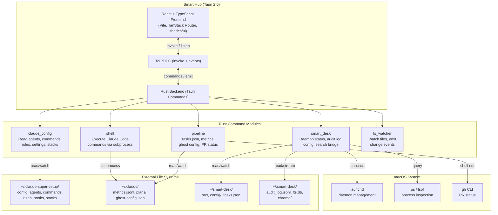
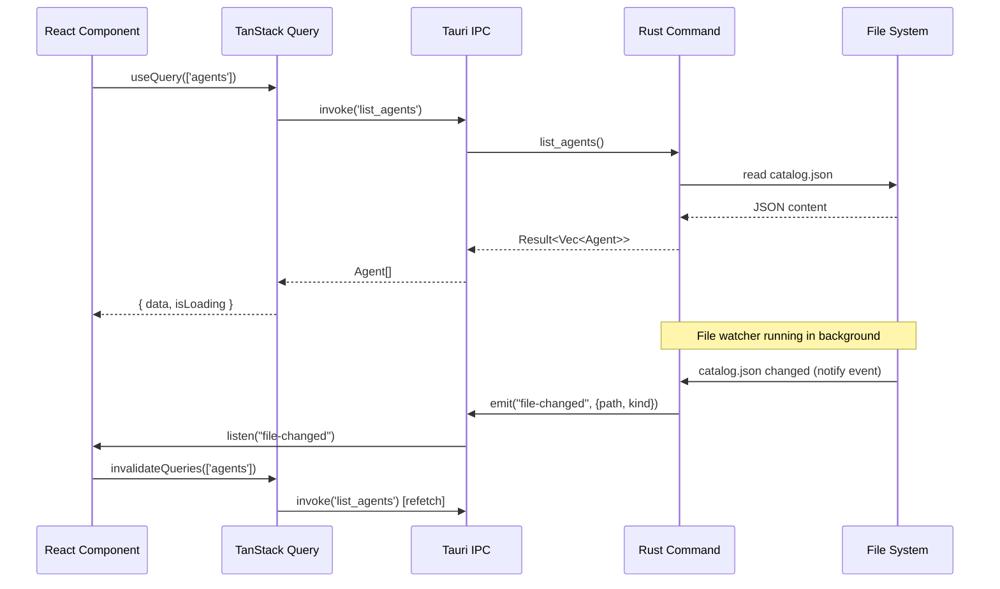
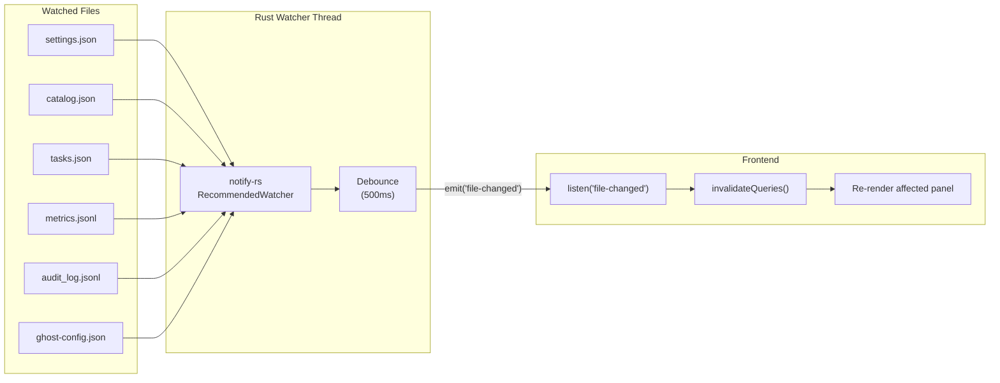
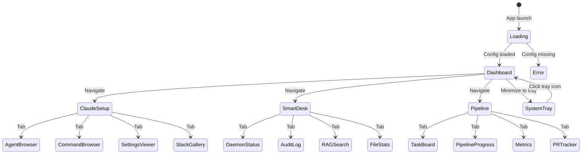

# Smart Hub — Design Document

**Created:** 2026-03-22
**Status:** Draft
**Author:** Caleb + Claude Code

---

## 1. Introduction

### 1.1 Purpose
Implementation-ready design document for **Smart Hub** — a Tauri 2.0 native macOS desktop app that unifies Claude Code setup management, Smart Desk monitoring, and autonomous pipeline tracking into a single command center. This document covers architecture, data structures, IPC contracts, frontend components, and development milestones.

### 1.2 Problem Statement
Caleb manages three interconnected systems exclusively through CLI and text files: claude-super-setup (80+ commands, 60+ agents), Smart Desk (5 MCP servers, 2 daemons), and autonomous pipelines (/auto-dev, /ghost-run). There is no visual overview, no unified dashboard, and context-switching between systems requires remembering file paths, JSON structures, and command names.

### 1.3 Solution Overview
A lightweight native macOS app (Tauri 2.0 = Rust backend + React/TypeScript frontend) with four panels: Dashboard, Claude Setup Manager, Smart Desk Monitor, and Pipeline Mission Control. The app reads config/state files directly via Rust commands, watches for changes using notify-rs/tauri-plugin-fs, and can trigger Claude Code CLI commands via subprocess.

### 1.4 Scope

**In scope:**
- Dashboard with at-a-glance status cards and activity feed
- Claude Setup: browse agents, commands, rules, hooks, settings, stack templates
- Smart Desk: daemon status, audit log viewer, RAG search UI, file org stats
- Pipeline: task kanban board, pipeline progress, agent activity feed, PR tracker
- Live updates via file watchers
- Quick action buttons for Claude Code commands
- System tray mode with menu bar access

**Out of scope:**
- Physical desk BLE/hardware control
- LobeHub integration
- Mobile companion app
- Multi-machine sync
- Direct MCP client protocol
- AI chat interface within the app

### 1.5 Key Constraints
- macOS-first (Tauri 2.0 uses WKWebView)
- Must handle 81MB audit log without freezing (streaming + virtualization)
- Read-only first; write operations deferred to later milestones
- Solo developer + Claude Code autonomous pipelines
- Must not modify existing file structures in ~/.claude/, ~/smart-desk/, ~/.smart-desk/

---

## 2. Architecture

### 2.1 System Overview



### 2.2 IPC Request Flow



### 2.3 File Watcher Event Flow



### 2.4 Application State Diagram



---

## 3. Data Structures

### 3.1 Claude Setup — Agent Entry

**Source:** `~/.claude-super-setup/agents/catalog.json`

```typescript
// types/claude-config.ts

interface AgentCatalog {
  $schema: string;
  version: string;
  model_tiers: Record<string, ModelTier>;
  teams: Record<string, Team>;
  agents: AgentEntry[];
}

interface ModelTier {
  model: string;      // e.g. "claude-haiku-3-5"
  use_for: string;    // human-readable description
}

interface Team {
  description: string;
  agents: string[];   // agent name references
}

interface AgentEntry {
  name: string;              // kebab-case identifier
  file: string;              // relative path to .md file
  source: 'core' | 'community' | 'project';
  source_repo?: string;      // for community agents
  department: AgentDepartment;
  description: string;
  model_tier: 'haiku' | 'sonnet' | 'opus' | 'custom';
  capabilities: string[];    // kebab-case tags
  tools?: string[];          // e.g. ["Read", "Write", "Bash"]
  teams?: string[];          // team membership
}

type AgentDepartment =
  | 'engineering'
  | 'testing'
  | 'design'
  | 'product'
  | 'marketing'
  | 'studio-operations'
  | 'project-management'
  | 'bonus';
```

**Agent Frontmatter** (parsed from .md files):
```typescript
interface AgentFrontmatter {
  name: string;                    // required
  department?: AgentDepartment;
  description: string;             // required, min 10 chars
  model?: 'haiku' | 'sonnet' | 'opus' | 'custom';
  tools?: string;                  // comma-separated string in YAML
  memory?: 'user' | 'project';
  skills?: string[];
  permissionMode?: string;
  invoked_by?: string[];
  escalation?: string;
  color?: string;
  maxTurns?: number;
}
```

### 3.2 Claude Setup — Settings

**Source:** `~/.claude-super-setup/config/settings.json`

```typescript
interface ClaudeSettings {
  $schema: string;
  env: Record<string, string>;
  permissions: {
    allow: string[];   // e.g. ["Read", "Bash(git *)"]
    deny: string[];    // e.g. ["Read(.env*)", "Bash(sudo *)"]
  };
  hooks: {
    SessionStart?: HookGroup[];
    SessionEnd?: HookGroup[];
    PostToolUse?: HookGroup[];
    PreToolUse?: HookGroup[];
    Stop?: HookGroup[];
  };
}

interface HookGroup {
  matcher?: string;    // glob pattern, e.g. "Write(**/*.ts)|Edit(**/*.ts)"
  hooks: HookDefinition[];
}

interface HookDefinition {
  type: 'command' | 'prompt';
  command?: string;    // for type: 'command'
  prompt?: string;     // for type: 'prompt'
  timeout?: number;    // seconds, for type: 'prompt'
  async?: boolean;     // for type: 'command'
}
```

### 3.3 Claude Setup — Command & Stack Template

```typescript
interface CommandEntry {
  name: string;          // kebab-case, from frontmatter
  description: string;   // from frontmatter
  filePath: string;      // resolved absolute path
  body: string;          // markdown body after frontmatter
}

interface StackTemplate {
  name: string;                    // kebab-case
  description: string;
  short_label: string;             // menu label
  init_commands: string[];         // shell commands
  directories: string[];           // dirs to mkdir
  starter_files: Record<string, string>;  // filepath → content
  commands: {
    dev: string;                   // required
    test: string;                  // required
    build?: string;
    lint?: string;
    typecheck?: string;
    format?: string;
  };
  env_example: string;
  claude_md: string;
  agents_md: string;
  package_json_scripts?: Record<string, string>;
  gitignore_extra?: string;
  devcontainer?: Record<string, unknown>;
}
```

### 3.4 Smart Desk — Audit Log Entry

**Source:** `~/.smart-desk/audit_log.jsonl` (81MB, one JSON object per line)

```typescript
interface AuditEntry {
  id: string;                  // UUID v4
  timestamp: string;           // ISO 8601 UTC
  action: 'move' | 'delete' | 'suspend' | 'resume' | 'sync' | 'clear_cache' | 'index';
  source: string | null;
  destination: string | null;
  metadata: Record<string, unknown>;
  reversible: boolean;
  reversed: boolean;
  reversed_by: string | null;  // ID of undo entry
}
```

### 3.5 Smart Desk — File System Models

```typescript
interface FileEntry {
  path: string;
  name: string;
  extension: string;
  size_bytes: number;
  created_at: string;    // ISO 8601
  modified_at: string;   // ISO 8601
  mime_type: string;
  is_symlink: boolean;
  is_hidden: boolean;
}

interface ClassificationResult {
  file_path: string;
  file_type: string;
  topic: string;
  confidence: number;
  method: string;
  suggested_destination: string;
  rule_matched: string | null;
}

interface DuplicateGroup {
  sha256: string;
  size_bytes: number;
  count: number;
  files: DuplicateFile[];
}

interface DuplicateFile {
  path: string;
  size_bytes: number;
  modified_at: string;
  is_original: boolean;
}
```

### 3.6 Smart Desk — Process & System Resources

```typescript
interface ProcessInfo {
  pid: number;
  name: string;
  cpu_percent: number;
  memory_mb: number;
  status: string;
  create_time: number;    // Unix epoch
  username: string;
  is_protected: boolean;
}

interface SystemResources {
  cpu_percent: number;
  cpu_count: number;
  memory_total_gb: number;
  memory_used_gb: number;
  memory_percent: number;
  disk_total_gb: number;
  disk_used_gb: number;
  disk_percent: number;
  top_cpu_processes: ProcessInfo[];
  top_memory_processes: ProcessInfo[];
}

interface SyncResult {
  target: 'gcs' | 'git';
  local_path: string;
  remote_path: string;
  files_transferred: number;
  bytes_transferred: number;
  files_deleted: number;
  errors: string[];
  dry_run: boolean;
  started_at: string;
  completed_at: string;
  status: 'success' | 'partial' | 'failed';
}

interface SearchResult {
  path: string;
  score: number;
  excerpt: string;
  match_type: 'keyword' | 'semantic' | 'hybrid';
}
```

### 3.7 Pipeline — Tasks & Metrics

**Source:** Project-level `tasks.json`

```typescript
interface TasksFile {
  project: string;
  stack: string;
  tasks: Task[];
}

interface Task {
  id: number;
  title: string;
  status: 'pending' | 'in_progress' | 'completed' | 'failed';
  priority: 'P0' | 'P1' | 'P2';
  risk: 'low' | 'medium' | 'high';
  depends_on: number[];
  acceptance: string[];
  files: string[];
  attempts: number;
  max_attempts: number;
}
```

**Source:** `~/.claude/metrics.jsonl`

```typescript
interface MetricsEvent {
  timestamp: string;       // ISO 8601
  job_id: string;          // e.g. "J-2026-000001"
  event: 'job_complete';
  project: string;
  feature: string;
  phases: {
    spec_minutes: number;
    plan_minutes: number;
    implement_minutes: number;
    verify_minutes: number;
    review_minutes: number;
  };
  agents_used: number;
  worktrees_used: number;
  rework_count: number;
  model_cost_usd: number;
  ci_minutes: number;
  human_minutes: number;
  total_minutes: number;
  outcome: 'merged' | 'blocked' | 'failed';
}
```

**Source:** `~/.claude/ghost-config.json`

```typescript
interface GhostConfig {
  feature: string;
  trust: 'conservative' | 'balanced' | 'aggressive';
  max_tasks: number;
  project_dir: string;
  status: 'pending' | 'running' | 'complete' | 'blocked_guardrail' | 'blocked_preview';
  started_at?: string;
  completed_at?: string;
  pr_url?: string;
  files_changed?: number;
  lines_added?: number;
  lines_removed?: number;
  tests_passed?: number;
  tests_failed?: number;
  typescript_new_errors?: number;
}
```

---

## 4. Implementation Details

### 4.1 Rust Command API

All Rust commands follow this pattern: `#[tauri::command]` → registered in `generate_handler![]` → called via `invoke<T>()` from React.

**Error envelope:**
```rust
// src-tauri/src/error.rs
use serde::Serialize;

#[derive(Debug, Serialize)]
#[serde(tag = "kind", content = "message")]
#[serde(rename_all = "camelCase")]
pub enum AppError {
    Io(String),
    Parse(String),
    NotFound(String),
    Shell(String),
}

impl From<std::io::Error> for AppError {
    fn from(e: std::io::Error) -> Self {
        AppError::Io(e.to_string())
    }
}

impl From<serde_json::Error> for AppError {
    fn from(e: serde_json::Error) -> Self {
        AppError::Parse(e.to_string())
    }
}
```

**Frontend error type:**
```typescript
type AppError =
  | { kind: 'io'; message: string }
  | { kind: 'parse'; message: string }
  | { kind: 'notFound'; message: string }
  | { kind: 'shell'; message: string };
```

### 4.2 Claude Config Commands

```rust
// src-tauri/src/commands/claude_config.rs

#[tauri::command]
async fn list_agents(config_dir: String) -> Result<AgentCatalog, AppError> {
    let path = PathBuf::from(&config_dir).join("agents/catalog.json");
    let content = tokio::fs::read_to_string(&path).await?;
    Ok(serde_json::from_str(&content)?)
}

#[tauri::command]
async fn list_commands(config_dir: String) -> Result<Vec<CommandEntry>, AppError> {
    // Glob commands/*.md, parse YAML frontmatter from each
}

#[tauri::command]
async fn read_settings(config_dir: String) -> Result<ClaudeSettings, AppError> {
    let path = PathBuf::from(&config_dir).join("config/settings.json");
    let content = tokio::fs::read_to_string(&path).await?;
    Ok(serde_json::from_str(&content)?)
}

#[tauri::command]
async fn list_stacks(config_dir: String) -> Result<Vec<StackTemplate>, AppError> {
    // Glob config/stacks/*.yaml, parse each
}

#[tauri::command]
async fn list_rules(config_dir: String) -> Result<Vec<RuleEntry>, AppError> {
    // Glob rules/*.md, parse frontmatter
}

#[tauri::command]
async fn list_hooks(config_dir: String) -> Result<Vec<HookEntry>, AppError> {
    // Glob hooks/*.sh, extract name + first comment line
}
```

### 4.3 Smart Desk Commands

```rust
// src-tauri/src/commands/smart_desk.rs

#[tauri::command]
async fn get_daemon_status() -> Result<Vec<DaemonStatus>, AppError> {
    // Shell out to: launchctl list | grep com.smartdesk
    // Parse PID and status for each daemon
}

#[tauri::command]
async fn get_system_resources() -> Result<SystemResources, AppError> {
    // Shell out to: ps aux --sort=-%cpu | head -10
    // Parse top CPU and memory processes
}

#[tauri::command]
async fn tail_audit_log(
    path: String,
    lines: usize,
    offset: Option<u64>,
) -> Result<AuditLogPage, AppError> {
    // Memory-mapped read from end of file
    // Return last N lines + byte offset for pagination
}

#[tauri::command]
async fn search_audit_log(
    path: String,
    query: String,
    action_filter: Option<String>,
) -> Result<Vec<AuditEntry>, AppError> {
    // Stream JSONL, filter by action + text match
}
```

### 4.4 Pipeline Commands

```rust
// src-tauri/src/commands/pipeline.rs

#[tauri::command]
async fn read_tasks(project_dir: String) -> Result<TasksFile, AppError> {
    let path = PathBuf::from(&project_dir).join("tasks.json");
    let content = tokio::fs::read_to_string(&path).await?;
    Ok(serde_json::from_str(&content)?)
}

#[tauri::command]
async fn read_metrics(metrics_path: String) -> Result<Vec<MetricsEvent>, AppError> {
    // Stream JSONL, parse each line
}

#[tauri::command]
async fn read_ghost_config(claude_dir: String) -> Result<GhostConfig, AppError> {
    let path = PathBuf::from(&claude_dir).join("ghost-config.json");
    let content = tokio::fs::read_to_string(&path).await?;
    Ok(serde_json::from_str(&content)?)
}

#[tauri::command]
async fn list_open_prs() -> Result<Vec<PullRequest>, AppError> {
    // Shell out to: gh pr list --json number,title,state,url,headRefName
}
```

### 4.5 Shell Execution Command

```rust
// src-tauri/src/commands/shell.rs

#[tauri::command]
async fn run_claude_command(
    command: String,          // e.g. "/auto-dev my-feature"
    project_dir: String,
    app: AppHandle,
) -> Result<String, AppError> {
    let child = tokio::process::Command::new("claude")
        .args(["-p", &command])
        .current_dir(&project_dir)
        .stdout(std::process::Stdio::piped())
        .stderr(std::process::Stdio::piped())
        .spawn()
        .map_err(|e| AppError::Shell(e.to_string()))?;

    let output = child.wait_with_output().await
        .map_err(|e| AppError::Shell(e.to_string()))?;

    Ok(String::from_utf8_lossy(&output.stdout).to_string())
}
```

### 4.6 File Watcher Setup

```rust
// src-tauri/src/watcher.rs
use notify::{RecommendedWatcher, RecursiveMode, Watcher, Config};
use std::sync::Mutex;
use tauri::{AppHandle, Emitter, Manager};

pub struct WatcherState(pub Mutex<Option<RecommendedWatcher>>);

#[derive(serde::Serialize, Clone)]
pub struct FileEvent {
    pub path: String,
    pub kind: String,
}

pub fn start_watchers(app: &AppHandle) {
    let app_handle = app.clone();
    let (tx, rx) = std::sync::mpsc::channel();

    let mut watcher = RecommendedWatcher::new(tx, Config::default())
        .expect("failed to create watcher");

    // Watch all critical paths
    let paths = [
        dirs::home_dir().unwrap().join(".claude-super-setup/config/settings.json"),
        dirs::home_dir().unwrap().join(".claude-super-setup/agents/catalog.json"),
        dirs::home_dir().unwrap().join(".claude/metrics.jsonl"),
        dirs::home_dir().unwrap().join(".claude/ghost-config.json"),
        dirs::home_dir().unwrap().join(".smart-desk/audit_log.jsonl"),
    ];

    for path in &paths {
        if path.exists() {
            let _ = watcher.watch(path, RecursiveMode::NonRecursive);
        }
    }

    // Store watcher to keep it alive
    app.state::<WatcherState>().0.lock().unwrap().replace(watcher);

    // Forward events to frontend
    std::thread::spawn(move || {
        for result in rx {
            if let Ok(event) = result {
                let payload = FileEvent {
                    path: event.paths.first()
                        .map(|p| p.display().to_string())
                        .unwrap_or_default(),
                    kind: format!("{:?}", event.kind),
                };
                let _ = app_handle.emit("file-changed", payload);
            }
        }
    });
}
```

### 4.7 Frontend — Key React Hooks

```typescript
// hooks/use-file-watcher.ts
import { listen } from '@tauri-apps/api/event';
import { useQueryClient } from '@tanstack/react-query';
import { useEffect } from 'react';

interface FileEvent {
  path: string;
  kind: string;
}

const PATH_TO_QUERY_MAP: Record<string, string[]> = {
  'catalog.json': ['agents'],
  'settings.json': ['settings'],
  'tasks.json': ['tasks'],
  'metrics.jsonl': ['metrics'],
  'ghost-config.json': ['ghost-config'],
  'audit_log.jsonl': ['audit-log'],
};

export function useFileWatcher() {
  const queryClient = useQueryClient();

  useEffect(() => {
    let unlisten: (() => void) | undefined;

    listen<FileEvent>('file-changed', (event) => {
      const filename = event.payload.path.split('/').pop() ?? '';
      const queryKeys = PATH_TO_QUERY_MAP[filename];
      if (queryKeys) {
        queryKeys.forEach((key) => queryClient.invalidateQueries({ queryKey: [key] }));
      }
    }).then((fn) => { unlisten = fn; });

    return () => unlisten?.();
  }, [queryClient]);
}
```

```typescript
// hooks/use-agents.ts
import { useQuery } from '@tanstack/react-query';
import { invoke } from '@tauri-apps/api/core';

export function useAgents() {
  return useQuery({
    queryKey: ['agents'],
    queryFn: () => invoke<AgentCatalog>('list_agents', {
      configDir: '~/.claude-super-setup'
    }),
    staleTime: Infinity, // only refetch on file-changed event
  });
}
```

### 4.8 Frontend — Component Tree

```
App
├── Layout
│   ├── Sidebar
│   │   ├── NavItem (Dashboard)
│   │   ├── NavItem (Claude Setup)
│   │   ├── NavItem (Smart Desk)
│   │   └── NavItem (Pipeline)
│   └── MainContent
│       └── <Outlet /> (TanStack Router)
│
├── /dashboard
│   ├── StatusCards (grid of summary cards)
│   │   ├── DaemonStatusCard
│   │   ├── ActiveTasksCard
│   │   ├── AgentCountCard
│   │   └── GhostStatusCard
│   ├── ActivityFeed (unified event stream)
│   └── QuickActions (command buttons)
│
├── /claude-setup
│   ├── AgentBrowser
│   │   ├── SearchBar + Filters (department, model_tier, source)
│   │   ├── AgentList (virtualized)
│   │   └── AgentDetail (sidebar panel)
│   ├── CommandBrowser
│   │   ├── SearchBar
│   │   └── CommandList with description
│   ├── SettingsViewer
│   │   ├── EnvVarsSection
│   │   ├── PermissionsSection
│   │   └── HooksSection
│   └── StackGallery
│       └── StackCard (name, description, commands)
│
├── /smart-desk
│   ├── DaemonPanel
│   │   └── DaemonRow (name, PID, status badge, uptime)
│   ├── AuditLogViewer
│   │   ├── ActionFilter (tabs: all, move, sync, index, ...)
│   │   ├── SearchBar
│   │   └── VirtualizedLogList (handles 81MB)
│   ├── RAGSearchPanel
│   │   ├── SearchInput
│   │   ├── ModeToggle (keyword / semantic / hybrid)
│   │   └── SearchResults list
│   └── FileStatsPanel
│       ├── MovesChart (by day/week)
│       └── CategoryBreakdown
│
├── /pipeline
│   ├── TaskBoard
│   │   ├── KanbanColumn (pending)
│   │   ├── KanbanColumn (in_progress)
│   │   ├── KanbanColumn (completed)
│   │   └── KanbanColumn (failed)
│   ├── PipelineProgress
│   │   └── GhostRunCard (status, feature, progress)
│   ├── MetricsDashboard
│   │   ├── CostChart
│   │   ├── DurationChart
│   │   └── SuccessRateChart
│   └── PRTracker
│       └── PRRow (number, title, status, checks)
```

---

## 5. Conventions & Patterns

### 5.1 Project Structure

```
smart-hub/
├── src/                          # React frontend
│   ├── components/
│   │   ├── ui/                   # shadcn/ui components
│   │   ├── layout/               # Sidebar, Layout, NavItem
│   │   ├── dashboard/            # Dashboard-specific components
│   │   ├── claude-setup/         # Claude Setup panel components
│   │   ├── smart-desk/           # Smart Desk panel components
│   │   └── pipeline/             # Pipeline panel components
│   ├── hooks/                    # Custom React hooks
│   ├── lib/                      # Utility functions
│   ├── types/                    # TypeScript type definitions
│   ├── routes/                   # TanStack Router route files
│   ├── App.tsx
│   └── main.tsx
├── src-tauri/                    # Rust backend
│   ├── src/
│   │   ├── commands/
│   │   │   ├── claude_config.rs
│   │   │   ├── smart_desk.rs
│   │   │   ├── pipeline.rs
│   │   │   └── shell.rs
│   │   ├── watcher.rs
│   │   ├── error.rs
│   │   ├── lib.rs
│   │   └── main.rs
│   ├── capabilities/
│   │   └── default.json
│   ├── Cargo.toml
│   └── tauri.conf.json
├── index.html
├── package.json
├── tsconfig.json
├── vite.config.ts
├── tailwind.config.ts
├── components.json               # shadcn/ui config
├── CLAUDE.md
└── AGENTS.md
```

### 5.2 Naming Conventions

| Layer | Convention | Example |
|-------|-----------|---------|
| Rust files | snake_case.rs | `claude_config.rs` |
| Rust commands | snake_case | `list_agents`, `tail_audit_log` |
| TS files | kebab-case.ts(x) | `agent-browser.tsx` |
| TS components | PascalCase | `AgentBrowser`, `StatusCard` |
| TS hooks | camelCase with `use` prefix | `useAgents`, `useFileWatcher` |
| TS types | PascalCase | `AgentEntry`, `AuditEntry` |
| CSS classes | Tailwind utility classes | `className="flex gap-4 p-2"` |
| Routes | kebab-case | `/claude-setup`, `/smart-desk` |

### 5.3 Error Handling

- **Rust**: All commands return `Result<T, AppError>`. `AppError` is a tagged enum serialized to JSON for the frontend.
- **Frontend**: TanStack Query handles error state. Components show error UI via `isError` + `error` from `useQuery`.
- **No silent failures**: Every Rust command logs errors to stderr before returning `Err`.

### 5.4 State Management

- **Server state** (from Rust): TanStack Query with `staleTime: Infinity` — only refetch on file-changed events
- **UI state** (tabs, filters, search terms): Zustand store, persisted to localStorage
- **No global Redux/Context** for data — TanStack Query is the single source of truth

### 5.5 Performance Patterns

- **Virtualized lists**: Use `@tanstack/react-virtual` for agent list (60+ items), audit log (millions of lines), command list (80+ items)
- **Streaming JSONL**: Rust reads from end of file for audit log, returns paginated chunks
- **Debounced search**: 300ms debounce on all search inputs before invoking Rust commands
- **Lazy route loading**: Each panel is a lazy-loaded route via TanStack Router

---

## 6. Development Milestones

### Milestone 1: Scaffold + Shell

**Deliverable:** Tauri app launches, shows sidebar navigation, loads config paths.

**Definition of Done:**
- [ ] `cargo create-tauri-app smart-hub` with React + TypeScript template
- [ ] Tailwind CSS + shadcn/ui installed and configured
- [ ] `@/*` path alias in tsconfig.json and vite.config.ts
- [ ] TanStack Router with 4 route stubs (dashboard, claude-setup, smart-desk, pipeline)
- [ ] TanStack Query provider configured
- [ ] Sidebar with navigation between 4 panels
- [ ] Rust error module (`AppError` enum)
- [ ] `read_file` and `list_directory` Rust commands working
- [ ] `tauri.conf.json` configured (window size, title, decorations)
- [ ] CLAUDE.md and AGENTS.md created
- [ ] `cargo tauri dev` launches successfully

**Depends on:** Nothing

---

### Milestone 2: Dashboard + File Watchers

**Deliverable:** Dashboard shows live status cards from all three systems.

**Definition of Done:**
- [ ] File watcher module (notify-rs) watching 6 critical files
- [ ] `file-changed` events emitting to frontend
- [ ] `useFileWatcher` hook invalidating TanStack Query caches
- [ ] `read_settings`, `read_ghost_config`, `read_tasks` commands
- [ ] DaemonStatusCard (launchctl query)
- [ ] ActiveTasksCard (tasks.json summary)
- [ ] AgentCountCard (catalog.json count)
- [ ] GhostStatusCard (ghost-config.json status)
- [ ] ActivityFeed component (combined recent events)
- [ ] QuickActions with placeholder buttons

**Depends on:** Milestone 1

---

### Milestone 3: Claude Setup Manager

**Deliverable:** Browse and search all agents, commands, rules, hooks, settings, and stack templates.

**Definition of Done:**
- [ ] `list_agents` command parsing catalog.json
- [ ] `list_commands` command parsing commands/*.md frontmatter
- [ ] `read_settings` command with structured output
- [ ] `list_stacks` command parsing config/stacks/*.yaml
- [ ] `list_rules` and `list_hooks` commands
- [ ] AgentBrowser with search, filter by department/model/source
- [ ] AgentDetail sidebar panel (shows full frontmatter + description)
- [ ] CommandBrowser with search
- [ ] SettingsViewer (env vars, permissions, hooks as read-only tree)
- [ ] StackGallery with cards showing name, description, commands
- [ ] Virtualized lists for agents and commands

**Depends on:** Milestone 2

---

### Milestone 4: Smart Desk Monitor

**Deliverable:** View daemon status, browse audit log, search with RAG, see file organization stats.

**Definition of Done:**
- [ ] `get_daemon_status` command (launchctl + plist parsing)
- [ ] `tail_audit_log` command with streaming pagination
- [ ] `search_audit_log` command with action filtering
- [ ] DaemonPanel with status badges and uptime
- [ ] AuditLogViewer with virtualized list (handles 81MB file)
- [ ] Action filter tabs (all, move, sync, index, etc.)
- [ ] Search within audit log
- [ ] FileStatsPanel with category breakdown
- [ ] RAGSearchPanel (subprocess bridge to rag-search-mcp)

**Depends on:** Milestone 2

---

### Milestone 5: Pipeline Mission Control

**Deliverable:** Task kanban board, pipeline progress, metrics charts, PR tracker.

**Definition of Done:**
- [ ] `read_tasks` command with project_dir parameter
- [ ] `read_metrics` command streaming metrics.jsonl
- [ ] `list_open_prs` command via gh CLI
- [ ] TaskBoard with kanban columns (drag disabled in read-only mode)
- [ ] Task cards showing priority, risk, acceptance criteria, dependencies
- [ ] GhostRunCard with status, feature name, timestamps
- [ ] MetricsDashboard with cost/duration/success charts (recharts)
- [ ] PRTracker with status badges and check results

**Depends on:** Milestone 2

---

### Milestone 6: Write Operations + System Tray

**Deliverable:** Can execute Claude Code commands, toggle agents, minimize to tray.

**Definition of Done:**
- [ ] `run_claude_command` subprocess execution
- [ ] QuickAction buttons wired to real commands (/auto-dev, /check, /ship, /ghost)
- [ ] Agent enable/disable toggles (write to settings.json)
- [ ] System tray icon with show/quit menu
- [ ] Window state persistence (position, size)
- [ ] Minimize to tray on close
- [ ] Dark/light theme toggle
- [ ] Keyboard shortcuts (Cmd+1-4 for panels, Cmd+K for search)

**Depends on:** Milestones 3, 4, 5

---

## 7. Project Setup & Tooling

### 7.1 Prerequisites
- Rust >= 1.77 (via rustup)
- Node.js >= 22 (via nvm)
- pnpm >= 9
- Xcode Command Line Tools (for macOS WebView compilation)
- Tauri CLI: `cargo install tauri-cli`

### 7.2 Quick Start

```bash
cd ~/smart-hub
pnpm install                    # Install frontend dependencies
cargo tauri dev                 # Launch app in development mode
```

### 7.3 Environment Variables

| Variable | Required | Description | Example |
|----------|----------|-------------|---------|
| SMART_HUB_CLAUDE_DIR | No | Override ~/.claude-super-setup path | /custom/path |
| SMART_HUB_SMART_DESK_DIR | No | Override ~/smart-desk path | /custom/path |
| SMART_HUB_STATE_DIR | No | Override ~/.smart-desk path | /custom/path |

### 7.4 Available Scripts

| Command | Description |
|---------|-------------|
| `pnpm dev` | Start Vite dev server (frontend only) |
| `cargo tauri dev` | Start full Tauri app (frontend + Rust) |
| `cargo tauri build` | Production build (.app bundle) |
| `pnpm lint` | ESLint |
| `pnpm typecheck` | TypeScript type checking |
| `cargo clippy` | Rust linting |
| `cargo test` | Rust unit tests |

### 7.5 Key Dependencies

**Frontend (package.json):**

| Package | Purpose |
|---------|---------|
| `@tauri-apps/api` | Tauri IPC (invoke, listen, events) |
| `@tauri-apps/plugin-fs` | File system access + watch |
| `@tauri-apps/plugin-shell` | Subprocess execution |
| `@tauri-apps/plugin-window-state` | Window position/size persistence |
| `@tanstack/react-query` | Server state management |
| `@tanstack/react-router` | File-based routing |
| `@tanstack/react-virtual` | Virtualized lists for large datasets |
| `zustand` | UI state (tabs, filters, theme) |
| `recharts` | Charts for metrics dashboard |
| `tailwindcss` + `shadcn/ui` | UI components and styling |

**Backend (Cargo.toml):**

| Crate | Purpose |
|-------|---------|
| `tauri` | Core framework |
| `tauri-plugin-fs` | File system plugin |
| `tauri-plugin-shell` | Shell execution plugin |
| `tauri-plugin-window-state` | Window state persistence |
| `notify` | File system watching |
| `serde` + `serde_json` | JSON serialization |
| `serde_yaml` | YAML parsing (stack templates, routing rules) |
| `tokio` | Async runtime |
| `dirs` | Home directory resolution |
| `gray_matter` | YAML frontmatter parsing from .md files |

---

## Appendix: Routing Rules Schema

For the Smart Desk file organization display:

```typescript
interface RoutingRule {
  name: string;
  priority: number;
  match: {
    extension?: string[];
    source_domain?: string[];
    filename_contains?: string[];
    filename_pattern?: string;
    mime_prefix?: string;
    any?: boolean;
  };
  destination: string;    // path template with {year}, {month}, {ext}, {date}
  action?: string;        // e.g. "classify_with_llm"
}
```

Priority ordering: 10 (Bank statements) → 20 (Tax) → 30 (Screenshots) → 40 (Code) → 50 (Installers) → 60 (Documents) → 100 (Images) → 110 (Videos) → 120 (Audio) → 999 (Catch-all LLM).
