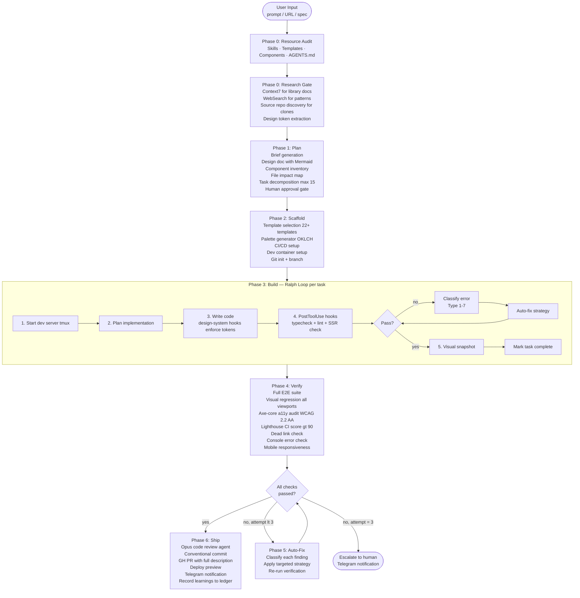
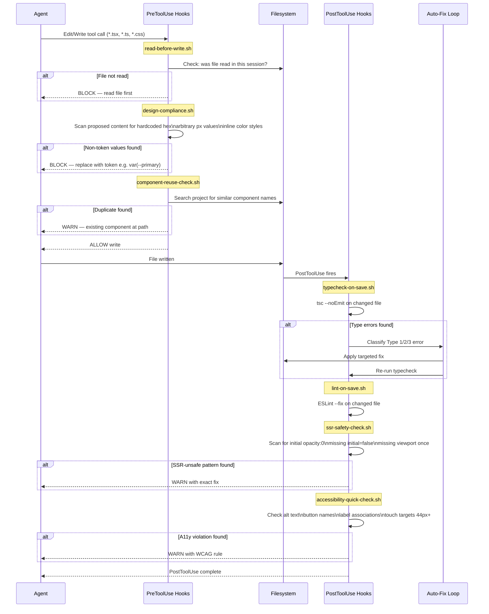
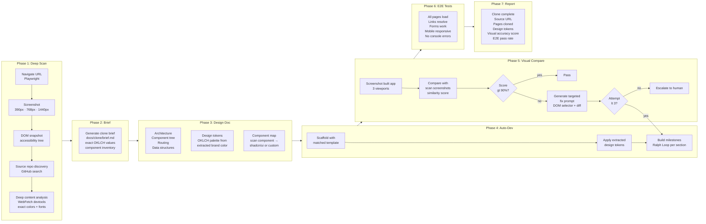
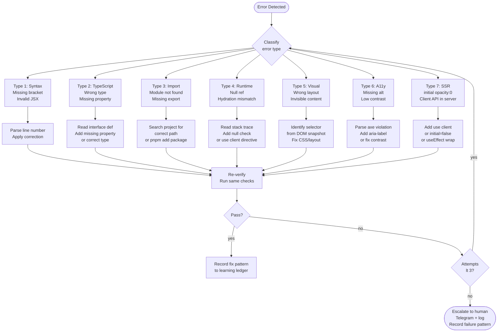

# Design Document: Super Claude Code Builder Enhancement

**Version:** 1.0
**Date:** 2026-03-26
**Author:** Architecture Planning Agent
**Status:** Approved for Implementation

---

## Table of Contents

1. [Introduction](#1-introduction)
2. [Architecture Diagrams](#2-architecture-diagrams)
3. [Data Structures](#3-data-structures)
4. [Implementation Details](#4-implementation-details)
5. [Conventions](#5-conventions)
6. [Cross-Cutting Concerns](#6-cross-cutting-concerns)
7. [Milestones](#7-milestones)
8. [Tooling](#8-tooling)

---

## 1. Introduction

### 1.1 Purpose

This document specifies the complete implementation plan to make `claude-super-setup` the best autonomous app builder in existence — surpassing Cursor, Same.new, Bolt.new, Lovable, and v0 in output quality, while preserving the flexibility and depth of a CLI-first, SDLC-driven workflow.

The goal is stated precisely in doc `09-vision.md`: generated apps must look indistinguishable from hand-crafted premium products, ship with zero dead links and zero console errors on first generation, be mobile-first by default, and recover from their own mistakes automatically.

### 1.2 Problem Statement

Three compounding deficiencies degrade the current system's output quality:

**Problem 1: Generated apps look AI-generated.**
Default shadcn/ui components with basic layouts produce outputs that are obviously machine-generated. Competing tools (v0, Lovable) generate visually polished apps because they have curated component registries and enforced design systems. Our current design-system skill is a set of instructions with no enforcement mechanism — nothing blocks an agent from writing `color: #3b82f6` instead of `color: var(--primary)`. Doc `02-gap-analysis.md` (Gap 11) rates this as P0.

**Problem 2: Clones are inaccurate.**
The current `/clone-app` pipeline captures screenshots and extracts design data, but it has no visual comparison scoring. It generates code, checks for type errors, and ships — with no automated verification that the output resembles the source. There is no fix loop driven by visual similarity. Doc `21-brainstorm-synthesis.md` (Gap 4) identifies this as the second highest impact gap.

**Problem 3: No self-healing pipeline.**
Runtime errors (missing env vars, hydration mismatches, broken API calls, invisible above-fold content) are invisible during the build phase because the dev server is never started. These errors only surface at the end of the pipeline, at which point the agent must diagnose blindly across many files. Doc `02-gap-analysis.md` (Gap 1) rates this P0. Doc `15-self-healing-spec.md` specifies the full fix loop.

### 1.3 Solution

Four interconnected systems, implemented across six milestones:

**Premium Design System** — enforced at the hook level, not just as instructions. A component registry replaces scratch-generation. An OKLCH palette generator (doc `22-color-palette-generator.md`) eliminates hardcoded colors.

**Enforcing Hooks** — 16 hooks (doc `11-hook-architecture.md`) fire at PreToolUse, PostToolUse, pre-commit, and post-build to block non-compliant writes before they reach the filesystem, run typechecks after every file change, and detect dead links and SSR animation bugs automatically.

**Visual Verification Loop** — Playwright screenshots at three viewports are compared against reference images with a scored similarity metric. If the score is below threshold, a targeted fix loop runs up to three rounds before escalating.

**Self-Healing Pipeline** — the dev server starts at the beginning of Phase 3 (Build) and stays running throughout. Console errors are captured via Playwright and fed back to the agent in the same task loop. Seven error classifications drive targeted auto-fix strategies (doc `15-self-healing-spec.md`).

### 1.4 Scope

This document covers six milestones:

| Milestone | Theme | Primary Impact |
|-----------|-------|---------------|
| M1 | Premium Design System + Hooks | Visual quality, design compliance enforcement |
| M2 | Clone Pipeline V2 | Clone accuracy, visual comparison scoring |
| M3 | Full-Stack Templates | SaaS generation completeness |
| M4 | Testing and Verification | Accessibility, visual regression, Lighthouse CI |
| M5 | Self-Healing Pipeline | Runtime error detection and auto-fix |
| M6 | Integration Polish | File impact maps, codegen wiki, Mac-VPS distribution |

Out of scope for this release cycle: `/quick-start` provisioning command (P1, separate initiative), `/watch-pr` background agent (P2), WebContainers sandboxing.

---

## 2. Architecture Diagrams

### 2.1 System Overview: Super Builder Pipeline



### 2.2 Hook Execution Flow



### 2.3 Clone Pipeline V2 (7-Phase Flow)



### 2.4 Self-Healing Error Classification and Fix Loop



---

## 3. Data Structures

These types are the contracts between pipeline stages. Define them in `~/.claude/skills/premium-builder/types.ts` as documentation — they are not executable code in this setup but serve as the canonical specification for any scripts or hooks that emit or consume these shapes.

### 3.1 DesignToken (OKLCH Palette Structure)

```typescript
// Generated by scripts/generate-palette.sh
// Consumed by: /new-app, /clone-app, web-shadcn-v4 template
type OKLCHValue = `oklch(${number} ${number} ${number})` | `oklch(${number} ${number} ${number} / ${number}%)`;

interface DesignTokenScale {
  "50": OKLCHValue;
  "100": OKLCHValue;
  "200": OKLCHValue;
  "300": OKLCHValue;
  "400": OKLCHValue;
  "500": OKLCHValue; // base brand color
  "600": OKLCHValue;
  "700": OKLCHValue;
  "800": OKLCHValue;
  "900": OKLCHValue;
  "950": OKLCHValue;
}

interface SemanticTokens {
  background: OKLCHValue;
  foreground: OKLCHValue;
  card: OKLCHValue;
  "card-foreground": OKLCHValue;
  muted: OKLCHValue;
  "muted-foreground": OKLCHValue;
  border: OKLCHValue;
  input: OKLCHValue;
  primary: OKLCHValue;
  "primary-foreground": OKLCHValue;
  accent: OKLCHValue;
  "accent-foreground": OKLCHValue;
  destructive: OKLCHValue;
  ring: OKLCHValue;
}

interface DesignTokens {
  // Input
  brandHex: string;          // e.g. "#0081F2"
  brandOKLCH: {              // Parsed OKLCH components
    L: number;               // Lightness: 0-1
    C: number;               // Chroma: 0-0.4
    H: number;               // Hue: 0-360
  };
  // Generated scales
  primary: DesignTokenScale;
  neutral: DesignTokenScale;
  // Semantic mapping (light and dark)
  light: SemanticTokens;
  dark: SemanticTokens;
  // Complementary
  success: OKLCHValue;       // oklch(0.72 0.17 155)
  warning: OKLCHValue;       // oklch(0.80 0.15 85)
  error: OKLCHValue;         // oklch(0.64 0.24 27)
  info: OKLCHValue;          // = primary.500
  // Output paths
  cssOutputPath: string;     // e.g. "src/app/globals.css"
  jsonOutputPath: string;    // e.g. "tokens.json" (W3C DTCG format)
}
```

### 3.2 HookConfig (Hook Definition in settings.json)

```typescript
// Stored in ~/.claude/settings.json under the "hooks" key
// Claude Code hook configuration shape
type HookEvent =
  | "PreToolUse"
  | "PostToolUse"
  | "PreToolUseStop"
  | "PostToolUseStop"
  | "Notification"
  | "Stop";

type HookAction = "block" | "warn" | "log";

interface HookMatcher {
  tool_name?: string;          // e.g. "Write", "Edit", "Bash"
  file_pattern?: string;       // glob e.g. "**/*.tsx"
  content_pattern?: string;    // regex to match in file content
}

interface HookDefinition {
  name: string;                // e.g. "design-compliance"
  event: HookEvent;
  matcher: HookMatcher;
  script: string;              // Absolute path to shell script
  action_on_fail: HookAction;  // What to do when script exits non-zero
  timeout_ms: number;          // Max execution time (default: 2000)
  enabled: boolean;
}

// Full hooks section in settings.json
interface HooksConfig {
  hooks: HookDefinition[];
}

// Example entry:
// {
//   name: "design-compliance",
//   event: "PreToolUse",
//   matcher: { tool_name: "Write", file_pattern: "**/*.{tsx,css}" },
//   script: "/Users/calebmambwe/claude_super_setup/hooks/design-compliance.sh",
//   action_on_fail: "block",
//   timeout_ms: 2000,
//   enabled: true
// }
```

### 3.3 VisualComparisonResult

```typescript
// Output of Phase 5 visual comparison step in /clone-app and /visual-verify
// Emitted as JSON to docs/clone/visual-comparison.json

interface ViewportComparison {
  viewport: "mobile" | "tablet" | "desktop";
  widthPx: 390 | 768 | 1440;
  referenceScreenshot: string;   // Absolute path to source screenshot
  builtScreenshot: string;       // Absolute path to generated app screenshot
  similarityScore: number;       // 0-100 (structural + color similarity)
  mismatches: VisualMismatch[];
}

interface VisualMismatch {
  type: "missing_section" | "wrong_color" | "layout_shift" | "invisible_content" | "extra_element";
  description: string;           // Human-readable description of the mismatch
  cssSelector?: string;          // DOM selector of the affected element
  referenceValue?: string;       // What the reference shows
  actualValue?: string;          // What the built app shows
  fixSuggestion: string;         // Actionable fix instruction for the agent
}

interface VisualComparisonResult {
  sourceUrl: string;
  builtProjectPath: string;
  timestamp: string;             // ISO 8601
  overallScore: number;          // Weighted average across viewports
  passThreshold: number;         // 90 (configurable)
  passed: boolean;               // overallScore >= passThreshold
  viewports: ViewportComparison[];
  iterationNumber: number;       // 1-3 (fix attempt number)
  fixApplied?: string;           // Description of auto-fix applied before this run
}
```

### 3.4 QualityGateResult

```typescript
// Output of Phase 4 Verify — covers all automated quality checks
// Written to docs/build-log.md after each pipeline run

type CheckStatus = "pass" | "fail" | "skip" | "warn";

interface CheckResult {
  name: string;
  status: CheckStatus;
  duration_ms: number;
  errors: string[];              // List of error messages if status = "fail"
  warnings: string[];
  details?: Record<string, unknown>;
}

interface LighthouseScores {
  performance: number;           // 0-100
  accessibility: number;         // 0-100
  bestPractices: number;         // 0-100
  seo: number;                   // 0-100
}

interface QualityGateResult {
  project: string;
  branch: string;
  commit: string;
  timestamp: string;
  overallStatus: CheckStatus;    // "fail" if ANY check fails at error level

  checks: {
    typecheck: CheckResult;
    lint: CheckResult;
    unitTests: CheckResult;
    e2eTests: CheckResult;
    visualRegression: CheckResult;
    accessibility: CheckResult;  // axe-core via Playwright
    deadLinks: CheckResult;
    consoleErrors: CheckResult;
    lighthouse: CheckResult & { scores?: LighthouseScores };
    secretScan: CheckResult;
  };

  // Summary for Telegram notification
  summary: {
    passed: number;
    failed: number;
    warned: number;
    skipped: number;
    totalDurationMs: number;
    actionRequired: string[];    // Human-readable list of items needing attention
  };
}
```

---

## 4. Implementation Details

Files are listed in dependency order — each file can only be built after its predecessors are stable. Files marked [NEW] do not currently exist. Files marked [ENHANCE] extend existing implementations.

### 4.1 M1 Files: Premium Design System + Hooks

#### `~/.claude/skills/premium-builder/SKILL.md` [NEW]

**Purpose:** Replace scratch-generation of UI components with a curated pattern library. When the agent needs a `Hero`, `PricingTable`, `Navbar`, or `Card`, it reads from this skill rather than generating from context. This directly addresses Gap 11 (doc `02-gap-analysis.md`).

**Content structure:**
- Typography scale (Display through Caption — exact Tailwind classes per doc `13-component-library-spec.md`)
- Spacing scale (section padding, max-width, card padding, gap scale)
- Visual effects library (glass-card, gradients, shadows, noise texture, grid texture)
- Animation library (badge pulse, cursor blink, marquee, hover glow, button arrow)
- Component patterns for each of: Cards, Buttons, Navbars, Hero sections, Feature sections, Pricing tables, Footers, Auth forms, Terminal/code mockups, Integration displays
- SSR-safe animation rules (from doc `18-animation-patterns.md`, referenced as rule set)
- Responsive breakpoints (mobile-first default through max-w-7xl)

**Dependencies:** none (self-contained reference)

---

#### `scripts/generate-palette.sh` [NEW]

**Purpose:** Given a single hex color, emit a complete `globals.css` token block with an 11-shade primary scale, neutral scale, and full semantic mappings for both light and dark themes. Called by `/new-app` and `/clone-app`.

**Algorithm summary** (per doc `22-color-palette-generator.md`):
1. Accept `$1` as hex input. Validate format.
2. Convert hex to OKLCH (L, C, H components).
3. Generate primary-50 through primary-950 by varying L while tapering C toward extremes.
4. Generate gray-50 through gray-950 with C=0.005 (barely tinted toward brand hue).
5. Map semantic tokens: `--background`, `--foreground`, `--card`, `--muted`, `--muted-foreground`, `--border`, `--input`, `--primary`, `--primary-foreground`, `--accent`, `--accent-foreground`, `--destructive`, `--ring`.
6. Emit dark theme variant by remapping semantic tokens to opposite ends of the scales.
7. Output to stdout — caller redirects to `globals.css`.

**Usage:** `./scripts/generate-palette.sh "#0081F2" >> src/app/globals.css`

**Dependencies:** `node` or `python3` for OKLCH math (pure bash cannot do floating-point OKLCH conversion accurately). The script shells out to a minimal node one-liner.

---

#### `hooks/design-compliance.sh` [NEW]

**Purpose:** PreToolUse hook that fires before every `Edit` or `Write` tool call on `*.tsx` and `*.css` files. Blocks writes containing hardcoded hex colors, inline style color/spacing values, or arbitrary pixel values that are not part of the known safe patterns.

**Check logic:**
- Regex: `#[0-9a-fA-F]{3,8}(?!\s*(\/\*|;|,).*oklch)` — blocks hex values not followed by an OKLCH comment (allowing the token-definition exception in `globals.css`)
- Regex: `style=\{.*color:` — blocks inline color styles
- Regex: `(?<!max-w-|min-h-|size-|w-|h-)\b\d{1,4}px` — blocks raw pixel values outside known utility patterns
- Allowlist: `globals.css`, `tailwind.config.*`, token definition files

**On failure:** Exit code 1 with a message: `BLOCKED: hardcoded color value found. Use design tokens e.g. text-foreground, bg-primary, var(--muted).`

**Dependencies:** `hooks/read-before-write.sh` must fire first (existing hook handles ordering)

---

#### `hooks/ssr-safety-check.sh` [NEW]

**Purpose:** PostToolUse hook on `*.tsx` files containing `framer-motion`. Detects SSR animation patterns that cause invisible above-fold content — the single most common visual bug in generated apps (doc `21-brainstorm-synthesis.md`, Gap 5).

**Checks:**
- `initial=\{\s*\{.*opacity:\s*0` without `initial={false}` nearby — WARN
- `whileInView` without `viewport=\{\{.*once:\s*true` — WARN
- `AnimatePresence` without `initial={false}` — WARN
- Missing `<noscript>` style block in `layout.tsx` (checked once per project, not per file)

**On failure:** Exit code 2 (warn, not block — build continues). Outputs exact line number and fix instruction.

**Dependencies:** None

---

#### `hooks/dead-link-check.sh` [NEW]

**Purpose:** Post-build hook. Crawls all rendered pages of the dev server and reports any `href="#"` placeholder links or links that return 4xx. Catches the most embarrassing class of generated-app bugs (doc `21-brainstorm-synthesis.md`, Gap 9).

**Implementation:**
- Requires dev server running at `$DEV_SERVER_URL` (default `http://localhost:3000`)
- Uses Playwright CLI: `playwright crawl --base-url $DEV_SERVER_URL --check-links --output dead-links.json`
- Falls back to grep-based static analysis if Playwright unavailable: `grep -r 'href="#"' src/`
- Reports each dead link: file path, line number, href value

**On failure:** Exit code 2 (warn). Does not block commit but is surfaced in `QualityGateResult`.

**Dependencies:** Dev server must be running (M5 starts it automatically)

---

#### `hooks/typecheck-on-save.sh` [NEW]

**Purpose:** PostToolUse hook. Runs `tsc --noEmit --skipLibCheck` scoped to the changed file after every `Edit` or `Write` on `*.ts` or `*.tsx`. Catches type errors before the next tool call reads the broken file — addressing Gap 5 (doc `02-gap-analysis.md`) for serial builds.

**Implementation:**
- Accept `$CLAUDE_TOOL_RESULT_FILE_PATH` env var (Claude Code passes this in PostToolUse context)
- Run: `pnpm exec tsc --noEmit --skipLibCheck 2>&1 | head -50`
- If output contains errors: exit 1, emit structured error block for auto-fix hook
- Timeout: 3s max (use `timeout 3 tsc ...`)

**On failure:** Triggers `hooks/auto-fix-typecheck.sh` (already exists in hooks directory as `auto-fix-loop.sh` — enhance to handle type errors specifically)

**Dependencies:** Project must have `tsconfig.json`. Graceful no-op if absent.

---

#### `~/.claude/config/stacks/web-shadcn-v4.yaml` [ENHANCE]

**Purpose:** The primary web template. Enhance it to include premium defaults from doc `13-component-library-spec.md` rather than default shadcn/ui outputs.

**Changes to make:**
- Add `premium_components` section: list of starter component files to copy from `skills/premium-builder/components/`
- Add `design_tokens` section: reference to palette generator call in `init_commands`
- Add `globals_css_additions`: the glass-card, product-shadow, gradient-text, bg-grid utility classes
- Add `framer_motion_config`: `AnimatePresence initial={false}` wrapper in `layout.tsx`
- Add `noscript_fallback`: `<noscript>` style block in `layout.tsx` ensuring visibility without JS
- Add `init_commands` step: run `generate-palette.sh` with the brand color (prompt user if not provided)

**Dependencies:** `scripts/generate-palette.sh` must exist before template can call it

---

### 4.2 M2 Files: Clone Pipeline V2

#### `commands/clone-app.md` [ENHANCE]

**Purpose:** Upgrade Phase 1 with deeper source repo discovery and upgrade Phase 5 with scored visual comparison.

**Phase 1 enhancements:**
- Step 1.3 (Template Discovery) is already specified in the current command — enforce it as non-skippable
- Add Step 1.6: extract color values from `devtools computed styles` via Playwright evaluate:
  ```
  document.querySelector(':root').style.getPropertyValue('--background')
  ```
  This gives exact CSS custom property values, not visual approximations

**Phase 5 enhancements:**
- After screenshot capture, compute structural similarity score:
  - Section count match: reference section count vs built section count (weighted 40%)
  - Color distance: average OKLCH distance between reference dominant colors and built dominant colors (weighted 35%)
  - Layout similarity: compare bounding box ratios of major elements (weighted 25%)
  - Combined score 0-100
- If score < 90: generate a `fixSuggestion` for each `VisualMismatch` using DOM snapshot to identify CSS selectors
- Run fix loop up to 3 rounds, re-scoring after each

**Phase 6 enhancements:**
- Output final `VisualComparisonResult` to `docs/clone/visual-comparison.json`
- Include visual accuracy score in clone report

**Dependencies:** `VisualComparisonResult` type definition (Section 3.3)

---

### 4.3 M3 Files: Full-Stack Templates

#### `~/.claude/config/stacks/saas-complete.yaml` [ENHANCE]

**Purpose:** Current template scaffolds the SaaS structure. Enhance it with complete auth (Clerk), database (Drizzle + Postgres), and payments (Stripe) wiring so the scaffold is functional, not structural.

**Additions:**
- `auth_provider`: Clerk — add `@clerk/nextjs` with middleware, `ClerkProvider` wrapper, sign-in/sign-up pages using premium auth form patterns from `skills/premium-builder/SKILL.md`
- `database`: Drizzle ORM + `drizzle-kit` — add `db/schema.ts` stub, `drizzle.config.ts`, migration script in `package.json`
- `payments`: Stripe — add `lib/stripe.ts`, webhook handler route, `PricingTable` component using premium pattern from doc `13-component-library-spec.md`
- `email`: React Email + Resend — add `emails/` directory, welcome email template, transactional email utility
- `e2e_tests`: Standard smoke test generator — auth flow, pricing page, dashboard access

**Dependencies:** `skills/premium-builder/SKILL.md` must exist for auth form and pricing table patterns

---

### 4.4 M4 Files: Testing and Verification

#### `hooks/accessibility-audit.sh` [NEW]

**Purpose:** PostToolUse hook that runs axe-core on newly rendered components via Playwright. Integrated into the build loop per doc `21-brainstorm-synthesis.md` (Gap 8).

**Implementation:**
- On component write: start dev server if not running (or use existing tmux session from M5)
- Run: `playwright test --grep "axe" e2e/accessibility.spec.ts` scoped to the current route
- Parse axe violations, report by WCAG rule ID and severity
- Block: critical violations (missing form labels, keyboard trap)
- Warn: serious violations (low contrast, missing alt text)

**Dependencies:** M5 dev server pattern (dev server already running)

---

#### `e2e/visual-regression.spec.ts` [NEW — template file]

**Purpose:** Baseline visual regression test generator. Added to every scaffold via `web-shadcn-v4.yaml`. Captures screenshots on first run, compares on subsequent runs.

**Template spec:**
- Test all routes in `app/` directory at 390px, 768px, 1440px
- On first run: write baselines to `e2e/screenshots/baseline/`
- On subsequent runs: compare against baseline, fail if pixel diff > 0.5%
- Skip in CI unless `UPDATE_SNAPSHOTS=1` is set (prevents baseline drift on automated runs)

**Dependencies:** Playwright installed, dev server running

---

### 4.5 M5 Files: Self-Healing Pipeline

#### `commands/auto-build.md` [ENHANCE]

**Purpose:** Start the dev server at the beginning of Phase 3 and keep it running throughout. This is the P0 fix from doc `02-gap-analysis.md` (Gap 1 and Gap 6).

**Changes to make:**
- Add "Phase 3 Pre-flight" step: `tmux new-session -d -s dev-server "pnpm dev"`, wait for HTTP 200 on `localhost:3000`
- Store `DEV_SERVER_SESSION=dev-server` in session state file `~/.claude/build-session.json`
- PostToolUse on every component write: `curl -s -o /dev/null -w "%{http_code}" http://localhost:3000` — if 5xx, read tmux output and feed error to agent
- After final task: kill tmux session
- Add console error capture step: Playwright navigates each route and captures `page.on('console')` events — errors fed to agent as Type 4 (Runtime) for auto-fix

**Session state file schema:**
```json
{
  "devServerSession": "dev-server",
  "devServerUrl": "http://localhost:3000",
  "devServerPid": 12345,
  "startedAt": "2026-03-26T10:00:00Z",
  "fixAttempts": { "task-3": 1, "task-7": 2 },
  "totalEscalations": 0
}
```

**Dependencies:** `tmux` installed, project has `pnpm dev` script

---

#### `hooks/console-error-capture.sh` [NEW]

**Purpose:** PostToolUse hook (after component writes). Uses Playwright to navigate to the affected route and capture console errors. Feeds them back to the agent as structured error context. This closes the "runtime errors are invisible" gap.

**Implementation:**
- Detect which route the changed component belongs to (based on file path: `app/(route)/page.tsx`)
- Run minimal Playwright script: navigate, collect console.error events for 3 seconds
- Output: JSON array of `{ type, message, source, line }` console events
- If any `error` level events: exit 1, emit structured error for auto-fix classification

**Dependencies:** Dev server running (M5), Playwright installed

---

### 4.6 M6 Files: Integration Polish

#### `commands/auto-plan.md` [ENHANCE]

**Purpose:** Add File Impact Map phase after task decomposition. Addresses Gap 3 (doc `02-gap-analysis.md`).

**Addition:**
- After `tasks.json` is generated, for each task: run grep across the project to identify which files the task will touch
- Append `files: string[]` to each task object in `tasks.json`
- Present to human at approval gate: "Task 3: add payment form — will modify `src/components/PaymentForm.tsx`, `src/api/payments.ts`, `src/lib/stripe.ts`"
- This prevents scope surprises and makes the human approval gate substantively useful

**Dependencies:** `tasks.json` schema must include `files` field (already present in current schema per `new-app.md`)

---

#### `commands/codegen-wiki.md` [NEW]

**Purpose:** Auto-generate architectural documentation from the codebase. Addresses Gap 4 (doc `02-gap-analysis.md`). Runs at the end of `/auto-ship`.

**Output:** `docs/architecture.md` containing:
- Mermaid component dependency diagram (derived from import analysis)
- Data flow diagram (routes → services → db)
- Environment variables table (all `process.env.*` references)
- API routes table (all `app/api/` route handlers)
- Key decisions section (auto-populated from git log `feat:` and `refactor:` commit messages)

**Auto-indexed by:** `knowledge-rag` MCP via `.claude/mcp.json` (already configured in every scaffold)

**Dependencies:** Project must have been scaffolded with `/new-app`

---

## 5. Conventions

Pulled from the global `CLAUDE.md` and applied specifically to this project.

### 5.1 File and Directory Naming

- Shell hooks: `hooks/kebab-case.sh`
- Command files: `commands/kebab-case.md`
- Skill files: `skills/skill-name/SKILL.md` (uppercase filename)
- Stack templates: `config/stacks/stack-name.yaml`
- Scripts: `scripts/verb-noun.sh`
- All new files get `set -euo pipefail` at the top of shell scripts
- TypeScript type files: `skills/premium-builder/types.ts`

### 5.2 Hook Script Structure

Every new hook follows this template:

```bash
#!/usr/bin/env bash
# Hook: {hook-name}
# Event: {PreToolUse|PostToolUse|pre-commit|post-build}
# Trigger: {what triggers it}
# Action on fail: {block|warn|log}
# Timeout: 2000ms

set -euo pipefail

# --- Configuration ---
HOOK_NAME="{hook-name}"
MAX_TIMEOUT=2  # seconds

# --- Main logic ---
# ... checks ...

# Exit codes:
# 0 = pass (silent)
# 1 = block (write/commit prevented)
# 2 = warn (continues, logged)
```

### 5.3 Commit Conventions

All work on this enhancement uses conventional commits:

- `feat:` — new hooks, commands, scripts
- `enhance:` — modifications to existing files
- `fix:` — bug fixes in hooks or scripts
- `docs:` — updates to skill files, design docs
- `test:` — new test specs
- `ci:` — CI/CD changes

One logical change per commit. Do not mix hook additions with command enhancements.

### 5.4 Testing Standards

- Every new shell hook gets a corresponding test in `tests/hooks/` using bats (Bash Automated Testing System)
- Test cases cover: pass case, block case, warn case, timeout behavior
- Every new command gets an E2E smoke test using Playwright
- Run all hook tests with: `bats tests/hooks/*.bats`

### 5.5 TypeScript Rules

Following CLAUDE.md critical rules:
- Never use `any` — use `unknown` with type guards
- Validate all external input with Zod at system boundaries
- All types exported from `skills/premium-builder/types.ts` are immutable (`readonly` properties)

---

## 6. Cross-Cutting Concerns

### 6.1 Security

- **Secret scanning:** `hooks/secret-scan.sh` (existing) fires pre-commit. Blocks `.env` files, API keys matching known patterns (regex for `sk-`, `pk_live_`, `ghp_`), and private keys.
- **No `.env` commits:** Every scaffold's `.gitignore` is verified to include `.env*` before the first commit (enforced in `new-app.md` Step 6).
- **Hook script permissions:** All hook scripts are `chmod 755`. They do not accept arbitrary user input — they only read `$CLAUDE_TOOL_*` environment variables set by Claude Code.
- **CSP headers:** The `web-shadcn-v4` template includes Next.js Content-Security-Policy headers in `next.config.ts` by default.

### 6.2 Testing Strategy

| Layer | Tool | When |
|-------|------|------|
| Hook unit tests | bats | On every hook change (CI) |
| Component visual snapshots | Playwright | After every component write (M4) |
| E2E smoke tests | Playwright | After every milestone build |
| Accessibility audit | axe-core via Playwright | PostToolUse on component writes (M4) |
| Visual regression baseline | Playwright screenshot diff | On every PR (M4) |
| Lighthouse CI | Lighthouse CI | On every PR (M4) target > 90 |
| Clone accuracy | Similarity scoring | End of Phase 5 in /clone-app (M2) |

### 6.3 Error Handling

The self-healing pipeline (doc `15-self-healing-spec.md`) defines the full error classification and fix loop. Key budget constraints:

- Per-task fix budget: 3 attempts
- Per-project escalation limit: 10 before pipeline pauses and sends Telegram notification
- Per error type: if historical success rate < 50%, skip auto-fix and escalate immediately (prevents wasting budget on reliably unfixable errors)
- All fix attempts and outcomes are recorded to the learning ledger via `record_learning` MCP tool

### 6.4 Deployment

Every scaffold includes:
- `.github/workflows/ci.yml` — runs typecheck, lint, tests, Playwright, Lighthouse on every PR
- Vercel deployment configuration (via `vercel.json` or framework detection)
- Preview deployment on every PR (Vercel preview URL posted to PR description)
- Production deployment on merge to main

### 6.5 Performance

Targets:
- Lighthouse Performance score > 90 on all scaffolded apps
- First Contentful Paint < 1.5s on desktop
- Hook execution time < 2s per hook (enforced by `timeout_ms` in HookConfig)
- Palette generator execution < 500ms

Generated app requirements:
- No images without `width` and `height` (Next.js `Image` component)
- No layout shift from animations (use `layout="position"` in Framer Motion)
- Dynamic imports for heavy components (code splitting by route)
- Fonts loaded via `next/font` (eliminates FOUT)

### 6.6 Observability

- **Telegram progress updates:** `hooks/progress-reporter.sh` (existing, from doc `11-hook-architecture.md`) fires on task completion markers. Sends: tasks completed/total, current phase, errors encountered.
- **Build log:** After each completed task, a 200-word summary is written to `docs/build-log.md` (Manus context discipline — intermediate results to disk, not context).
- **QualityGateResult:** Written to `docs/quality-gates.json` after every pipeline run. Provides a persistent history of check outcomes.
- **Learning ledger:** Every auto-fix success and failure is recorded via `record_learning` MCP. Session end: `hooks/session-end.sh` triggers `/reflect`.

---

## 7. Milestones

### M1: Premium Design System + Hooks

**Theme:** Make the design system law, not suggestion.
**Duration estimate:** 3–4 days
**Research reference:** Docs 09, 11, 13, 21, 22, 23

#### Files to Create/Modify

| File | Action | Purpose |
|------|--------|---------|
| `~/.claude/skills/premium-builder/SKILL.md` | CREATE | Component patterns, typography scale, animation library |
| `scripts/generate-palette.sh` | CREATE | OKLCH palette from single hex input |
| `hooks/design-compliance.sh` | CREATE | Block non-token colors and spacing pre-write |
| `hooks/ssr-safety-check.sh` | CREATE | Warn on unsafe Framer Motion patterns post-write |
| `hooks/dead-link-check.sh` | CREATE | Catch href="#" and 404 links post-build |
| `hooks/typecheck-on-save.sh` | CREATE | Run tsc after every .ts/.tsx write |
| `~/.claude/config/stacks/web-shadcn-v4.yaml` | ENHANCE | Add premium defaults, palette generator call, noscript fallback |
| `~/.claude/settings.json` | ENHANCE | Register all 4 new hooks with correct matchers and events |

#### Definition of Done

- [ ] `generate-palette.sh "#3ECF8E"` outputs valid CSS custom properties for both `:root` and `.dark` covering all 14 semantic tokens
- [ ] `design-compliance.sh` blocks a test file containing `color: #3b82f6` and passes a file using `var(--primary)`
- [ ] `ssr-safety-check.sh` warns on `initial={{ opacity: 0 }}` without `initial={false}`
- [ ] `typecheck-on-save.sh` catches a missing import and exits 1 with a structured error message
- [ ] `dead-link-check.sh` reports `href="#"` links in a test HTML fixture
- [ ] All 4 new hooks are registered in `settings.json` and verifiable by running `claude hooks list`
- [ ] `web-shadcn-v4` scaffold includes premium card pattern, gradient-text utility, and glass-card utility in `globals.css`
- [ ] A test app generated with `/new-app web test-premium` has no hardcoded hex values in its initial files
- [ ] Hook tests pass: `bats tests/hooks/design-compliance.bats`, `bats tests/hooks/ssr-safety.bats`

---

### M2: Clone Pipeline V2

**Theme:** Visual comparison scoring closes the accuracy gap.
**Duration estimate:** 3–4 days
**Research reference:** Docs 09, 12, 21

#### Files to Create/Modify

| File | Action | Purpose |
|------|--------|---------|
| `commands/clone-app.md` | ENHANCE | Source repo discovery enforcement, visual comparison scoring, 3-round fix loop |
| `scripts/visual-compare.sh` | CREATE | Screenshot diff scoring: structural + color distance + layout |
| `skills/premium-builder/types.ts` | CREATE | VisualComparisonResult and related types |

#### Definition of Done

- [ ] `/clone-app https://supabase.com` performs GitHub source repo search before generating any code
- [ ] Phase 5 emits a `VisualComparisonResult` JSON file to `docs/clone/visual-comparison.json`
- [ ] Similarity score is computed and printed in the clone report: "Visual accuracy: ~87%"
- [ ] If score < 90, the fix loop runs automatically (verified by cloning a simple static site and checking iteration behavior)
- [ ] After 3 iterations, the pipeline escalates with a Telegram message listing remaining mismatches
- [ ] A clone of a well-known site (e.g. vercel.com) produces a similarity score > 75% without manual intervention

---

### M3: Full-Stack Templates

**Theme:** One command produces a running full-stack app, not just a scaffold.
**Duration estimate:** 4–5 days
**Research reference:** Docs 09, 14

#### Files to Create/Modify

| File | Action | Purpose |
|------|--------|---------|
| `~/.claude/config/stacks/saas-complete.yaml` | ENHANCE | Clerk auth, Drizzle+Postgres, Stripe, React Email + Resend |
| `skills/premium-builder/SKILL.md` | ENHANCE | Add auth form patterns, pricing table patterns |
| `templates/saas/emails/welcome.tsx` | CREATE | React Email welcome template (used by saas-complete) |
| `templates/saas/e2e/smoke.spec.ts` | CREATE | Standard smoke test: auth flow, pricing, dashboard |

#### Definition of Done

- [ ] `/new-app saas my-saas` generates a project with Clerk middleware installed and sign-in route responding
- [ ] Generated project includes `db/schema.ts` with a `users` table and Drizzle migration script
- [ ] Generated project includes `app/api/webhooks/stripe/route.ts` handling `checkout.session.completed`
- [ ] Generated pricing page uses premium `PricingTable` pattern (not flat card defaults)
- [ ] `pnpm test:e2e` passes the auth smoke test (sign-up → redirect to dashboard)
- [ ] Generated auth form has OAuth button, divider, password show/hide, and loading state

---

### M4: Testing and Verification

**Theme:** Automated quality gates that run without human prompting.
**Duration estimate:** 3–4 days
**Research reference:** Docs 07, 16, 21

#### Files to Create/Modify

| File | Action | Purpose |
|------|--------|---------|
| `hooks/accessibility-audit.sh` | CREATE | axe-core WCAG 2.2 AA audit on component writes |
| `templates/e2e/visual-regression.spec.ts` | CREATE | Baseline visual regression spec (added to all scaffolds) |
| `templates/e2e/accessibility.spec.ts` | CREATE | axe-core integration test template |
| `templates/e2e/lighthouse.config.ts` | CREATE | Lighthouse CI config with > 90 performance budget |
| `~/.github/workflows/quality.yml` | CREATE | CI workflow: visual regression + a11y + Lighthouse |
| `commands/auto-ship.md` | ENHANCE | Add Lighthouse CI gate before PR creation |

#### Definition of Done

- [ ] `accessibility-audit.sh` detects a missing `alt=""` attribute and exits 2 (warn)
- [ ] `accessibility-audit.sh` blocks (exit 1) a form input with no associated label
- [ ] Visual regression spec captures baselines on first run and fails with pixel diff report on second run with a layout change
- [ ] Lighthouse CI fails the pipeline when performance score < 90 (tested with a deliberately bloated bundle)
- [ ] All three specs are included in every new `/new-app web` scaffold automatically
- [ ] CI workflow runs on every PR in a test repository with all gates passing on a clean scaffold

---

### M5: Self-Healing Pipeline

**Theme:** Runtime errors are visible and fixable without leaving the build loop.
**Duration estimate:** 4–5 days
**Research reference:** Docs 02 (Gap 1, Gap 6), 15

#### Files to Create/Modify

| File | Action | Purpose |
|------|--------|---------|
| `commands/auto-build.md` | ENHANCE | Start dev server at Phase 3 start, keep running, capture console errors |
| `hooks/console-error-capture.sh` | CREATE | PostToolUse: navigate route, capture console.error events |
| `hooks/auto-fix-loop.sh` | ENHANCE | Add Type 4 (Runtime) and Type 7 (SSR) fix strategies |
| `scripts/classify-error.sh` | CREATE | Classify error text into Type 1-7, emit structured JSON |
| `~/.claude/build-session.json` | SCHEMA | Session state file (dev server PID, fix attempt counts) |

#### Definition of Done

- [ ] `/auto-build` starts a tmux `dev-server` session before the first task and the server is reachable at `localhost:3000`
- [ ] After writing a component with `initial={{ opacity: 0 }}`, `console-error-capture.sh` detects the hydration warning and classifies it as Type 7
- [ ] The auto-fix loop applies `initial={false}` and re-verifies in the same task loop without human intervention
- [ ] A project with a missing `"use client"` directive auto-fixes it after a Runtime error is captured (Type 4)
- [ ] `classify-error.sh "Module not found: @/lib/stripe"` outputs `{ "type": 3, "strategy": "search-project-path" }`
- [ ] After 3 failed fix attempts on the same error, the pipeline sends a Telegram notification and writes to `docs/build-log.md`
- [ ] Dev server is killed when the build phase completes

---

### M6: Integration Polish

**Theme:** The pipeline knows what it's about to touch and documents what it built.
**Duration estimate:** 2–3 days
**Research reference:** Docs 02 (Gap 3, Gap 4), 17, 20

#### Files to Create/Modify

| File | Action | Purpose |
|------|--------|---------|
| `commands/auto-plan.md` | ENHANCE | File Impact Map: grep each task's scope before human approval gate |
| `commands/codegen-wiki.md` | CREATE | Auto-generate docs/architecture.md from codebase analysis |
| `commands/auto-ship.md` | ENHANCE | Call /codegen-wiki at pipeline end |
| `hooks/progress-reporter.sh` | ENHANCE | Include file impact counts in Telegram progress updates |
| `docs/super-builder/benchmarks.md` | CREATE | Benchmark suite: clone accuracy, build time, Lighthouse score baselines |

#### Definition of Done

- [ ] `/auto-plan "add payment form"` outputs a `tasks.json` where every task has a populated `files` array
- [ ] Human approval gate displays: "Task 3: add payment form — will modify 3 files: `PaymentForm.tsx`, `api/payments.ts`, `lib/stripe.ts`"
- [ ] `/codegen-wiki` on the test saas project generates `docs/architecture.md` with a valid Mermaid component diagram
- [ ] The generated `docs/architecture.md` lists all environment variables referenced in the codebase
- [ ] After `/auto-ship` completes, `docs/architecture.md` is present and indexed by knowledge-rag
- [ ] Benchmark suite runs successfully and produces a baseline report to `docs/super-builder/benchmarks.md`
- [ ] All 6 milestone tests pass in sequence on a clean machine (documented in benchmarks)

---

## 8. Tooling

### 8.1 Prerequisites

Before implementing any milestone, verify these are installed on the build machine (Mac and VPS):

```bash
# Node and package manager
node --version    # Must be >= 22 (per .nvmrc convention)
pnpm --version    # Must be >= 9

# Playwright (for visual verification and console capture)
pnpm exec playwright --version  # >= 1.40

# tmux (for persistent dev server in M5)
tmux -V           # Any recent version

# bats (for hook unit tests)
bats --version    # >= 1.10

# GitHub CLI (for PR creation in /ship)
gh --version      # Any recent version

# Python 3 or Node (for OKLCH math in palette generator)
python3 --version  # >= 3.10 (or node is fine)
```

### 8.2 Quick Start for Testing Changes

```bash
# Clone or navigate to the setup repo
cd ~/claude_super_setup

# Test a specific hook manually
echo "color: #3b82f6;" | bash hooks/design-compliance.sh

# Run all hook unit tests
bats tests/hooks/*.bats

# Test the palette generator
bash scripts/generate-palette.sh "#0081F2"

# Run a full integration test (scaffold + verify)
/new-app web palette-test
cd ~/Projects/palette-test
pnpm typecheck && pnpm lint && pnpm test
```

### 8.3 Available Scripts (after all milestones complete)

| Script | Purpose |
|--------|---------|
| `scripts/generate-palette.sh <hex>` | Generate OKLCH CSS token palette |
| `scripts/visual-compare.sh <ref-dir> <built-dir>` | Score visual similarity between two screenshot sets |
| `scripts/classify-error.sh <error-text>` | Classify an error string into Type 1-7 JSON |
| `tests/hooks/run-all.sh` | Run all hook unit tests with bats |
| `tests/benchmark/run.sh` | Run the full benchmark suite |

### 8.4 Settings.json Hook Registration

After M1, the hooks section of `~/.claude/settings.json` must include entries for all 4 new hooks. Reference the `HookDefinition` type from Section 3.2 for the exact shape. Key entries:

```
design-compliance   → PreToolUse,  *.tsx + *.css,  action: block
ssr-safety-check    → PostToolUse, *.tsx,           action: warn
typecheck-on-save   → PostToolUse, *.ts + *.tsx,    action: log (triggers auto-fix)
dead-link-check     → post-build,  (all pages),     action: warn
console-error-capture → PostToolUse, *.tsx,         action: log (triggers auto-fix)
```

These supplement the existing 10 hooks (`budget-guard`, `read-before-write`, `branch-guard`, `protect-files`, `auto-quality-gate`, `auto-fix-loop`, `auto-learn`, `progress-reporter`, `checkpoint`, `test-after-impl`).

---

## Appendix: Research Document Reference Map

| Doc | Title | Used In |
|-----|-------|---------|
| 01 | AI Builder Landscape | Background context |
| 02 | Gap Analysis | Sections 1.2, 1.3, 4.1, 4.5, M1-M6 priorities |
| 03 | Quality Patterns | M4 testing strategy |
| 04 | Design System Bible | M1 hook logic, design token definitions |
| 05 | Automation Pipeline | M5 dev server pattern |
| 06 | Hook Specifications | M1 hook implementation |
| 07 | Quality Gates | M4 QualityGateResult schema |
| 09 | Vision | Section 1.1, all milestone themes |
| 10 | Template Enhancement Spec | M1 template enhancements |
| 11 | Hook Architecture | Section 2.2 (hook flow diagram), all hook files |
| 12 | Clone Pipeline V2 | Section 2.3 (clone flow diagram), M2 |
| 13 | Component Library Spec | Section 4.1 premium-builder SKILL.md, M3 auth/pricing |
| 14 | Full-Stack Generation Spec | M3 saas-complete template |
| 15 | Self-Healing Spec | Section 2.4 (error classification), M5 |
| 16 | Testing Strategy | M4 test templates |
| 17 | Collaboration Spec | M6 Mac-VPS distribution |
| 18 | Animation Patterns | M1 ssr-safety-check hook, SKILL.md animation library |
| 19 | Deployment Pipeline | M4 CI workflow, M3 template CI |
| 20 | Learning System | Section 6.6 observability |
| 21 | Brainstorm Synthesis | Section 1.2 problem statement, all gap priorities |
| 22 | Color Palette Generator | Section 3.1 DesignToken type, M1 generate-palette.sh |
| 23 | Premium Skill Spec | M1 SKILL.md content |
| 24 | Integration Map | M6 integration polish |
